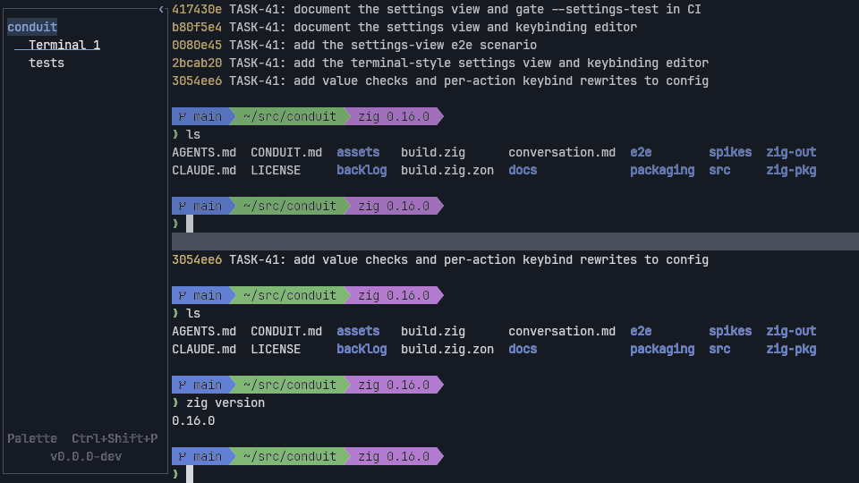
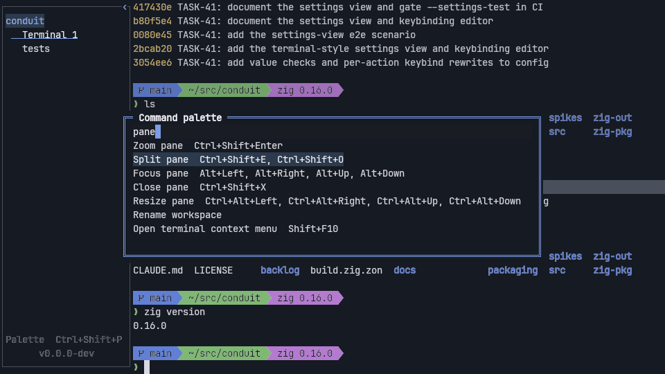
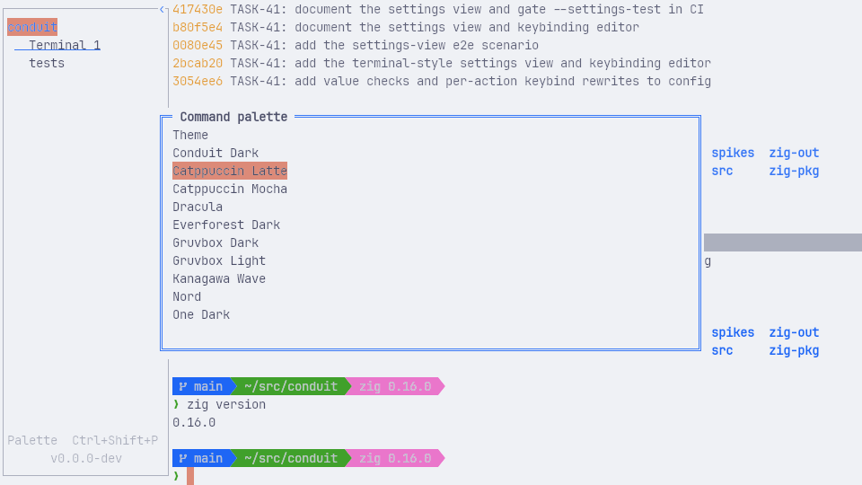
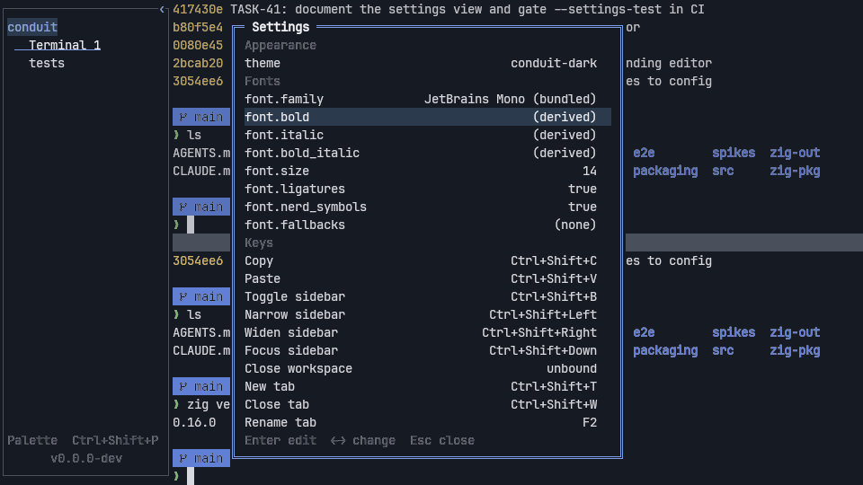

# Conduit

Conduit is a terminal workspace written in Zig on top of Ghostty's terminal engine (libghostty).
One window holds named workspaces; each workspace has tabs, split panes and an always-running
scratchpad terminal, all driven equally by keyboard and mouse through a command palette. Its own
interface is drawn in the terminal's grid and colours rather than as desktop chrome, and every
element is exposed to a test driver so that an AI agent can launch, drive and screenshot it like a
user. First-class support for coding-agent CLIs (Claude Code, Codex, Pi) and Backlog.md planning
is the goal of the next milestones; today those tools run in Conduit as ordinary terminal programs.

Conduit is pre-1.0. Linux x86_64 is the primary platform, with the fullest test coverage. macOS
arm64 (a disk image, ad hoc signed and not notarized) and Windows x86_64 (a portable zip, unsigned)
are released from v0.1.9 on and verified only on GitHub's hosted runners, so expect rough edges.



## Features

What works today (Linux):

- **Terminal.** A real PTY with your shell, rendered by Conduit's GPU grid renderer: true colour,
  bold/italic faces, mouse reporting, selection (drag, double and triple click, Shift to override a
  program's mouse capture), clipboard and middle-click primary selection, scrollback, IME input,
  bash/zsh/fish shell integration for working-directory tracking and prompt marks.
- **Tabs and panes.** A sidebar lists the workspace's tabs. Create, rename, reorder (drag or keys),
  close (with a prompt when a program is still running). Each tab splits right or down to any depth;
  focus, resize (drag a divider or use keys), zoom and close panes. New tabs and panes start in the
  directory the shell reported.
- **Command palette.** Fuzzy search over every command with its key chord, recent commands first,
  arguments collected in nested steps, every row clickable.
- **Scratchpad.** One persistent shell per workspace, shown as a bottom dock at 50% or 90% of the
  window and kept running while hidden.
- **Workspaces.** Several named workspaces in one window, each with its own tabs, panes and
  scratchpad. They are not saved across restarts yet.
- **Links and file references.** Ctrl+click (Cmd+click on macOS) opens URLs, OSC 8 hyperlinks and
  `path:line:col` references; files open in `vi` in a new tab.
- **Search.** Find in scrollback with literal or regular-expression matching and a case toggle.
- **Context menu.** Right click for copy, paste, open link, split and search.
- **Configuration.** A Ghostty-style settings file with hot reload, rebindable keys, and a
  settings view that edits it in place.
- **Themes.** Fourteen bundled colour schemes, Ghostty-format user themes, automatic light/dark
  switching and a picker with live preview.
- **Fonts.** Bundled JetBrains Mono and Nerd Font symbols, configurable family and style faces,
  fallback chains, colour emoji, programming ligatures, pixel-exact box drawing and Powerline
  glyphs, and size chords.

Coming next (see [`CONDUIT.md`](CONDUIT.md) §4 and §6 and the [`backlog/`](backlog/) milestones):
SSH and WSL workspaces, agent status, notifications and structured agent views for Claude Code,
Codex, Pi and OpenCode, Backlog.md board integration, workspace persistence, a `conduit` CLI, and
macOS/Windows releases.

| Command palette | Theme picker previewing Catppuccin Latte | Settings view |
|---|---|---|
|  |  |  |

## Install (Linux x86_64)

Releases are published at <https://github.com/thowd22/Conduit/releases>. Each release has a
Debian package, an AppImage, a tarball and a `SHA256SUMS` file. They need glibc 2.35 or newer
(Ubuntu 22.04 or later), OpenGL 3.3 and an X11 or Wayland session. From v0.1.9 each release
also has `conduit-<version>-macos-arm64.dmg` (macOS 14 or newer; ad hoc signed, so Gatekeeper
needs a right-click Open the first time) and `conduit-<version>-windows-x86_64.zip` (unpack and
run `Conduit\conduit.exe`; unsigned, so SmartScreen warns), each with a `.sha256` file.

Download the assets for a version (here 0.1.8) and check them:

```sh
gh release download v0.1.8 --repo thowd22/Conduit   # or download them from the release page
sha256sum -c SHA256SUMS
```

Then install one of them:

```sh
# Debian or Ubuntu
sudo apt install ./conduit_0.1.8_amd64.deb

# AppImage (no installation; needs FUSE 2, or add --appimage-extract-and-run)
chmod +x Conduit-0.1.8-x86_64.AppImage
./Conduit-0.1.8-x86_64.AppImage

# Tarball: bin/conduit plus share/ (desktop entry, icons, shell integration, licences)
tar -xzf conduit-0.1.8-x86_64-linux.tar.gz
./conduit-0.1.8-x86_64-linux/bin/conduit
```

`conduit --version` prints the installed version. The Debian package installs a desktop entry
and icon, so Conduit also appears in the application menu.

## Build from source

Conduit needs exactly **Zig 0.16.0** (the `minimum_zig_version` in `build.zig.zon`; other
versions are not supported). Everything else is fetched and compiled by the build: SDL3, FreeType,
HarfBuzz, Oniguruma, zlib, libpng and the Ghostty terminal engine are pinned in `build.zig.zon`
and statically linked. At runtime SDL loads the system OpenGL and X11 or Wayland libraries.

```sh
git clone https://github.com/thowd22/Conduit.git
cd Conduit
zig build                 # installs zig-out/bin/conduit and zig-out/bin/conduit-test
zig build run             # build and start Conduit
zig build test            # unit and integration tests
```

`zig build -Doptimize=ReleaseSafe` builds the optimised binary the releases ship;
`zig build --prefix <dir>` stages the full install tree (binary, fonts, shell integration, desktop
entry, icons, licences). [`docs/release.md`](docs/release.md) describes the release build and
packaging.

The end-to-end checks open a real window, so on a machine without a display run them under Xvfb.
The CI gate (`.github/workflows/linux-e2e.yml`) installs these Ubuntu packages for them:
`xvfb xauth xdotool dbus-x11 ibus ibus-hangul libglib2.0-bin sway jq xclip x11-utils
desktop-file-utils fonts-noto-color-emoji fonts-noto-cjk fonts-dejavu-core`. Only `xvfb` (and
`xauth`) is needed for the built-in checks below; the rest serve the platform checks in
`.github/scripts/`.

```sh
xvfb-run -a zig build run -- --palette-test          # one deterministic built-in check
xvfb-run -a zig build e2e -- --artifact-dir="$(mktemp -d)"   # the scripted scenarios
```

The built-in checks are `--grid-test`, `--self-test`, `--scroll-test`, `--mouse-test`,
`--clipboard-test`, `--ui-test`, `--ime-test`, `--sidebar-test`, `--tabs-test`, `--panes-test`,
`--palette-test`, `--scratchpad-test`, `--workspaces-test`, `--links-test`, `--search-test`,
`--menu-test`, `--config-test`, `--theme-test`, `--font-test`, `--settings-test`, `--git-test`, `--agent-test`, `--ssh-test`, `--agent-view-test`, `--agent-manager-test`, `--backlog-test`, `--control-test`, `--restore-test`, `--a11y-test`, `--agent-prompts-test`, `--profiles-test`, `--editor-test` and
`--driver-test`; each exits non-zero on failure. `conduit --help` lists every flag.

## Documentation

- [`docs/user-guide.md`](docs/user-guide.md): using Conduit, and the full keybinding reference.
- [`docs/config.md`](docs/config.md): the settings file, every key, themes, fonts and keybinding
  syntax.
- [`docs/agents.md`](docs/agents.md): running Claude Code, Codex, Pi and OpenCode in Conduit, and
  letting them drive Conduit through `conduit-test`.
- [`docs/architecture.md`](docs/architecture.md): how the code is organised.
- [`docs/release.md`](docs/release.md): cutting and verifying a Linux release.
- [`CONDUIT.md`](CONDUIT.md): the product specification and roadmap.
- [`AGENTS.md`](AGENTS.md): the contributor and coding-agent guide, including the current state of
  every feature and what is verified on which platform.
- [`backlog/`](backlog/): the plan, as Backlog.md tasks, decisions and milestones.

## For agents

Conduit ships a development-only automation surface: `--test-driver` starts a local JSON-RPC
server in the app, and the `conduit-test` executable (built by `zig build`, not packaged in
releases) launches isolated runs and drives them through the real input path:

```sh
run="$(./zig-out/bin/conduit-test --root=/tmp/ct launch --width=960 --height=540 --scale=1)"
./zig-out/bin/conduit-test --root=/tmp/ct --run="$run" inspect      # semantic tree as JSON
./zig-out/bin/conduit-test --root=/tmp/ct --run="$run" key CTRL+SHIFT+p
./zig-out/bin/conduit-test --root=/tmp/ct --run="$run" screenshot   # prints the PNG path
./zig-out/bin/conduit-test --root=/tmp/ct --run="$run" quit
```

`conduit-test mcp` exposes the same commands as an MCP server; the checked-in
[`.mcp.json`](.mcp.json) registers it for Claude Code. [`docs/agents.md`](docs/agents.md) covers
Codex and Pi, and `AGENTS.md` describes the full development loop.

## Licence

Conduit is released under the [MIT licence](LICENSE). It compiles in or bundles the components
below. `zig build` and the release packages install their licence texts under
`share/licenses/conduit/` (all but the colour-scheme notices, which live in
[`assets/themes/README.md`](assets/themes/README.md)); the sources are in
[`assets/THIRD-PARTY-LICENSES/`](assets/THIRD-PARTY-LICENSES/), [`assets/fonts/`](assets/fonts/)
and the pinned dependencies.

| Component | Licence |
|---|---|
| Ghostty terminal engine (`ghostty-vt`) | MIT |
| SDL 3 | zlib (`SDL-LICENSE.txt` also carries the notices of SDL's own bundled code) |
| zopengl | MIT |
| FreeType | FreeType Licence (FTL), or GPL-2.0 at your option |
| HarfBuzz | Old MIT |
| Oniguruma | BSD-2-Clause |
| zlib | zlib |
| libpng | PNG Reference Library License v2 |
| JetBrains Mono (bundled font) | SIL Open Font License 1.1 |
| Symbols Nerd Font Mono (bundled font) | SIL OFL 1.1 for the font, MIT for Nerd Fonts' sources; per-glyph-set licences in `NerdFonts-license-audit.md` |
| Bundled colour schemes | Values copied from iTerm2-Color-Schemes (MIT); each scheme's project licence is listed in `assets/themes/README.md` |
