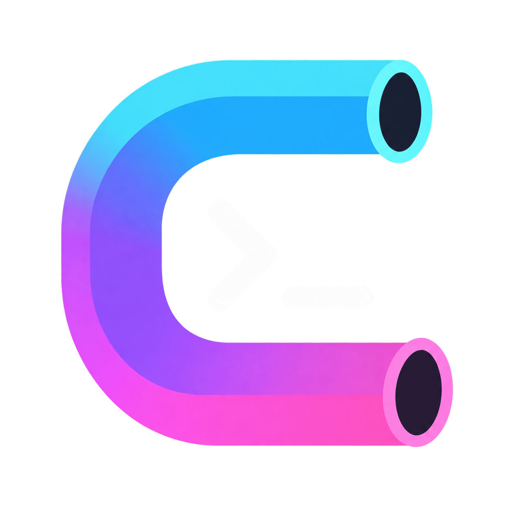
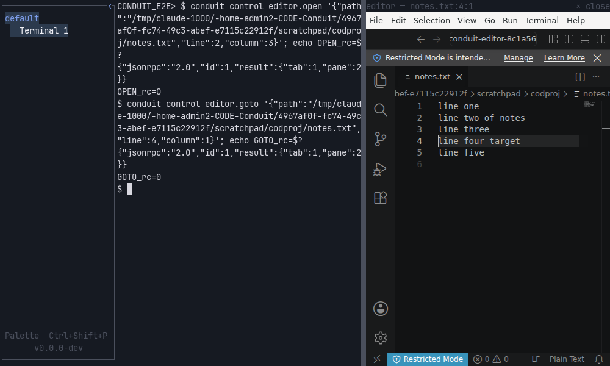

<p align="center">
  
</p>

<h1 align="center">Conduit</h1>

<p align="center">
  <strong>A terminal workspace built for the way you work with coding agents.</strong><br>
  Tabs, split panes, named workspaces and a scratchpad that never dies, drawn in the terminal's own grid,
  with Claude Code, Codex, Pi and OpenCode as first-class citizens.
</p>

<p align="center">
  <a href="https://github.com/thowd22/Conduit/releases/latest"></a>
  <a href="https://github.com/thowd22/Conduit/actions/workflows/linux-e2e.yml"></a>
  <a href="https://github.com/thowd22/Conduit/actions/workflows/ci.yml"></a>
  <a href="LICENSE"></a>
</p>


Conduit is written in Zig on top of Ghostty's terminal engine. It is a real terminal first: a
PTY, a GPU grid renderer, true colour, ligatures, emoji, IME, mouse reporting, shell integration.
Everything Conduit adds on top is drawn as terminal text in the same grid and colours. No native
chrome, no web view, no icons: if you can see it, you can click it, and if you can click it, there
is a key chord and a palette command for it too.

## Why Conduit

- **Agents are not an afterthought.** Launch Claude Code, Codex, Pi or OpenCode into a tab, or
  start one by hand anywhere. The sidebar shows what each agent is doing (`▸` working, `?` waiting
  for input, `!` waiting for permission, `✓` done), notifications collect every wait, a structured
  view shows the transcript and lets you answer permission prompts, and an agent manager lists every
  agent across workspaces.
- **Agents get a steering wheel.** A local, token-scoped control API lets the agent running in a
  tab open tabs, split panes, show you a file at a line in an editor pane, and post status, with
  the scratchpad always out of its reach. The same surface drives Conduit from tests and MCP.
- **The scratchpad belongs to you.** Every workspace starts a shell that keeps running while
  hidden, docks at 50% or 90% of the window, and can never be taken over by an agent.
- **Workspaces, local or remote.** One window, many named workspaces, each with its own tabs,
  panes and scratchpad, saved on change and restored on the next launch. SSH workspaces reuse one
  connection and show OpenSSH's own prompts; WSL workspaces run inside a distribution of your choice.
- **Backlog.md built in.** A board of the workspace's tasks, task details, status and criteria
  edits through the `backlog` CLI, and a one-key "start an agent on this task".
- **Testable to the pixel.** Every element registers once in a semantic tree that rendering, mouse
  hit testing, keyboard focus, accessibility and the test driver all read. An agent can launch an
  isolated Conduit, drive it through the real input path and screenshot it like a user.

## Tour

| Command palette | Theme picker, previewing live | Settings view |
|---|---|---|
|  |  |  |

**Terminal.** True colour, bold and italic faces, selection with drag, double and triple click,
clipboard and primary selection, scrollback, IME, and bash, zsh, fish and PowerShell integration
for working-directory tracking and prompt marks. Ctrl+click opens URLs, OSC 8 hyperlinks and
`path:line:col` references. Search across scrollback with literals or regular expressions.

**Layout.** Tabs you can create, rename, reorder and close; panes that split right or down to any
depth, resize by divider drag or keys, zoom and close; a right-click context menu for copy, paste,
open link, open in editor, split and search. New tabs and panes start where the shell was.

**Editor pane.** With [VSCodium](https://vscodium.com) installed, "Editor: open file", the context
menu over a file reference, or an agent's `editor.open` request opens the file at a line in a
split pane. On X11 the VSCodium window is hosted inside the pane and follows it as it moves,
resizes, zooms or hides; a second request reuses the pane.



**Looks.** Fourteen bundled colour schemes, Ghostty-format user themes, automatic light and dark
switching, a theme picker and a font picker with live preview. JetBrains Mono and Nerd Font
symbols are bundled; fallback chains, colour emoji, programming ligatures, pixel-exact box drawing
and Powerline glyphs come for free.

**Configuration.** One Ghostty-style settings file, hot-reloaded, every key rebindable, with a
settings view that edits it in place and a keybinding editor that captures the chord you press.

## Install

Grab the latest release from the [releases page](https://github.com/thowd22/Conduit/releases).

| Platform | Package | Notes |
|---|---|---|
| Linux x86_64 | `.deb`, AppImage, tarball | glibc 2.35+ (Ubuntu 22.04 or later), OpenGL 3.3, X11 or Wayland |
| macOS arm64 | `.dmg` | macOS 14+. Ad hoc signed, so right-click, Open the first time |
| Windows x86_64 | portable `.zip` | Unpack and run `Conduit\conduit.exe`. Unsigned, so SmartScreen warns |

Every asset has a checksum (`SHA256SUMS`, or a `.sha256` file beside it):

```sh
gh release download v0.1.9 --repo thowd22/Conduit
sha256sum -c SHA256SUMS
sudo apt install ./conduit_0.1.9_amd64.deb        # or run the AppImage, or unpack the tarball
conduit --version
```

Linux is the primary platform with the fullest coverage. The macOS and Windows builds ship from
v0.1.9 and are verified on GitHub's hosted runners, so expect rough edges there; see the
[current state](AGENTS.md#current-state) for exactly what is proven where.

## Let an agent drive it

Inside any Conduit tab, an agent (or you) can talk to the window it lives in:

```sh
conduit control tab.open '{"cwd":"/home/me/src/app"}'
conduit control pane.split '{"direction":"down"}'
conduit control editor.open '{"path":"src/main.zig","line":142,"column":7}'
conduit control tab.status '{"text":"running tests"}'
```

The endpoint and token arrive in the tab's environment, are scoped to that workspace, and can
never reach the scratchpad. Claude Code hooks, Codex, Pi and OpenCode snippets are in
[`docs/control-api.md`](docs/control-api.md).

For testing and exploration, `conduit-test` launches an isolated Conduit and drives it through the
real input path, with a semantic tree instead of pixel coordinates:

```sh
run="$(./zig-out/bin/conduit-test --root=/tmp/ct launch --width=960 --height=540 --scale=1)"
./zig-out/bin/conduit-test --root=/tmp/ct --run="$run" inspect        # the semantic tree
./zig-out/bin/conduit-test --root=/tmp/ct --run="$run" key CTRL+SHIFT+p
./zig-out/bin/conduit-test --root=/tmp/ct --run="$run" screenshot     # a PNG you can look at
./zig-out/bin/conduit-test --root=/tmp/ct --run="$run" quit
```

`conduit-test mcp` exposes the same commands as an MCP server, and the checked-in
[`.mcp.json`](.mcp.json) registers it for Claude Code.

## Build from source

Conduit needs exactly **Zig 0.16.0**. Everything else (SDL3, FreeType, HarfBuzz, Oniguruma, zlib,
libpng and the Ghostty engine) is pinned in `build.zig.zon`, fetched by the build and statically
linked.

```sh
git clone https://github.com/thowd22/Conduit.git && cd Conduit
zig build            # zig-out/bin/conduit and zig-out/bin/conduit-test
zig build run        # start it
zig build test       # unit and integration tests
```

The end-to-end checks open a real window; on a headless machine run them under Xvfb:

```sh
xvfb-run -a zig build run -- --palette-test                   # one of 33 deterministic checks
xvfb-run -a zig build e2e -- --artifact-dir="$(mktemp -d)"    # 22 scripted scenarios
```

`conduit --help` lists every check; [`AGENTS.md`](AGENTS.md) describes the development loop,
and [`docs/release.md`](docs/release.md) the release build.

## Documentation

- [`docs/user-guide.md`](docs/user-guide.md): using Conduit, with the full keybinding reference.
- [`docs/config.md`](docs/config.md): every setting, themes, fonts and keybinding syntax.
- [`docs/agents.md`](docs/agents.md): running coding agents in Conduit and letting them drive it.
- [`docs/control-api.md`](docs/control-api.md): the control API and the `conduit` CLI.
- [`docs/architecture.md`](docs/architecture.md): how the code is organised.
- [`CONDUIT.md`](CONDUIT.md): the product specification.
- [`AGENTS.md`](AGENTS.md): the contributor and coding-agent guide, including what is verified
  on which platform.
- [`backlog/`](backlog/): the plan as Backlog.md tasks, decisions and milestones.

## Status

Conduit is pre-1.0. All planned milestones are implemented; what remains open is signed and
notarized macOS and Windows packages, accessibility bridges on macOS and Windows (Linux has
AT-SPI), editor-pane hosting outside X11, and a couple of Windows checks that report rather than
gate. Issues and pull requests are welcome.

## Licence

Conduit is MIT. It compiles in or bundles the components below; `zig build` and the release
packages install their licence texts under `share/licenses/conduit/`, and the sources are in
[`assets/THIRD-PARTY-LICENSES/`](assets/THIRD-PARTY-LICENSES/), [`assets/fonts/`](assets/fonts/),
[`assets/themes/README.md`](assets/themes/README.md) and the pinned dependencies.

| Component | Licence |
|---|---|
| Ghostty terminal engine (`ghostty-vt`) | MIT |
| SDL 3 | zlib (`SDL-LICENSE.txt` also carries the notices of SDL's own bundled code) |
| zopengl | MIT |
| FreeType | FreeType Licence (FTL), or GPL-2.0 at your option |
| HarfBuzz | Old MIT |
| Oniguruma | BSD-2-Clause |
| zlib | zlib |
| libpng | PNG Reference Library License v2 |
| JetBrains Mono (bundled font) | SIL Open Font License 1.1 |
| Symbols Nerd Font Mono (bundled font) | SIL OFL 1.1 for the font, MIT for Nerd Fonts' sources; per-glyph-set licences in `NerdFonts-license-audit.md` |
| Bundled colour schemes | Values copied from iTerm2-Color-Schemes (MIT); each scheme's project licence is listed in `assets/themes/README.md` |
