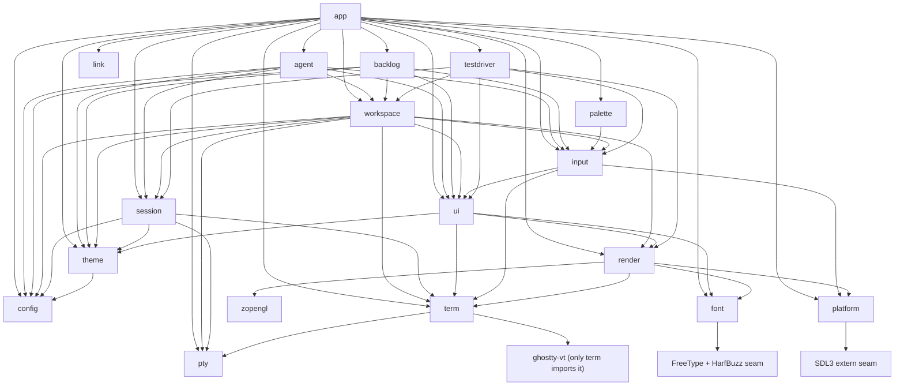

# Conduit — Code Architecture

How Conduit's code is organised. This is the document a later task builds against: it names
every module, says what it owns and what it must never do, fixes the direction dependencies
point, and records the two external seams the spikes settled.

| Question | Source of truth |
|---|---|
| What should the product do? | `CONDUIT.md` |
| What counts as done? | `backlog/tasks/*` acceptance criteria |
| Coding rules, toolchain, invariants | `AGENTS.md` |
| Why Ghostty is consumed as `ghostty-vt` | `decision-1`, evidence in `doc-1` |
| Why SDL3 + OpenGL 3.3 core | `decision-2`, evidence in `doc-2` |
| How the code is organised | this file |

Read this with `AGENTS.md` open. Where the two disagree, stop and resolve it with the user
rather than picking a side (CONDUIT.md §14).

**How to read the claims below.** Every rule here is quoted or derived from `AGENTS.md`,
`CONDUIT.md`, `decision-1` and `decision-2` (with `doc-1`/`doc-2` as their evidence), or from a
backlog task's acceptance criteria. Two labels are used and they matter:

- **(rule)** — stated in one of those documents. Changing it needs the user's agreement and a
  decision record.
- **(convention)** — this document's choice, made so two agents do not invent two layouts. Safe
  to change; if you change it, change it here too.

Anything genuinely undecided is collected in [§9 Undecided](#9-undecided) instead of being
guessed at.

---

## 1. Repository layout

```
Conduit/
├── .github/workflows/
│   └── linux-e2e.yml    checked-in TASK-25 Linux gate; remote acceptance evidence pending
├── build.zig            root build: modules, deps, install/run/test/font-check steps
├── build.zig.zon        pinned deps: ghostty @5dc28bb8, SDL, zopengl
├── e2e/
│   ├── runner.zig       isolated scripted-scenario runner and artifact collector
│   └── scenarios.zig    declarative real-input TASK-25 scenarios
├── src/
│   ├── main.zig         the app module: entry point, process lifetime, event loop, wiring
│   ├── platform.zig     window, input and clipboard OS seam
│   ├── pty.zig          PTY abstraction and backends
│   ├── term.zig         ghostty-vt wrapper
│   ├── link.zig         bounded terminal-link detection and parsing
│   ├── render.zig       GPU surface, draw, present, capture
│   ├── font.zig         discovery, shaping, glyph atlas
│   ├── ui.zig           four primitives, semantic tree, hit testing
│   ├── input.zig        key/mouse encoding, actions, keybindings
│   ├── workspace.zig    workspace/session/tab/pane lifecycle and ExecutionContext owner
│   ├── session.zig      PTY + terminal state for one live terminal
│   ├── config.zig       settings file, defaults, hot reload
│   ├── theme.zig        palette and colour schemes
│   ├── agent.zig        adapter interface + Claude Code / Codex / Pi
│   ├── backlog.zig      backlog.md data layer
│   ├── palette.zig      allocation-bounded command search and chord formatting
│   ├── testdriver.zig   in-app automation protocol core
│   └── conduit_test.zig external conduit-test executable composition root
├── assets/              files embedded into the binary by build.zig, with their licences
│   ├── fonts/           bundled JetBrains Mono fallback face (OFL)
│   ├── linux/           freedesktop desktop entry, hicolor PNG icons and the window-icon pixels
│   ├── shell-integration/  Conduit's own bash, zsh, fish scripts (OSC 7 / OSC 133), injected per shell
│   └── THIRD-PARTY-LICENSES/  FreeType and HarfBuzz notices
├── docs/                this file and reports that belong to the repo, not a task
└── spikes/              THROWAWAY. Prototypes from TASK-2 and TASK-3.
```

Rules for this tree:

- One module per file, `snake_case` file names, `TitleCase` types, `camelCase` functions
  (`AGENTS.md`, coding standards).
- A module grows sub-modules in `src/<name>/` once one file stops being readable; the root file
  stays the module's public surface.
- `spikes/` is never referenced from the root build and never absorbed into `src/` (doc-2 calls
  the TASK-3 prototype "self-contained, throwaway, not part of the project build"). Its build
  output is generated noise.
- Every module exists from TASK-4 as a scaffold with at least one unit test (TASK-4 AC #2), even
  when its feature is a non-goal for v0.1. A scaffold that implements nothing is honest; a
  feature that quietly ships early is not.
- `main.zig` is the `app` module and the executable's root module — there is no separate
  `src/app.zig`. Every other module gets `src/<name>.zig`.
- A module is wired into `zig build test` when its file exists; a module with no file is not a
  missing build entry, it is an unfinished task.
- SDL3 is part of the normal build graph. `wireThirdPartySeams` resolves the pinned
  `castholm/SDL` artifact, gives `platform` the translated `sdl` module, and links SDL3 through
  that module. `zig build`, `run`, and the module tests therefore exercise the same seam the app
  uses; linking SDL does not itself create a window or require a display.

---

## 2. The module list

The list is fixed by `AGENTS.md` (section "Module layout") and `CONDUIT.md` §4. Each entry
below gives what the module owns, what it must never do, and the modules it may depend on —
nothing else is a legal dependency.

### `app`

- **Owns** process lifetime and top-level composition: parse `std.process.Init`, start scoped
  logging (TASK-6), construct every module once with explicit allocators, run the event loop, and
  shut down in reverse order. It is the only module that knows the whole module list. It projects
  the current `Workspace` and its tabs into the semantic tree, owns the sidebar's visible width,
  and adapts named UI actions to workspace selection and grid geometry. TASK-29 also gives this
  composition layer the transient rename `Input`, close-confirmation overlay and pointer-drag
  state; durable tab identity, order, labels and attention remain in `workspace`. TASK-30 adds a
  renderer registry with one retained `render.Grid` per pane, including panes in hidden tabs, a
  full-canvas overlay compositor, pane/divider semantic projection and transient divider-drag and
  pending-pane-close state; pane/session identity and tree geometry remain in `workspace`.
  TASK-31 adds the centered command-palette semantic surface, query and argument `Input` state,
  modal pointer/key ownership and nested command/argument presentation. Search and recency logic
  remain in `palette`; action definitions and invocation validation remain in `input`. TASK-32 adds
  a retained scratchpad grid, hidden/50-percent/90-percent presentation state and an
  independent interactive-shell specification plus asynchronous start/restart slot. The permanent
  session and its child remain workspace-owned; `app` owns only their presentation and spawn-job
  coordination. TASK-33 replaces the single presentation with an ordered `WorkspaceRegistry` and
  one `WorkspacePresentation` bundle per stable workspace key. Only the selected bundle is drawn
  or receives user input, but pumping and asynchronous terminal/scratchpad jobs retain their
  initiating workspace key so hidden workspaces continue running without selection redirecting
  their results.
- **Child environment (TASK-73).** `ChildSpec` builds every child's argv and environment for the
  context kind of the workspace that spawns it. A Local child starts from Conduit's own process
  environment — the desktop session (DISPLAY/WAYLAND_DISPLAY, XDG_RUNTIME_DIR,
  DBUS_SESSION_BUS_ADDRESS, SSH_AUTH_SOCK, LC_*) and the user's exports — with
  `TERM=xterm-256color`, `COLORTERM=truecolor` and `TERM_PROGRAM=conduit` set on top, the
  PATH/HOME/LANG fallbacks applied when unset or empty, and shell-integration variables added only
  when that spawn injects integration. It drops exactly `ChildSpec.inherited_exclusions`:
  `CONDUIT_TEST_RUN`/`CONDUIT_TEST_ROOT` (they would aim a child's `conduit-test` at a driver),
  `CONDUIT_LOG_FILE` (this run's exact log file), the four `CONDUIT_*` shell-integration handshake
  variables of an enclosing Conduit, and `TERM_PROGRAM_VERSION` (it describes the replaced
  `TERM_PROGRAM`). The driver endpoint and artifact directory reach the app only as flags, so the
  environment never names them; `conduit-test launch`'s isolated HOME/XDG_*/TMPDIR are the app's
  environment and therefore also the child's. SSH and WSL contexts cannot forward this machine's
  environment, so they receive only the curated identity-plus-fallback set and their remote side
  supplies the rest. The scratchpad and `--command`/check children use the same rule.
- **Tab actions.** User commands are `tab.new`, `tab.close`, `tab.rename`, `tab.previous`,
  `tab.next`, `tab.goto` and `tab.move`. Semantic pointer paths use `tab.activate` and
  `tab.reorder`; the overlays complete through `tab.rename.commit`/`tab.rename.cancel` and
  `tab.close.confirm`/`tab.close.cancel`. Sidebar rows and lifecycle footer text are clickable,
  rename is the existing `ui.Input` primitive, and confirmation is a `ui.Surface` with clickable
  `InteractiveText` choices — no extra widget or parallel interaction model is introduced.
- **Pane actions.** `pane.split`, `pane.focus`, `pane.resize`, `pane.zoom` and `pane.close` are the
  keyboard and sidebar command surface. Semantic pane clicks dispatch `pane.activate`; one-cell
  semantic dividers dispatch `pane.resize` while pointer motion supplies their signed cell delta.
  Splits copy the focused session's tracked cwd (falling back to workspace cwd) before asynchronous
  `ExecutionContext` spawn. Close uses the tab close modal for a live child without current OSC 133
  idle evidence; a non-final close removes the pane, its renderer and its session, while the final
  pane delegates to the tab close policy. Before an action adopts another live session, `app`
  flushes terminal responses and user input in their defined order; if encoded, staged, committed,
  paste or response debt remains, the transition is deferred with the old session still active.
  Once the UI claims a left-button press, `app` retains that gesture through motion and release,
  including a pane activation deferred by that debt, so no later event leaks to the old terminal.
- **Palette actions.** `palette.open` presents a centered semantic `Surface` with a query `Input`
  and clickable `InteractiveText` rows for every registry definition whose palette metadata is
  present. Command+Shift+P binds it on macOS; Ctrl+Shift+P binds it on Linux and Windows, and the
  sidebar footer's centred `sidebar.palette` hint (`Palette  <chord>`, TASK-74) dispatches it by
  mouse. The dialog sizes itself to its content: `openPalette` measures the widest title, command
  row (label plus formatted chords), prompt or choice label in display cells, and `paletteBounds`
  uses that width plus four columns, at least 40, clamped to the canvas, so rows are never wrapped
  and clip only when the window is narrower than the text. Arrow
  keys or Tab move selection, Enter or a row click dispatches through the same action registry,
  and Escape or an outside click closes it. Fixed-choice and free-text argument metadata open a
  nested modal step before dispatch. `palette.dialog`, `palette.query`, indexed command/choice
  rows, `palette.prompt` and `palette.argument` are all registered in the one semantic tree. The
  palette owns the complete pointer gesture and every key while open, so neither an outside-click
  release nor unbound input reaches content underneath.
- **Scratchpad actions.** `scratchpad.toggle-50` and `scratchpad.toggle-90` present or hide a
  full-width bottom dock at the requested fraction. `scratchpad.restart` starts a fresh independent
  interactive shell and atomically replaces the old one only after the new PTY is ready;
  `scratchpad.hide` and Escape remove only the presentation. The semantic surface registers stable
  `scratchpad`, `scratchpad.terminal`, `scratchpad.restart` and `scratchpad.hide` ids. While visible,
  terminal input is routed to the scratchpad and the dock owns outside/border pointer gestures so
  none leak to the panes behind it.
- **Workspace actions.** `workspace.create`, `workspace.rename`, `workspace.switch` and
  `workspace.close` are palette-visible commands, while sidebar rows dispatch
  `workspace.activate` (the per-action footer controls were removed by TASK-74; the footer is the
  `Palette <chord>` hint over a centred `sidebar.version` line) and the confirmation surface dispatches `workspace.close.confirm` or
  `workspace.close.cancel`. Create accepts a directory, activates an existing workspace for the
  same normalized directory, or starts an independent terminal and reserved scratchpad through
  the new workspace's `ExecutionContext`. Every pane, divider, tab and scratchpad semantic id is
  qualified by its stable workspace key. A transition first flushes retained terminal input and
  response debt; close then selects a surviving workspace, waits for outstanding start jobs to
  settle, and releases the removed workspace's complete ownership graph. Removing the final
  workspace requests orderly application shutdown.
- **Terminal-link actions.** The landed URL/OSC 8 slice of TASK-34 copies only visible link
  targets into bounded app-owned storage, projects them once as stable `terminal_link`
  `InteractiveText` elements, and routes `terminal.open-link` through `platform.openUrl` only
  after an explicit Command-click on macOS or Ctrl-click on Linux/Windows. Plain clicks, drags and
  DEC mouse reports remain terminal gestures. Hover under the modifier adds only a semantic
  underline decoration. OSC 8 metadata is authoritative, including malformed or non-HTTP targets
  that mask lexical URL detection, and stable ids use a domain-separated 128-bit SHA-256
  fingerprint. Visible lexical file references (`path`, `path:line`, `path:line:col`) are
  registered the same way under the `.file` fingerprint domain, which covers the visible path
  spelling, line and column. The same modified click on one snapshots the source session's
  tracked OSC 7 cwd (falling back to the workspace cwd), resolves a relative spelling against it
  without canonicalizing, stat'ing or reading anything, creates an ordinary tab labelled with the
  bounded file name, and spawns the decision-5 built-in editor as shell-free argv
  `vi +<line> -- <path>` (or `vi -- <path>`) through the workspace `ExecutionContext` with that
  cwd; a detected column is identity only and is never passed. The job owns that argv until its
  worker joins. Text that cannot be dispatched safely is logged at debug level without its
  contents and ignored. `EditorSpawnObserver` is the deterministic-check seam that sees the exact
  argv and cwd before the real spawn. In command mode the loop no longer treats a tab whose spawn
  worker is still in flight as a vanished child.
- **Terminal-search actions.** TASK-36 owns the inline search surface, query `Input`, bounded
  polling state, selected match and semantic highlight projection.
  `search.open`, `search.close`, `search.next`, `search.previous`, `search.toggle-case` and
  `search.toggle-regex` and `search.activate-match` share the action registry and mouse/key paths.
  The terminal owns match discovery and viewport reveal. Regex search uses the statically bundled,
  Ghostty-pinned Oniguruma source behind the same bounded cursor/page contract as literal search.
- **Font actions (TASK-40).** `app` owns the committed font settings as one owned `FontSettings`
  (family after the `--font` session layer, the three style families, fallbacks, size, ligatures,
  built-in symbols) and builds every `font.Request` from it, at startup and on each reload. Each
  font worker gets its own copy, so a commit never frees strings a worker reads. A face is
  identified by `FontValues.faceKey` (everything but ligatures, plus the display scale);
  `requestFontReload` starts nothing when the wanted key is the one drawn or the one being built,
  so the config reload a command's own write causes is a no-op, and a ligature change toggles
  `Manager.setLigatures` and invalidates every pane, scratchpad and overlay grid instead of
  rebuilding. The palette commands are `font.pick` (fixed choices from a heap `FontChoices` list:
  the bundled face plus `font.Catalog.monospaceFamilies`, at most 256, committed family first,
  relisted only while the palette is closed), `font.size.increase`/`decrease`/`reset` (1 point,
  6–72; reset writes 14), `font.ligatures.toggle`, `font.symbols.toggle` and `font.fallbacks` (free
  text, comma-separated, `none` clears). Each commits live state first and then writes its key with
  `config.writeDocumentValue`. The picker previews the keyboard-highlighted or, after a real
  pointer motion, hovered family by rebuilding the manager with it (a failed build keeps the
  previous face and reports through `config.error`); Escape or an outside click reverts, a choice
  is adopted without a second build. Only a pointer motion may move a hover preview, because the
  previewed face's cell size moves the rows under a still pointer. The dialog's `palette.preview`
  Text names the drawn family and exists only once the highlighted face has landed, which is what
  scripted checks wait on. Palette choice ids are stored per visible row, so a choice list can be
  longer than the action registry.
- **Settings view (TASK-41).** `settings.open` (palette "Settings"; Ctrl+Shift+, on Linux/Windows,
  Cmd+Shift+, on macOS) opens a centred modal `Surface` (`settings.dialog`, titled ` Settings `)
  measured like the palette and clamped to the window. Its rows are rebuilt from fixed field
  tables and the registry on each opening: dim `Text` headings (`settings.heading.<group>`) for
  Appearance, Fonts, Keys, Scratchpad and Mouse; one `InteractiveText` per setting
  (`settings.row.<key>`) whose label is `<key>  <value> ·`, the value being the one in effect and
  `·` marking a value the file sets (`Config.lines`); one per palette command without an argument
  plus `palette.open` (`settings.row.keybind.<action>`, value the live chords or `unbound`); and
  `settings.raw`, which closes the view and dispatches `config.open`. Rows activate through the
  palette-hidden `settings.activate` action (a click) or Enter; only rows on screen are
  registered and the list scrolls to keep the highlight and its heading visible. Bools toggle,
  `mouse.right_click` cycles, `theme` and `font.family` close the view and open the existing
  `theme.pick` / `font.pick` chooser, and numbers and text open the inline `settings.input`
  prefilled with the file spelling; Left/Right toggle, cycle or step a number by one
  (`stepFontPoints` for the size, 10–100 for the scratchpad). A commit runs `config.checkValue`,
  shows a refusal as `settings.error` (`<key>: <message>`, the parser's own text) and writes
  nothing, else writes with `config.writeDocumentValue` and calls `reloadConfig` at once, so the
  watcher's reload of the same write finds nothing left to change. The view owns every key press
  before `inputmod.resolve` (releases only settle `BindingState` or reach the terminal that saw the
  press), so a captured chord never runs its current action. Capture refuses a bare key that types
  text or a bare Enter/Tab/Backspace/Escape, names a chord another command holds in
  `settings.error` (`conflict: <label>`) and takes it on a second Enter, and writes through
  `config.writeActionKeybinds`: the command's own lines go, each shipped chord it still holds is
  unbound, and `<chord>=<action>` is appended; the reload rebuilds the table. Pointer gestures are
  modal like the palette (an outside press closes and owns its release); text and composition reach
  only the inline field.
- **Sidebar branch rows (TASK-76).** A tab whose focused session's OSC 7 cwd is inside a git work
  tree occupies two rows: its unchanged name row and a non-interactive `Text` child
  `workspace.<k>.tab.<n>.branch` (role `branch`, label = the full branch name or the 8-digit
  short commit of a detached HEAD) indented beneath it, painted `muted` with `TextStyle.small`
  and ellipsized to the row. A tab outside a repository has no branch row, and the list reclaims
  it; `list_limit` counts rows, so a branch row is only added when it still fits. Hover, focus,
  activation and rename act on the name row; a drag dropped on a branch row targets its tab.
  `src/git.zig` (a file of the `app` module, not a module of its own) resolves the repository
  without starting git: `git.resolve` walks up at most 32 directories through the workspace
  `ExecutionContext.Ref.statPath`/`readFile`, follows a `gitdir:` file (linked worktrees and
  submodules), reads `HEAD` (at most 4 KiB) and validates the name (non-empty, ≤ 128 bytes, valid
  UTF-8, no C0/C1 control or DEL). Malformed or unreadable input is "no repository", never an
  error. The app keeps one `GitTrack` per session (owner thread), marked stale by a new OSC 7
  cwd, an OSC 133 prompt start or a terminal reset; `App.pollGit`, on the loop's poll and never
  per frame, runs each refresh as one `git.Lookup` worker (the context may be remote, and remote
  reads must not block the UI thread), and for a Local context also holds a
  `ExecutionContext.watch` on the git directory so a `HEAD` rewritten without a new prompt
  refreshes. Tracks for vanished sessions are dropped, and a closing workspace joins its lookups
  before its context is released.
- **Sidebar workspace gap (TASK-77).** Every workspace after the first listed one, and every row
  of its group, is registered with `ElementRegistration.offset_px = 5 × group index` logical
  pixels (`sidebar_workspace_gap_px`), so a 5-pixel gap scaled by the window scale separates one
  workspace's last row from the next workspace row while rows within a group keep whole-cell
  spacing. `sidebarRowLimit` lowers the list limit by the group's device-pixel shift rounded up
  to whole rows, so no shifted row reaches the blank row above the footer, the Palette hint or the
  version line.
- **Never** duplicate workspace/session/tab/pane records or semantic element state, implement
  behaviour owned by a lower module, call SDL, GL or an OS syscall directly, or hold state another
  module owns. Product views are compositions of model data and the four `ui` primitives.
- **May depend on** `agent`, `backlog`, `config`, `font`, `input`, `link`, `palette`, `platform`, `pty`,
  `render`, `session`, `term`, `testdriver`, `theme`, `ui`, and `workspace` — every other Conduit
  module.
- **Root** `src/main.zig` — this module *is* the executable's root module, so there is no
  `src/app.zig`.
- **(convention)** The event loop lives in `app`, i.e. in `src/main.zig`. `platform` *produces*
  events; it does not run the loop.
- **Lands** M0 — TASK-4, TASK-6; M3 — TASK-28 (workspace/sidebar composition and action adapters),
  TASK-29 (tab lifecycle actions and transient overlays), TASK-30 (pane composition, interaction
  and rendering), TASK-31 (command-palette composition and modal interaction), TASK-32
  (scratchpad process coordination, presentation and interaction), TASK-33 (multi-workspace
  presentation, action routing and lifecycle), TASK-34 (URL/OSC 8 opening and file-reference
  editor tabs), TASK-36 (bounded literal and regex search UI); M4 — TASK-40 (font settings,
  commands and family picker), TASK-41 (settings view and keybinding editor); TASK-76 (git branch
  rows and the secondary small face), TASK-77 (sidebar workspace gap).

### `platform`

- **Owns** window, input and clipboard OS calls. `platform.window`: window creation, the GL
  context, HiDPI and scale, window visibility, IME composition and input area, event translation,
  the hidden-but-real headless window, optional fixed display scale, application identity metadata
  and runtime backend/density reporting. `platform.clipboard`: native copy/paste, primary
  selection, and the OSC 52 policy. `platform.openUrl` is the sole desktop URL-opening seam. PTY
  and font-discovery backends own
  their narrow OS calls, as architecture invariant 10 permits. SDL3 arrives through the
  `castholm/SDL` build package plus a thin `@cImport`/extern seam Conduit owns (decision-2).
  Every new window gets Conduit's icon through `SDL_SetWindowIcon` from an embedded 64x64 RGBA8
  fixture (`assets/linux/io.github.thowd22.Conduit-64.rgba`), which X11 task switchers read as
  `_NET_WM_ICON`; a refusal is logged at warn and never fails window creation.
- **Never** contain product logic, layout or workspace behaviour; let an SDL handle escape above
  the seam; place an OS conditional in a shared module (P12, invariant 10 — the only permitted
  OS conditionals are *selecting* a backend).
- **May depend on** the SDL3 extern seam and nothing else in this list. `render` uses the window
  and context `platform` hands it, never the reverse.
- **Lands** M0/M1 — TASK-3 (the choice), TASK-7 (window and context), TASK-15 (clipboard);
  M2 — TASK-22 (hidden window and fixed scale); per-OS polish M5 — TASK-48, TASK-49, TASK-50.

### `pty`

- **Owns** the PTY abstraction and its backends: POSIX first (TASK-8), Windows ConPTY later
  (TASK-16). Spawn, resize, read, write, close, and the OS process handle.
- **Never** know about sessions, workspaces, agents or UI (`AGENTS.md`, module layout). Never
  assume the local machine: a spawn always arrives through the workspace's ExecutionContext (P7),
  so this module never opens a workspace-scoped path itself.
- **May depend on** no other Conduit module. Its platform-specific backends own the syscalls they
  need, as permitted by architecture invariant 10.
- **Wakeups (TASK-75).** The POSIX backend's read thread and owner thread share a 64 KiB byte
  ring and signal each other over two nonblocking pipes, one per direction: `owner_wake` carries
  "bytes queued" and "child ended" from the reader and is drained only by the owner in
  `waitUntilPending`; `reader_wake` carries "room made" from `takeBytes` and "stop" from
  `destroy` and is drained only by the read thread. A byte is a hint and each side re-checks its
  predicate after draining, which is sound only because exactly one thread consumes each channel.
  The earlier single shared pipe let the owner's drain eat the byte meant for a reader that had
  just seen a full ring, stalling the session forever; a deterministic test parks the reader at
  that point and proves it is woken. A live POSIX terminal therefore holds five descriptors. The
  Windows backend already used separate `space`, `owner_wake` and `stop` events.
- **Lands** M1 — TASK-8, TASK-16; TASK-75 (per-direction wake channels).

### `term`

- **Owns** the wrapper around the `ghostty-vt` Zig module: terminal construction, feeding PTY
  bytes through `Stream`, resize, damage tracking, cell and selection access, search, and
  Conduit's own style describer. It exposes OSC 8 target metadata without interpreting product
  actions and implements bounded literal and retry-limited regex full-scrollback search, ordered
  results, viewport reveal and generation invalidation after terminal output or resize. See
  [§4.1](#41-the-ghostty-vt-boundary).
- **Never** render, load fonts, own a PTY, or take a UI concern. Never reach for the macOS
  embedding library (decision-1). Never rely on `ghostty_vt.Style`'s `{f}`: it does not compile
  on Zig 0.16 (decision-1 consequences, doc-1).
- **May depend on** `pty`, the external `ghostty-vt` package and the statically bundled Oniguruma
  source used only by the search boundary.
- **(convention)** `term` is the *only* module that imports `ghostty-vt`. `input` takes key and
  mouse encoding from `term`, so the third-party module never appears in two import tables.
- **Lands** M0 — TASK-2 (the boundary); M1 — TASK-9 (state wired to the PTY); partial M3 —
  TASK-34 (OSC 8 metadata), TASK-36 (literal and regex search).

### `link`

- **Owns** allocation-free, bounded detection and parsing of terminal link candidates. It
  recognizes HTTP(S) URLs and explicit file-reference forms, and applies OSC 8 precedence and
  masking rules supplied by the caller.
- **Never** open a URL or editor, resolve a path against a workspace, read a file, own semantic
  elements, or retain borrowed terminal bytes. Those are app/platform/workspace responsibilities.
- **May depend on** no other Conduit module.
- **Lands** M3 — TASK-34. The URL, OSC 8 and file-reference detector is integrated; `app`
  performs cwd resolution and the decision-5 editor dispatch above it.

### `render`

- **Owns** the GPU surface and everything drawn into it: the FBO the renderer *always* draws
  into, shaders and programs, viewport and scissor, `present`, `Surface.read` (`glReadPixels`),
  and Conduit's deterministic RGBA8 PNG encoder. The grid renderer and the UI renderer are two
  draw sequences into that one target — that is P6 expressed as call order (doc-2). Its terminal
  origin is independently configurable in whole columns: TASK-28 shifts terminal cells, cursor
  and decorations to the right while the semantic-tree overlay keeps full-canvas coordinates.
  TASK-30 adds absolute, scissored pane viewports and independent retained grid state for each
  pane. A dedicated overlay `Grid` adopts the current font cell, baseline and ascent, then draws
  the semantic-tree overlay once across the full canvas after all visible pane grids.
  TASK-39: every cell's glyph comes from `font.Manager.resolve` (the fallback chain, sprites
  included), a wide cell passes `font.face_flag_wide` so a fallback glyph is fitted to two cells,
  and colour glyphs (emoji) are queued separately and drawn in a third instanced pass that samples
  a lazily created `RGBA8` texture of the manager's colour atlas with premultiplied blending (the
  same glyph program, switched by `u_color_mode`). `attachAtlas` also invalidates the colour
  texture, so a new manager (font size or display scale change) re-uploads both atlases. While
  `font.Manager.ligatures()` is on, a repainted row is read once and each maximal run of
  same-style printable-ASCII cells containing ligature punctuation is shaped as one HarfBuzz run;
  every glyph is still placed in the cell its cluster came from, so the grid never moves.
  TASK-76 (decision "Small UI text via a secondary scaled face"): the overlay `Grid` can attach a
  second, smaller atlas (`attachSmallAtlas`) built by a second `font.Manager` at 0.6 of the
  configured point size (512×512 coverage atlas). An `OverlayCell` marked `small` keeps its full
  cell for fills and decorations, but its glyph is shaped and rasterised with that manager,
  centred vertically in the cell and packed at the small advance with the small cells before it
  on the same row (`SmallRun`), then drawn in a fourth instanced pass over the small texture.
  Without a small face the cell draws at the normal size. TASK-77: `OverlayCell.offset_y_px`
  moves a cell down by whole device pixels, the same shift `ui` applied to its element's bounds.
- **Never** own product or layout state; it draws terminal cells or UI primitives supplied by
  callers. Never call SDL event or window functions (those are `platform`'s). Never block on IO.
- **May depend on** `font` (glyphs), `platform` (window and context), `term` (terminal cells and
  damage), and the external `zopengl` GL bindings.
- **Lands** M1 — TASK-7 (FBO and present), TASK-11 (grid renderer); M2 — TASK-22 (`capture`);
  M3 — TASK-28 (terminal inset origin and full-canvas overlay geometry), TASK-30 (independent pane
  viewports and the font-metric-aware overlay compositor); M4 — TASK-39 (fallback glyphs, colour
  glyph pass, ligature runs); TASK-76 (small-face overlay pass), TASK-77 (overlay row offsets).

### `font`

- **Owns** discovery, loading, shaping and the glyph atlas, plus the per-OS discovery backends
  (macOS, Windows, Linux/fontconfig, bundled fallback — CONDUIT.md §8). With `platform` and `pty`
  it is one of the only places an OS conditional is allowed.
  TASK-39 (v2): `Manager.resolve` walks a per-codepoint chain — built-in sprites
  (`font_sprite.zig`: box drawing U+2500–U+257F, blocks U+2580–U+259F, braille U+2800–U+28FF,
  Powerline U+E0B0–U+E0BF, U+E0D2, U+E0D4, drawn at the cell size so they tile; off with
  `Request.builtin_symbols = false`), the primary style face then its regular face (missing styles
  are synthesised with FreeType emboldening and a 12° shear), `Request.fallbacks` families, system
  faces by coverage (each file's cmap is read into sorted ranges at scan time, on the loader thread;
  monospaced regular faces first, colour faces last or first for emoji presentation; private-use
  codepoints try the bundled symbols face first), the bundled Nerd Fonts Symbols Nerd Font Mono face
  and finally the bundled JetBrains Mono. Extra faces are numbered from `font.sprite_face + 1`,
  opened lazily (a system face is opened on first use, once) and their glyphs scaled into the one-
  or two-cell box. FreeType is built with libpng and zlib so CBDT/sbix colour emoji load; they go to
  a separate premultiplied RGBA `color_atlas`, box-filtered to the cell box. Face indices carry
  `face_flag_bold`, `face_flag_oblique` and `face_flag_wide` in their top bits. Shaping uses
  HarfBuzz's own OpenType functions over the same font bytes, never `hb-ft` on the rasteriser's
  `FT_Face`, because `hb-ft` resizes that face to its own scale. `Request.ligatures` /
  `Manager.setLigatures` turn `liga`, `calt` and `dlig` off. A size or display-scale change is a
  new `Manager` at the new `Size`: every face, sprite and emoji is rasterised again at that size.
  TASK-40: `Request.bold_family`, `italic_family` and `bold_italic_family` replace a style slot
  with the named family's exact style face (else its regular face); an empty or uninstalled one
  keeps the derived face. `Catalog.monospaceFamilies` lists picker candidates — families with a
  non-colour file FreeType reports fixed-width that maps `M` and `0` — sorted, de-duplicated
  case-insensitively and bounded, borrowing the catalog's strings. `Manager.configuredFallbackCount`,
  `builtinSymbols` and `styleFamilyName` let the app and its checks observe the request's effect.
- **Never** know about sessions, workspaces, agents or UI (`AGENTS.md`). Never draw anything
  itself. Never let a missing glyph turn a terminal into boxes (CONDUIT.md §8).
- **May depend on** no other Conduit module, plus the external FreeType and HarfBuzz seam.
  Platform-specific discovery is selected inside `font`.
- **Lands** M1 — TASK-10 (v1); M4 — TASK-39 (v2), TASK-40 (picker).

### `ui`

- **Owns** the four primitives — `Text`, `InteractiveText`, `Surface`, `Input` — and the single
  semantic element tree they register into: stable id, role, label, state, bounds, action. Plus
  hit testing, hover, focus, and the terminal-styled UI renderer. Product selection is a retained
  semantic state independent of transient hover, focus and press state; render projections and
  JSON inspection derive it from the same registered element.
- **Never** add a fifth primitive, a widget kind, an icon or native chrome (P4, invariant 2).
  Never keep a second representation of the tree (P5, invariant 3). Never draw the UI as ANSI
  through the terminal (P6). Never discover what is on screen by some path other than the tree.
  Never import `session`, `agent`, `backlog` or `workspace`: `ui` is the primitive layer, and
  every product view is composed above it (P4).
- **May depend on** `term` and `render` (`AGENTS.md`, module layout), plus `font` for glyphs and
  `theme` for colours.
- **Colours are roles.** A primitive's style names `theme.Role`s, never colour values; the canvas
  resolves them against the palette the caller passes to `Canvas.view` at projection time, so a
  theme change or a picker preview recolours every element without recomposing it. Chrome uses
  the derived roles (`strong`, `muted`, `border`, `attention`, `danger`, `on_accent`, `field`,
  `accent`, `selection`) rather than raw ANSI slots, which keeps it readable on light schemes.
- **Small text and sub-cell offsets.** `TextStyle.small` (TASK-76) asks the renderer for the
  secondary small face; layout, clipping and hit testing stay in whole cells. An element may be
  registered with `ElementRegistration.offset_px`, a downward shift in logical pixels (TASK-77,
  decision "Sidebar workspace gap via sub-cell row offsets"). `Geometry.pixel_scale` converts it
  to whole device pixels once, at registration, in `Geometry.boundsForShifted`; the element's
  reported `bounds` are the shifted device-pixel bounds, so hit testing, hover, press/release, the
  test driver's `inspect` JSON and accessibility all read the same shifted geometry, and
  `Tree.render` stamps the same shift on every canvas cell the element paints. Pixels a shift
  uncovers belong to no element.
- **Lands** M2 — TASK-18 (primitives), TASK-19 (tree, hit testing, hover, focus); M3 — TASK-28
  (semantic selected state used by the first composed workspace view); TASK-76 (small text),
  TASK-77 (sub-cell element offsets).

### `input`

- **Owns** turning raw events into intent: keyboard encoding and IME, mouse reporting and text
  selection gestures, the action registry, keybindings, and routing. Every command is a named
  action in the registry (invariant 4, P3). Each definition also carries validated user-facing
  palette visibility and an optional fixed-choice or free-text argument contract; semantic-only
  actions explicitly opt out.
- **Never** swallow a key Conduit did not bind (P10, invariant 8). Ctrl+C with no selection is
  always SIGINT. Never expose a command that is not in the registry, and never special-case a
  harness. Never deliver one physical keystroke twice: SDL follows a printable key event with a
  text-input echo, and `KeyTextEcho` (TASK-71) drops the echo that exactly repeats the text the
  key already wrote, while unrelated text input (IME commits, dead keys) is still committed.
- **May depend on** `ui` (hit testing, focus), `term` (key and mouse encoding, terminal writes),
  `platform` (raw events, clipboard).
- **Lands** M1 — TASK-12 (encoding and IME), TASK-14 (mouse and selection); M2 — TASK-20 (routing,
  registry, keybindings); M3 — TASK-28 (platform-specific sidebar toggle, resize and focus
  bindings: Command+Shift+B/Left/Right/Down on macOS, Ctrl+Shift+B/Left/Right/Down on Linux and
  Windows), TASK-29 (tab lifecycle bindings), TASK-35 (`Shift+F10` opens the terminal context
  menu at the cursor on both profiles; `pointerMods` is public so the app can ask `term` who owns
  a right press). Down explicitly focuses the active tab; focus
  navigation plus activation then provides the keyboard counterpart to clicking a workspace or tab
  row without making plain Tab leave the terminal. TASK-30 adds the pane action bindings below;
  TASK-31 adds palette metadata, structured invocation arguments and the open binding.
- **TASK-29 defaults.** macOS uses Command+T/W for new/close, F2 for rename,
  Command+Shift+`[`/`]` for previous/next and Command+1…9 for direct selection. Linux and Windows
  use Ctrl+Shift+T/W, F2, Ctrl+PageUp/PageDown and Alt+1…9. All three use Alt+Shift+Up/Down for
  keyboard reorder. These resolve to `tab.new`, `tab.close`, `tab.rename`, `tab.previous`,
  `tab.next`, `tab.goto` and `tab.move`; pointer activation and drag dispatch named actions too.
  The command palette enumerates the same registry; TASK-29 does not build a second command
  surface.
- **TASK-30 defaults.** macOS uses Command+D and Command+Shift+D for split right/down,
  Command+Alt+Arrow for directional focus, Command+Ctrl+Arrow for directional resize,
  Command+Shift+Enter for zoom and Command+Shift+X for close. Linux and Windows use
  Ctrl+Shift+E/O, Alt+Arrow, Ctrl+Alt+Arrow, Ctrl+Shift+Enter and Ctrl+Shift+X respectively. These
  resolve to `pane.split`, `pane.focus`, `pane.resize`, `pane.zoom` and `pane.close`; pane clicks
  dispatch `pane.activate`, while divider drags dispatch `pane.resize` with divider id and delta.
- **TASK-31 defaults.** macOS uses Command+Shift+P and Linux/Windows use Ctrl+Shift+P for
  `palette.open`. The palette displays every binding for each exposed command in platform binding
  order. The open and internal activation actions are semantic plumbing and do not list themselves.
- **TASK-32 defaults.** macOS uses Command+Backtick for the 50-percent scratchpad and
  Command+Shift+Backtick for 90 percent. Linux and Windows use Ctrl+Backtick and
  Ctrl+Shift+Backtick respectively. The bindings resolve to `scratchpad.toggle-50` and
  `scratchpad.toggle-90`; the dock's clickable controls dispatch `scratchpad.restart` and
  `scratchpad.hide` through the same registry.
- **TASK-34 link gesture.** Command on macOS or Ctrl on Linux/Windows is the native terminal-link
  modifier. It changes decoration and activates `terminal.open-link` only over a semantic
  `terminal_link`; an unmodified pointer gesture and modified gestures elsewhere retain normal
  terminal ownership.
- **TASK-36 search defaults.** Command+F on macOS or Ctrl+Shift+F on Linux/Windows opens
  `search.open`. Enter/F3 and Shift+Enter/F3 navigate next/previous, Alt+C toggles case, Alt+R
  toggles regex, and Escape closes. Both toggles are also clickable semantic controls.
- **TASK-37 configured bindings.** `parseChord` turns a settings-file chord (`ctrl+shift+t`,
  `super+,`, `ctrl+backtick`, `shift+f10`; modifiers `ctrl`/`shift`/`alt`/`super` and their
  aliases, `plus`/`equal` for the separator characters) into the same `Chord` the defaults use,
  lowercasing letters because bindings match the unshifted key. `buildBindings` copies the
  profile defaults, then applies `BindingOverride`s in file order: each removes every binding with
  an equal chord (`chordEql`, lock modifiers ignored) and either binds in the first removed
  position or appends, or only removes for `unbind`. The resulting `BindingTable` owns its
  override strings in an arena and is swapped wholesale by `app` on reload; `BindingState`'s
  held-key storage is a fixed 64 entries independent of the table, so a reload never reallocates
  it under a held key. `keybindArgument` derives a keybind's argument name from the action's
  palette contract (validating fixed choices) or, for a palette-hidden action, from its shipped
  bindings; an action that is neither is semantic plumbing and cannot be bound. Both default
  profiles add `config.open` (Command+, on macOS, Ctrl+, on Linux/Windows). The search chord and
  modal-surface keys remain fixed in `app`.
- **TASK-40 font size defaults.** Ctrl+= and Ctrl+Shift+= (Ctrl+Plus on layouts where `+` is
  shifted) increase, Ctrl+- decreases and Ctrl+0 resets on Linux and Windows; macOS uses Command
  with the same keys. They resolve to `font.size.increase`, `font.size.decrease` and
  `font.size.reset`. The legacy terminal encoding sends `=` and `0` with Ctrl as the plain
  character and has no control code for Ctrl+-, so no common program loses input; Ctrl+Shift+-
  (Ctrl+_, a C0 control) stays the terminal's.
- **TASK-41 keybinding editor support.** Both profiles append `settings.open` (Ctrl+Shift+, on
  Linux/Windows, Command+Shift+, on macOS; no C0 code, plain Shift+, stays the terminal's).
  `chordOf` turns a raw press into the `Chord` a binding would match (null for a modifier alone),
  `findBinding` is the conflict query (the first binding with an equal chord, the one a press
  dispatches), `chordTypesText` flags a character key without Ctrl, Alt or Super, and
  `formatChordSpelling` writes the settings-file spelling (`ctrl+alt+super+shift+<key>`, `plus`,
  `equal` and `space` for the characters a chord cannot hold) that `parseChord` reads back
  unchanged; a unit test round-trips every shipped chord.

### `palette`

- **Owns** the allocation-bounded search model over borrowed action definitions, run-local MRU
  counters, deterministic result selection and formatting of all bound key chords. It allocates
  fixed result/score/recency storage once at construction; query refresh, navigation and recency
  updates allocate nothing. Fuzzy search is an ASCII-case-insensitive subsequence match over both
  the user-facing label and stable action name, with deterministic registration-order tie breaks.
- **Never** compose UI, dispatch an action, own registry definitions, or keep product/workspace
  state. It only returns borrowed definition indices and presentation text to `app`.
- **May depend on** `input` and no other Conduit module.
- **Lands** M3 — TASK-31.

### `workspace`

- **Owns today** `Workspace`, with its copied name and working directory, one owned type-erased
  `ExecutionContext`, a registry of every session created in that context, the complete tab
  lifecycle and each tab's binary pane tree. It also defines `WorkspaceRegistry`, the ordered
  owner of independent `Workspace` records. Every leaf binds one workspace-owned session; branch
  nodes retain split direction, divider identity and resize weight. The Local implementation is
  the only production call to `pty.spawn`; SSH and WSL supply later implementations of the same
  vtable.
- **Environment rule.** Local inherits; remote contexts supply their own. A Local context is this
  machine, so its children inherit Conduit's process environment minus the driver/isolation
  exclusions documented under `app`; a context whose processes run elsewhere (SSH, WSL) gets only
  the curated terminal identity and fallbacks, because this process's DISPLAY, sockets and paths
  mean nothing there. `ExecutionContextKind` selects the rule explicitly, so a new kind must choose.
- **Owns eventually** the rest of each product aggregate described by CONDUIT.md §3: theme and
  state metadata, agent and backlog state, and their composed views.
- **Workspace registry.** Each heap-allocated record remains address-stable until removal and has
  a monotonic, non-reused `WorkspaceKey`; mutable display names are not identities. Insert and
  rename validate duplicates atomically, activation changes only the selected key, and removal
  selects the following record (or the preceding one when the removed record was last). Removal
  fully deinitializes that workspace and reports a PTY signalling error only after releasing all
  of its sessions, scratchpad and execution-context ownership.
- **Session registry.** Heap-allocated records keep stable addresses, while `SessionId` values are
  monotonic and never reused. A closed record retains its immutable kind and exited lifecycle;
  a live `Session` owns its terminal and optional PTY independently of any view.
- **Tab lifecycle.** Heap-allocated `Tab` records retain stable addresses, monotonic non-reused
  `TabId` values and stable `tab.<id>` semantic ids while their sidebar order changes. Creation
  atomically adds and selects a childless human-terminal session as the root pane; rename replaces
  only the copied label; move reorders the same record. Closing the active tab selects the next row,
  or the previous row when the closed tab was last. Closing the final tab leaves no selection so
  `app` can represent an empty model; the product path instead requests orderly app shutdown and
  lets normal reverse-order teardown release every pane session and the scratchpad.
- **Pane lifecycle.** `PaneId` and `DividerId` values are monotonic and never reused. Right/down
  splits replace one leaf with a binary branch, focus the new session-backed leaf and support
  arbitrary nesting. Layout traversal reserves a one-cell divider and at least 2x2 terminal cells
  for every leaf; impossible splits are refused and resize clamps at those minimums. Directional
  focus selects the nearest pane spatially, divider drags move a named branch, and keyboard resize
  grows the focused pane at its nearest edge. Zoom presents only the focused leaf across the tab
  without changing the tree, weights or session lifetime. Closing a non-final leaf releases its
  session and promotes its sibling subtree; closing the final leaf delegates to tab close. Pane
  session creation validates geometry and limits and completes every allocation before committing
  the registry, tree, focus, zoom or monotonic counters, so refusal or allocation failure consumes
  no session, pane or divider id.
- **Attention.** A background session that produces bytes latches an allocation-free `* ` prefix;
  BEL raises it to `! ` and ordinary output cannot lower it. Activating the tab clears either
  prefix. These are terminal activity indicators only. Coding-agent state and notifications remain
  TASK-56 and must not be inferred from terminal bytes.
- **Scratchpad boundary.** Construction reserves exactly one childless `.scratchpad` session and
  rejects attempts to create or close another. The app starts its independent interactive shell
  asynchronously through the workspace's `ExecutionContext`, and normal view-independent pumping
  keeps the child and terminal alive while the dock is hidden. Restart first spawns a replacement,
  resizes it to the current scratchpad grid, then atomically swaps the terminal/PTY while retaining
  the permanent session id and `.running` lifecycle; every pre-commit failure leaves the old shell
  untouched. The TASK-28 tab registry rejects the scratchpad, so the sidebar does not turn it into
  an ordinary tab.
- **File and command capabilities (TASK-62).** Beside `spawn` and `kind`, the vtable carries
  `read_file`, `list_dir`, `stat_path`, `watch` and `run`, reached through both the owner and the
  borrowed `ExecutionContext.Ref`: `readFile(io, path, buffer) FsError![]u8` (the buffer length
  is the bound; a longer file is `error.TooLarge`), `listDir(io, path, DirVisitor) FsError!void`
  (a visitor returning `false` stops the listing), `statPath(io, path) FsError!PathStat`
  (`kind`, `size`, `mtime_ns`), `watch(allocator, io, path) WatchError!WatchHandle` and
  `run(allocator, io, RunRequest) RunError!RunResult`. Paths are `/`-separated in the
  context's own syntax and every error set is closed so remote contexts map onto it. An entry a
  context does not implement defaults to `error.Unsupported`, which is how SSH and WSL contexts
  (TASK-43, TASK-47) and test fakes compile before they supply their own. Local inherits; remote
  contexts supply their own: the Local `run` uses `std.process` with Conduit's inherited
  environment, no shell, stdin capped at 16 KiB, each output stream capped (`OutputTooLarge`)
  and a whole-run timeout that kills the child (`Timeout`); a missing program is
  `CommandNotFound`, and a non-zero exit is a `RunResult`, not an error.
- **Watch threads.** A `WatchHandle` starts no thread and never calls back. The Local handle
  drains a non-blocking inotify descriptor on Linux at `pollChanges`; elsewhere, and while the
  watched directory does not exist yet, it compares a bounded fingerprint of the entries' names,
  kinds, sizes and mtimes at most once a second (the `config.Watcher` design without its
  thread). It only reports that something may have changed; the owner re-reads through the
  context, so no file content crosses threads. `spawn`, `readFile`, `listDir`, `statPath` and
  `run` keep no mutable context state and may run on any thread holding a `Ref`; they block on
  IO, so for a remote context they stay off the render thread, and `run` waits for its child
  and belongs on a worker everywhere. A handle belongs to the thread that created it.
- **SSH context (TASK-43 part one, decision-8).** `workspace.ssh` (`src/ssh.zig`, inside the
  `workspace` module) implements the SSH `ExecutionContext` (`kind() == .ssh`) as "a Local spawn
  of the system `ssh`": no SSH library, and Conduit never handles a credential.
  `SshContext.create(allocator, io, Options)` copies a `Target` (`destination` alias or
  `[user@]host`, optional `port`, optional `config_file` for `-F`, extra `-o Key=Value`
  `options`, `shell_integration = .off | .auto`) and `local_env`, prepares the control directory
  and starts nothing; `SshContext.fromContext`/`fromRef` recover it from an owned or borrowed
  context. `connect(size)` starts the master
  `ssh -M -N -o ControlMaster=yes -o ControlPersist=no -o ControlPath=<dir>/m<pid>-<n>
  -o ServerAliveInterval=15 -o ServerAliveCountMax=3 … -- <destination>` through `pty.spawn` in
  a PTY the context owns; `masterTerminal()` is a non-owning `pty.Pty` view of it for the owner to
  present as the connection session, where OpenSSH's host-key, passphrase, password and 2FA
  prompts appear verbatim. Conduit's lifecycle options precede `-F`, `-p` and the target options
  on every command line (OpenSSH keeps the first value), the master never gets `-v`, and Conduit
  never sets `StrictHostKeyChecking` or `UserKnownHostsFile`. Without `config_file` the user's
  `~/.ssh/config` decides everything else (aliases, `ProxyJump`, identities). The state machine
  (`State`: `disconnected`, `connecting`, `connected`, `lost`, `failed`) is advanced by the
  owner's non-blocking `poll()`: `connected` once the master's control socket accepts a
  connection (OpenSSH binds it only after authentication), `failed` if the master exits first,
  `lost` if it exits or a worker finds it gone (an exec's 255 with no live socket, or
  `checkMaster()`'s `ssh -O check`) without Conduit hanging it up, `disconnected` after
  `disconnect()` (`ssh -O exit`, then SIGHUP). Hang-up and loss both exit 255; `sessionEnd`
  classifies a session client's end from that plus "Conduit hung it up" and "master alive".
  `reconnect()` starts a new master at the master terminal's last size in the same view; the
  owner respawns sessions once `connected`. A worker that detects loss sets an atomic flag and
  calls `Options.wake`; the owner applies it at its next `poll`.
  - **Sessions.** `spawn` refuses with `error.Closed` unless `connected` (a client with no master
    silently opens a second, separately authenticated connection) and runs
    `ssh -tt -o ControlMaster=no -o ControlPath=…`. The request is read context-neutrally:
    `argv` is the remote program (empty: the remote login shell `"${SHELL:-/bin/sh}" -l`), `cwd` a
    remote directory (empty: the remote home; `cd` failure falls back to home), `env` the remote
    overlay, and `size` the local PTY, whose resizes the client forwards. The local client gets
    `Options.local_env` (Conduit's inherited environment, so `SSH_AUTH_SOCK`, `SSH_ASKPASS`,
    `DISPLAY` and `KRB5CCNAME` reach it); `pty.SpawnRequest` gained no field. Overlay variables
    that describe this machine (`PATH`, `HOME`, `SHELL`, `USER`, `TMPDIR`, `DISPLAY`, `XDG_*`,
    `SSH_*`, the local shell-integration handshake) or have invalid names never cross.
  - **Quoting.** Every value is single-quoted with `'\''` escaping into one `/bin/sh` script, and
    the script crosses the remote login shell as `exec /bin/sh -c 'eval "$(printf %b "…")"'` with
    every byte outside `[A-Za-z0-9 _./:=,+@-]` octal-escaped, because fish treats `\\`/`\'`
    inside single quotes as escapes and csh-family shells cannot carry a newline in quotes. The
    round trip is unit-tested through sh, dash, bash and zsh and was checked once in a container
    through fish and tcsh. NUL is refused.
  - **Exec channels.** `readFile`, `listDir`, `statPath` and `run` run
    `ssh -T -o BatchMode=yes -o ControlMaster=no -o ControlPath=…` over pipes through
    `workspace.runLocalProcess` (the Local `run`, now shared; an empty `RunRequest.cwd` keeps
    Conduit's own directory), refuse with `Unavailable` unless `connected`, and use small POSIX-sh
    helpers: `head -c <max+1>` for reads, NUL-terminated kind+name records without GNU
    `find -printf` for listings, and GNU `stat -c` with a BSD `stat -f` fallback for metadata.
    Helper exit codes 64 to 67 map to `NotFound`, `IsADirectory`, `AccessDenied` and
    `NotADirectory`. `run` reports a missing remote cwd or program as `CommandNotFound`, as Local
    does. `watch` keeps one long-lived exec channel whose remote loop fingerprints the directory
    (`ls -lan` with full timestamps, `cksum`) every `watch_interval_s` (2 s) and streams `c`/`h`
    lines; `watch` blocks until the loop's baseline exists, `pollChanges` reads without blocking,
    and an ended channel reports a change and restarts at most every 2 s while connected.
  - **Control directory.** `$XDG_RUNTIME_DIR/conduit/ssh` (from `Options.runtime_dir`), else
    `/tmp/conduit-<uid>/ssh`. Each level Conduit names is created 0700 and `lstat`-checked: a real
    directory, owned by the effective uid, mode exactly 0700, never a symlink. Socket names are
    `m<pid>-<serial>` (no hostnames or users), and the path must leave room in `sun_path` for
    OpenSSH's 17-byte temporary bind suffix.
  - **Not yet.** Remote shell integration (`.auto` behaves as `.off`: no remote OSC 7 or prompt
    marks) and the connection session kind, sidebar state and `--ssh-test` (part two). On macOS
    (the same design, but its control-directory checks are not written) and Windows (no
    ControlMaster) `create` reports `error.Unsupported`. Threads: the master PTY, `connect`, `poll`,
    `disconnect`, `reconnect`, `masterTerminal` and destruction are owner-thread only; `spawn`,
    the file capabilities, `run` and `checkMaster` block on a local `ssh` and belong on workers.
    The sshd-container integration test (`test/fixtures/ssh/Dockerfile`, skipped without Docker)
    proves one authentication for two shells, exec channels and a watch, loss detection and
    reconnect.
- **Spawn boundary.** `ExecutionContext` owns and destroys its erased implementation. A worker may
  borrow an `ExecutionContext.Ref` and return the PTY for owner-thread `attachChild`. For a new
  tab, `app` snapshots and owns a copy of the invoking session's current validated OSC 7 cwd before
  asynchronous spawn; pane splits use the same rule from the focused pane. When no session cwd is
  known either path copies the workspace cwd. The job retains both that copy and the initiating
  session id, so a later selection or terminal feed cannot redirect the child or invalidate its
  path. The borrowed context cannot destroy its owner and must not outlive the workspace.
- **Close policy boundary.** `Workspace.closeTab` and `Workspace.closePane` perform deterministic
  ownership cleanup; neither guesses whether a process is safe to terminate. `app` asks for
  confirmation for an attached live child whenever
  foreground/idle state is unknown or a process may be running. A current OSC 133 prompt is the
  only positive evidence that permits immediate close. Cancel keeps the tree and session untouched;
  confirm closes the requested stable pane or tab id even if focus changed.
- **PTY service boundary.** `Workspace.pump` makes one bounded, allocation-free pass over every
  live session, whether or not a view shows it. It drains child output, delivers terminal events
  synchronously before a later feed can invalidate their borrowed payloads, and flushes terminal
  protocol replies. Each `Session` retains reply remainders across short, zero and failed writes;
  the app's wait budget and readiness poll account for every attached child, not only the visible
  one. An exited child stays pumpable until a zero-byte drain proves its final output queue empty,
  then becomes quiescent.
- **Teardown.** Every live session is closed and destroyed before the execution context, copied
  cwd and name. Cleanup continues after a PTY hangup error and returns the first such error only
  after all owned resources have been released.
- **Never** assume the local machine — no direct spawn, no local path or file read where the
  workspace could be remote (P7, invariant 5). Never terminate a session to hide it (P8,
  invariant 6). Never let an agent or the control API own, target or take over the scratchpad
  (P9, invariant 7).
- **May depend on** `pty`, `session` and `term` for today's owner, tab index and pane trees. Composed
  workspace views live at the `app` boundary and may also use `config`, `input`, `render`, `theme`
  and `ui`; `agent` and `backlog` depend on `workspace`, never the reverse.
- **Lands** M3 — TASK-27 implements the nonvisual owner, Local execution context and session
  registry; TASK-28 adds the provisioned-tab index and first visible workspace interaction;
  TASK-29 completes the flat tab lifecycle, cwd inheritance, attention and close policy; TASK-30
  adds binary pane ownership, layout, navigation, resize, zoom and close; TASK-32 starts and
  atomically restarts the permanent scratchpad; TASK-33 adds the ordered multi-workspace registry
  and its app-facing lifecycle. TASK-34 links (including file-reference editor tabs, which are
  ordinary tabs spawned through the workspace `ExecutionContext` with a job-owned argv) and
  TASK-36 search are composed above this owner; TASK-35 remains an unfinished workspace
  interaction. TASK-62 (M7) adds the context's file, watch and command capabilities for
  `backlog`.

### `session`

- **Owns** one live terminal: its stable terminal allocation, optional attached PTY, explicit kind
  (`human_terminal`, `scratchpad` or `agent_terminal`), and the rule that it outlives its view
  (CONDUIT.md §13).
- **Never** stop the PTY because a tab, pane or the scratchpad is hidden; hiding is never
  termination (P8, invariant 6). Never spawn a process or own layout; `workspace` spawns through
  its context and transfers the returned PTY into a starting session on the owner thread.
- **Pumping and teardown.** `drainChildOutput` makes one nonblocking, allocation-free bounded pass
  and feeds terminal state without reference to a view. `deinit` asks an attached child to hang up,
  destroys the PTY before the terminal, and reports a signalling failure only after cleanup.
- **May depend on** `pty` and `term`.
- **Lands** M1 — TASK-9 (terminal state wired to the PTY); M3 — TASK-27 (kinds, detached creation,
  bounded pumping and workspace-owned lifecycle).

### `config`

- **Owns** the settings file, its schema, its validation, hot reload, and the built-in defaults
  every other module reads when there is no file.
- **Never** be required to start: a missing file is the built-in layer, and a file that cannot be
  read keeps the previous values. Never treat a malformed file as fatal — malformed external
  input must never crash the app (§11). Never parse a chord or decide whether an action exists:
  a `keybind` line is carried as text for `input` and the registry.
- **May depend on** no other Conduit module (`std` and `builtin` only; `builtin.os.tag` selects
  the location and the watch backend). Workspace-scoped state belongs to `workspace`; *how*
  workspace state is persisted is TASK-65.
- **Lands** M4 — TASK-37. TASK-35 added the first resolved setting declaration ahead of the file
  layer: `RightClick` (`mouse.right_click`, built-in `menu`, with `paste` supplied through the
  session layer by the `--right-click=` launch flag).
- **TASK-37 file layer.** `docs/config.md` is the user-facing grammar. The file is Ghostty-style
  text (`key = value`, `#` comment lines, repeatable `keybind = <chord>=<action>[:<argument>]` or
  `<chord>=unbind`) at `$XDG_CONFIG_HOME/conduit/config` (else `~/.config/conduit/config`) on
  Linux, `~/Library/Application Support/conduit/config` on macOS and `%APPDATA%\conduit\config`
  on Windows (`defaultPath`). `parse` is bounded (256 KiB file, 1024-byte lines, 256-byte
  strings, 256 keybind lines, 64 stored diagnostics) and never fails on input: each bad line
  becomes a `Diagnostic` with its 1-based line and a terse message naming the key (never the
  value), and the rest of the file applies. A key whose every line was rejected keeps the
  previous `Config`'s value (`kept_previous`). Supported keys: `font.family`, `font.bold`,
  `font.italic`, `font.bold_italic`, `font.size` (1–72 points), `font.ligatures`,
  `font.nerd_symbols`, `theme` (resolved by `app` through `theme`, TASK-38), `scratchpad.size` and
  `scratchpad.large_size` (10–100 percent, default 50/90), `mouse.right_click` and `keybind`.
  A `Config` owns everything through one arena and is replaced wholesale on reload.
  `defaults_document` is the commented self-documenting file `config.open` writes; a unit test
  proves that uncommenting it changes nothing. `Watcher` owns one thread: inotify on the parent
  directory on Linux (rename-replace saves are seen; bursts coalesce after 100 ms of quiet), and
  size/mtime/inode polling every second while the directory is missing and on other operating
  systems. The thread only sets an atomic flag and calls the owner's wake callback; `app` reads,
  validates and applies the file on the main thread. `app` resolves `font.family` and
  `mouse.right_click` through `Layer` with `--font` / `--right-click` as the session layer, and
  built-in checks other than `--config-test`, `--theme-test` and `--font-test` never read the
  user's file.
- **TASK-38 additions.** `themesDirectory` names the user theme directory (`themes` beside the
  settings file). `setDocumentValue` returns the document with one key set: the winning line is
  replaced in place (indentation and line ending kept), every other line and comment is kept byte
  for byte, and an absent key is appended; `writeDocumentValue` applies it to the file, creating
  it from `defaults_document` when missing, through a sibling write and rename. The theme picker
  uses it; TASK-40 and TASK-41 can reuse it. Theme files are not watched by themselves: the
  watcher watches the settings file's directory, and `app` re-reads the theme directory on every
  settings reload.
- **TASK-40 additions.** `font.fallbacks` is a comma-separated list (at most
  `max_font_fallbacks` = 8 trimmed, non-empty names; more is a line diagnostic that keeps the
  previous list), parsed by `splitFallbacks` into `Settings.font_fallbacks` and written back by
  `formatFallbacks` as `A, B`. Every `font.*` key now reaches `font.Request` through `app`.
  `stepFontPoints` is the size commands' rule: whole points, one at a time, within
  `min_step_font_points` (6) and `max_font_points` (72), never jumping across the range. The font
  commands write `font.family`, `font.size`, `font.ligatures`, `font.nerd_symbols` and
  `font.fallbacks` through `writeDocumentValue`; `--font-test` is the third check that reads a
  (private) settings file.
- **TASK-41 additions.** `checkValue` validates one typed value with the parser's own rules and
  returns the message its file line would report (`expected 1 to 72 points`), allocation-free; a
  quote is refused because `setDocumentValue` quotes by itself. `setActionKeybinds` returns the
  document with every `keybind` line naming one action removed (any argument), every
  `<chord>=unbind` line for a chord it is about to unbind removed, then those unbind lines and
  `<chord>=<action>` appended, every other line kept byte for byte; `writeActionKeybinds` applies
  it to the file with the same create-from-defaults, sibling write and rename (`replaceDocument`)
  as `writeDocumentValue`. `--settings-test` is the fourth check that reads a private file.

### `theme`

- **Owns** the colour model: the terminal palette and the UI colours that `ui` and `render`
  consume, plus the built-in colour schemes.
- **Never** introduce a colour path outside `theme` — two renderers, one palette (P6). Never
  draw anything.
- **May depend on** `config` (the build offers it; the module uses only `std`); `ui` and
  `render` read it downward.
- **Lands** M4 — TASK-38.
- **TASK-38 engine.** A `Scheme` is what a scheme author writes: 16 ANSI colours, foreground,
  background, cursor, selection background and the optional cursor-text and selection-foreground
  colours (stored; the grid keeps a cell's own colours under the cursor and a selection), with a
  dark/light `kind` from the background's WCAG luminance. `derive` maps a scheme onto every
  `Role`: the terminal roles are the scheme's own, and the chrome roles (`strong`, `muted`,
  `accent`, `border`, `attention`, `danger`, `on_accent`, `field`, and a `selection` toned toward
  the background when it would hide text) each prefer the conventional ANSI slot and fall back
  rule by rule to keep WCAG contrast (4.5:1 for text, 3:1 for coloured chrome, 1.8:1 for muted).
  `conduit-dark` derives exactly the palette Conduit drew with before themes. The 14 bundled
  schemes are compile-time data in `theme_schemes.zig`, copied from the Ghostty theme files of
  the iTerm2-Color-Schemes collection with a source URL per scheme; `assets/themes/README.md`
  records the licences. `parseGhostty` reads Ghostty's theme format, bounded (64 KiB files,
  1024-byte lines, eight stored diagnostics) and never fatal; colours a file omits come from
  `conduit-dark`. `parseSelection` reads the `theme` value (empty, a name, or
  `auto:<dark>,<light>`), and `sameName` compares names ignoring case, spaces, hyphens and
  underscores. `app` owns the rest: a heap-stable `ThemeCatalog` of bundled plus user themes
  (user files shadow bundled names, at most 32, sorted, the active one first) that the
  `theme.pick` palette command borrows as its choices; resolution at startup, on every settings
  reload and on SDL's system-theme event through `platform.systemTheme`; the active `Palette`
  feeding `render.Colors` for every pane grid, scratchpad grid and the overlay plus the cleared
  surface; and the picker's live preview, which follows the most recently moved keyboard
  highlight or hovered choice and returns to the committed palette when the picker closes.

### `agent`

- **Owns** the common adapter interface (spawn, observe state, read and write the prompt where
  supported, surface notifications and permission requests, expose the transcript as structured
  elements — CONDUIT.md §13), the agent state model, and the three adapters: Claude Code
  (TASK-53), Codex (TASK-54), Pi (TASK-55).
- **Never** let harness specifics escape an adapter (P11, invariant 9: nothing outside `agent/`
  may special-case a harness). Never let transcript, prompt or permission text trigger an action
  without an explicit user gesture (§11). Never own or target the scratchpad (P9).
- **May depend on** `config`, `input`, `session`, `theme`, `ui`, and `workspace`. An agent's own
  PTYs are sessions spawned in the workspace's ExecutionContext, and its views are composed from
  the four `ui` primitives.
- **Lands** M6 — TASK-51 – TASK-61. Explicitly a v0.1 non-goal. decision-7 (from TASK-51's
  `doc-3`) fixes the strategy: the harness TUI always runs in a Conduit PTY, each adapter adds
  the harness's structured side channel, and PTY heuristics are the baseline every agent gets.
- **Today (TASK-52)** the core is in place, split under `src/agent/` and re-exported from
  `agent.zig`; the harness adapters land beside it (Codex below).
  - `state.zig`: `State` (`idle`, `working`, `waiting_input`, `waiting_permission`, `done`,
    `errored`), `Source` (`structured`, `heuristic`) and the `canTransition` table. `done` and
    `errored` are turn outcomes, left only for `idle` or a new `working` turn; the two waiting
    states are unreachable from them, and `idle → done` is refused.
  - `event.zig`: the typed `Event` union (`message`, `tool_use`, `file_reference`,
    `permission_request` with the harness's own decision list, `permission_resolved` including
    `resolved_elsewhere`, `status_change` with its source, `subagent`, `notification`, `exited`).
    Payload text is untrusted and never acted on. `EventQueue` is the bounded, mutex-guarded
    hand-over from adapter IO threads to the owner thread; each slot deep-copies one event into
    fixed inline storage, truncating free text at a UTF-8 boundary and refusing over-long
    identifiers, and a full queue refuses the push so the adapter keeps the event.
  - `adapter.zig`: the type-erased `Adapter` (`detect`, `launch`, `attach`, `poll`, `sendInput`,
    `respondPermission`, `readPrompt`, `updatePrompt`, `stop`, `destroy`). Every method is gated
    by the instance's `Capabilities` and returns `error.Unsupported` when off. `launch` returns a
    `LaunchSpec` (argv plus extra env) that the workspace spawns through its ExecutionContext into
    an `agent_terminal` session; `CorrelationToken` is the `CONDUIT_AGENT_TOKEN` value hooks and
    extensions report back. Methods other than `harness`/`capabilities` run on IO workers only.
  - `registry.zig`: `Registry` of `Agent` records under monotonic, never-reused `AgentId`s, each
    bound to one `WorkspaceKey` and `SessionId`, iterated per workspace. An *owned* agent needs
    an `agent_terminal` session; an *observed* one (started by hand) lives in a `human_terminal`
    the human keeps; the scratchpad is refused for both by id (the caller passes
    `Workspace.scratchpadId()`) and by kind. `apply` folds events into state, tracks pending
    permission ids, ignores heuristic status once a structured event has arrived, and freezes the
    record at `exited`. Owner thread only.
  - `heuristics.zig`: `Heuristics.observe` maps terminal facts (output, title, BEL, OSC 9/777,
    OSC 133 command start and prompt, human input, quiet ticks, child exit) to heuristic
    `status_change`, `notification` and `exited` events. Pure; the caller supplies timestamps.
  - `fake.zig`: `FakeAdapter`, a scripted implementation of every method used by the unit tests
    and available to later fake-adapter E2E scenarios.
  - `opencode.zig` (TASK-78): `OpenCodeAdapter`, OpenCode's structured side channel through the
    HTTP server its TUI starts when given `--port`. `launch` describes
    `opencode --port P --hostname 127.0.0.1 [--prompt …]` (or `opencode serve …` headless) with
    `CONDUIT_AGENT_TOKEN`, `OPENCODE_SERVER_USERNAME=opencode` and the token as
    `OPENCODE_SERVER_PASSWORD`, so the loopback server needs basic auth only the child's
    environment knows. A minimal HTTP/1.1 client (`writeRequest`, `parseHead`, an incremental
    chunked/length `BodyDecoder`) and an incremental, bounded `SseParser` read `GET /event`;
    `poll` never blocks longer than `Options.poll_wait_ns`. Mapping: `session.status`
    busy/retry → `working`, idle and `session.idle` → `done` (cancelling pending permissions);
    `session.error` → `errored` plus a notification, except `MessageAbortedError` → `idle`;
    `permission.asked` (and v1 `permission.updated`) → `permission_request` with OpenCode's
    `once`/`always`/`reject`; `permission.replied` → `permission_resolved`, `allowed`/`rejected`
    when Conduit answered and `resolved_elsewhere` when the TUI did; `question.asked` →
    `waiting_input` plus a notification; finished text parts, tool parts (with `filePath` as a
    file reference) and file parts → transcript events, each part once; child sessions
    (`session.created` with `parentID`) → `subagent`. `respondPermission` posts
    `{"reply":…}` to `/permission/:id/reply`, falling back to the deprecated
    `/session/:sid/permissions/:id` `{"response":…}`; `sendInput` uses `prompt_async`
    (creating a session on a headless server), `stop` uses `abort`, and `attach` with a harness
    session id replays `GET /session/:id/message`. Every request carries `?directory=` for the
    agent's cwd. Structured capabilities are reported only while the event stream is live; an
    unreachable server leaves the PTY baseline and is retried with backoff. Gaps: `detect`
    is unsupported until the ExecutionContext can run a probe; the channel is Local-only (SSH and
    WSL get the plain TUI, TASK-61); an `opencode` started by hand without `--port` has no
    external server; prompts are files, so read/update prompt are unsupported; events over
    1 MiB are dropped. The protocol was read from opencode.ai/docs/server and the
    anomalyco/opencode `dev` source (a697115, v1.18.35) on 2026-10-07 and is unverified against
    a live opencode; the fixtures in `test/fixtures/agent/opencode/` are hand-written, and the
    live test skips when `opencode` is not installed.
  - `pi.zig` (TASK-55): `PiAdapter` for Pi 0.73.1 and, as `Variant.omp`, the omp fork. Pi has no
    hooks and no permission prompts, so the adapter speaks one of two channels (`Mode`). `tui`:
    Conduit's dependency-free extension `pi/conduit.js` (embedded as `extension_source`; the owner
    writes it to `<sink>/conduit.js` through the ExecutionContext before the spawn) is loaded
    with `pi -e` and appends versioned, token-tagged JSON lines to `$CONDUIT_AGENT_SINK/events.jsonl`;
    with `CONDUIT_AGENT_GATE` it holds bash/write/edit on Pi's own confirm dialog and also accepts
    a `yes`/`no` file at `<sink>/decisions/<id>`, published by rename, whichever answers first
    (`resolved_elsewhere` when the human answered in Pi). `rpc`: `pi --mode rpc` for headless
    agents; the confirm arrives as `extension_ui_request` and is answered with
    `extension_ui_response`, input is `prompt`/`steer`, stop is `abort`. All IO goes through an
    owner-supplied `Transport` (non-blocking `read`, plus `write` for RPC or `decide` for the
    decision file), so the adapter makes no OS calls and a remote context can carry it. Mapping:
    `agent_start` → working, `agent_end` → done/errored/idle by `stopReason`, user and assistant
    `message_end` → message, `tool_execution_start` → tool_use plus file_reference for a `path`,
    confirm → permission_request with decisions `yes`/`no`, RPC `select`/`input`/`editor` →
    waiting_input, retry exhaustion → errored, `get_state.isStreaming` → working/idle. Lines are
    bounded (1 MiB default; an over-long line keeps only its `type`, so an oversized `agent_end`
    still ends the turn), and a full queue resumes mid-line on the next poll. `SessionReader`
    parses Pi's session JSONL (v3 header, `message`/`compaction`/`branch_summary`/`custom_message`
    entries) incrementally into transcript events and refuses unknown versions;
    `sessionDirName` gives Pi's `--<cwd>--` directory name and `recognizeCommand` classifies a
    foreground `pi`/`omp`. Gaps versus Claude Code and Codex: no permission prompts without the
    gate extension, no subagents, no hooks for manual starts (session JSONL and the PTY baseline
    only until the extension is installed with consent), prompt access left to TASK-59, no
    structured stop for a TUI turn, and omp's native approvals, `rpc-ui` and ACP unused and
    unverified. `detect` runs `pi --version` (or `omp --version`) through `ExecutionContext.run`. Unit tests use captured fixtures
    under `src/agent/pi/testdata/`; two integration tests run the real `pi --mode rpc` with the
    extension against a loopback mock model (`testdata/mock_chat.py`) and skip when `pi` or
    `python3` is absent.
  - `claude_code.zig` (TASK-53): `ClaudeCodeAdapter` (`init(allocator, io, Options)`, `deinit`,
    `adapter()`). Options name the per-agent *sink* directory (inside the run's private state
    dir), Claude's config dir (`$CLAUDE_CONFIG_DIR` or `~/.claude`, read only) and the probe
    environment. `detect` runs `claude --version` through the ExecutionContext. `launch` writes
    the sink — `settings.json` with one command hook per event (SessionStart,
    InstructionsLoaded, UserPromptSubmit, PreToolUse, PermissionRequest, PostToolUse,
    PostToolUseFailure, Notification, SubagentStart/Stop, Stop, StopFailure, SessionEnd) and the
    POSIX `hook.sh` relay — and returns `claude --settings <sink>/settings.json --session-id
    <uuid from the token> [-- <prompt>]` plus `CONDUIT_AGENT_TOKEN`. The relay appends each hook
    input as one wrapped line to `<sink>/events.jsonl`; for PermissionRequest it waits (≤ 580 s)
    for `<sink>/decisions/<request>`, which `respondPermission` writes atomically, prints Claude's
    `hookSpecificOutput.decision.behavior` `allow`/`deny` reply and appends a synthetic
    `PermissionEnd`. `poll` tails that file (bounded lines, bytes and line length; a full queue
    resumes at the same event), then the session transcript (`TranscriptReader`: messages, and
    tool uses with file references when no hooks report them), then — for an observed session —
    the undocumented `<config>/sessions/<pid>.json` status. `findRunningSession` matches that
    registry by pid, cwd or session id so a `claude` started by hand in a terminal can be
    attached by its session id. `Stop` maps to `done`; an owned agent's exit comes from its PTY
    child, an observed one's from `SessionEnd`. `send_input`, `read_prompt`/`update_prompt`
    (TASK-59), `stop` and headless launch are unsupported. The interim sink is replaced by the
    TASK-60 control endpoint; sink, transcript and registry reads are local until TASK-61.
    Fixtures live in `src/agent/claude_code/fixtures/` because `@embedFile` cannot leave the
    module's directory.
  - `codex.zig` (TASK-54): `CodexAdapter`, the Codex app-server client. JSON-RPC (without the
    `jsonrpc` member) runs over a `Transport`: `WebSocketTransport` (a minimal RFC 6455 client:
    verified handshake, masked text frames, ping/pong, close, fragments, oversized messages
    skipped as they stream) over `FdStream.connectUnix` to the shared daemon's
    `$CODEX_HOME/app-server-control/app-server-control.sock` (`Mode.daemon`, joining a TUI's
    thread), or `LineTransport` (newline-delimited) over the pipes of an owner-spawned
    `codex app-server --listen stdio://` (`Mode.stdio`, a headless agent). `attach` runs
    `initialize`/`initialized`, then `thread/resume` for a known harness session id,
    `thread/start` in stdio mode, or — for a hand-started TUI — `thread/loaded/list` plus
    `thread/list` filtered to the agent's cwd, resuming the most recently updated loaded thread.
    `poll` maps `thread/status/changed`, `turn/started`/`completed`, `item/started`/`completed`,
    `serverRequest/resolved` and `error` to events, emitting only legal state transitions; the
    approval server requests (`item/commandExecution/requestApproval`,
    `item/fileChange/requestApproval`, `item/permissions/requestApproval`, the legacy
    `execCommandApproval`/`applyPatchApproval`) become `permission_request`s with Codex's own
    `availableDecisions`, and `respondPermission` replies with exactly the chosen decision's JSON.
    `sendInput` is `turn/start` or `turn/steer`; `stop` is `turn/interrupt`. The app-server is
    version-gated to 0.160.0 ≤ v < 0.162.0 (from the owner's `codex --version` probe and the
    `initialize` `userAgent`); outside it the adapter reports heuristic-only capabilities and
    `attach` fails with `error.Protocol`. `detect` is unsupported until the ExecutionContext can
    run a probe. `RolloutReader` parses `sessions/YYYY/MM/DD/rollout-*.jsonl` incrementally into
    message, tool-use and status events (approvals are never in rollouts). Fixtures under
    `test/fixtures/agent/codex/` hold the 0.160.1 schema's method list, an approval round trip
    recorded from the real binary against a local mock provider, and a trimmed mock rollout.

### `backlog`

- **Owns** the backlog.md data layer — projects, tasks, milestones, statuses, dependencies — and
  the linking of a backlog task to an agent (TASK-64). It owns *data*; the board and task-detail
  views are `ui` compositions of that data.
- **Never** treat backlog file content as trusted data — it is untrusted text and must not be able
  to trigger actions (§11). Never keep a second copy of backlog state that can disagree with the
  file.
- **May depend on** `config`, `input`, `theme`, `ui`, and `workspace`. Reads arrive through the
  workspace's ExecutionContext, and backlog views are composed from the four `ui` primitives.
  The TASK-62 data layer imports only `workspace`, for `ExecutionContext.Ref`.
- **Model (TASK-62).** `Project.load(allocator, io, ref, root_dir, Limits)` reads a `backlog/`
  directory: `config.yml` (statuses, default status, labels, date format, task prefix) and the
  `tasks/`, `completed/`, `drafts/`, `milestones/`, `docs/` and `decisions/` directories into
  `Task` (id, title, status text, assignees, labels, milestone, dependencies, priority, ordinal,
  dates, parent, description, numbered acceptance criteria, plan, notes, final summary, path and
  active/completed/draft state), `Milestone`, `Doc` and `Decision`. Front matter is read by
  `backlog/yaml.zig`, which accepts only the YAML subset Backlog.md writes (plain, quoted and
  folded/literal block scalars, flow and block lists) and turns everything else into a
  line-numbered issue; `backlog/markdown.zig` reads the tool's `SECTION:*` and `AC` markers, with
  a `## Heading` fallback. Parsing is bounded by `Limits` (1 MiB per file, 4096 files per
  directory, 4096-byte front-matter lines, 256 list items and criteria, 32 diagnostics per file),
  tolerant and never fatal: a malformed file is a `Diagnostic` and, without a usable id, no item.
  Only a missing root (`NotABacklog`) or a context without files fails a load. Each file owns an
  arena, so re-reading one file frees exactly that file.
- **Live update.** `Project.watch` takes one context `WatchHandle` for the root and each
  directory; `Project.poll(change_allocator)` lists only directories whose watch fired, re-reads
  only files whose size or mtime changed, drops removed ones and returns `Change{kind, location,
  path, id}` records. A burst of writes between polls is one change per file. A `config.yml`
  rewrite re-parses every file only when the statuses or default status changed, because the CLI
  normalises that file on every write. Without watches (`error.Unsupported`) `poll` compares every
  file.
- **Writes.** `Cli` runs `backlog <args>` through `ExecutionContext.run` with the directory that
  contains `backlog/` as cwd. `detect` reports `error.CliUnavailable` when the context has no
  `backlog` (the caller then presents the backlog read-only); otherwise every call returns
  `.ok` with stdout or `.failed` with the exit status and stderr. `setStatus`, `checkAcceptance`,
  `editTitle`, `addNote`, `setAssignee` and `setPriority` validate the id (`isTaskId`, which a
  flag can never satisfy) and the value (no control characters except a note's newlines and
  tabs) and pass each as one `--option=value` argv entry. Conduit never edits backlog markdown;
  the CLI's file changes return through `poll`.
- **Threads.** A `Project` belongs to the thread that loaded it and blocks on the context's IO;
  `Cli` calls wait for the child. Both therefore run on a worker for a remote context, and `Cli`
  on a worker always; TASK-63 decides the hand-over to `ui`.
- **Lands** M7 — TASK-62 provides the data layer; TASK-63 and TASK-64 the views and agent
  linking. Explicitly a v0.1 non-goal.

### `testdriver`

- **Owns** the in-app automation server: JSON-RPC over a Unix domain socket, or a Windows named
  pipe, local only, disabled in release builds unless explicitly enabled. Methods: `inspect`,
  `click`, `ctrl_click`, `double_click`, `right_click`, `drag`, `key`, `type`, `scroll`,
  `terminal_text`,
  `wait_for`, `get_logs`, `screenshot`, `quit`. It runs on the app's main thread inside the same
  event loop, so driver calls are FIFO-ordered (CONDUIT.md §10, doc-2).
- **Never** bypass the UI: `click` resolves an id in the semantic tree and generates the same
  mouse event a human click does; `key`/`type` go through the real input path. Never assert —
  assertions are written by the caller. Never be reachable over the network. Never reach into app
  state to set up or assert what a user could do or see (`AGENTS.md`, testing standards).
- **May depend on** `input` (the real input path), `render` (`capture`), `session`, `ui` (the
  semantic tree), and `workspace`.
- **Lands** M2 — TASK-21 – TASK-25.

TASK-21's implemented wire contract is newline-delimited JSON-RPC 2.0. Requests are capped at
1 MiB, responses at 4 MiB, and the main/transport queues at 64 entries. The endpoint exists only
when `--test-driver=<endpoint>` is supplied. Linux and macOS use a mode-0600 AF_UNIX socket;
Windows uses a one-instance, remote-rejecting named pipe with a protected DACL granting read/write
only to the process token's logon SID. Blocking transport work stays on its worker; parsed requests,
semantic queries, waits and input injection execute on the main thread. Synthetic input is
acknowledged only after a labelled SDL FIFO barrier. `terminal_text` and terminal-text `wait_for`
accept the read-only targets `active` and `scratchpad`, defaulting to `active`. The explicit
scratchpad target resolves the reserved session even while hidden; input requests have no target
selector and continue through the real active-presentation path, so the driver cannot take over
the scratchpad.

TASK-22 implements the `screenshot` method. The main thread invalidates and immediately draws the
shared surface before synchronously reading the FBO, so the request observes the current app state.
It copies those top-down RGBA8 pixels into one bounded screenshot job; a worker performs PNG
compression and filesystem IO, creates parent directories, and opens the destination exclusively.
Only one driver screenshot may be in flight. Results are named `screenshot-0001.png`,
`screenshot-0002.png`, and so on under the run's artifact directory and are returned only after the
file is complete. `--test-artifact-dir=<dir>` supplies that directory; otherwise a test-driver run
generates a unique `conduit-artifacts-<run-id>` directory beneath the resolved log directory.

#### External `conduit-test` composition root

TASK-23 installs `conduit-test` next to `conduit`. It is a separate executable composition root,
not another product module and not an import edge into `app`: it combines `testdriver`'s wire
types with `platform`'s local client transport. By default it resolves the sibling installed
`conduit` executable; `launch --conduit <path>` is the explicit override for build trees and other
layouts.

Its command shape is:

```text
conduit-test [--root=<dir>] [--run=<id>] [--json] <command>
```

The `--root value` and `--root=value` forms are equivalent, as are both forms of `--run`. The
corresponding `CONDUIT_TEST_ROOT` and `CONDUIT_TEST_RUN` environment variables are fallbacks;
explicit flags win. Without a root, the client uses `conduit-test` beneath the first available of
`TMPDIR`, `TEMP`, or `TMP` (and `/tmp` on Unix), then canonicalizes it to an absolute path. A
later command derives the selected run's private paths from that root and the validated safe run
id, so independent agents can select runs without sharing process memory.

`launch` accepts `--width`, `--height` and `--scale`, defaults to a hidden window, and passes fixed
geometry plus the private endpoint, artifact directory and log directory to Conduit. `--visible`
is the opt-in debugging form. `--no-child` and `--command <line>` provide deterministic terminal
process choices for automation. On Linux, when neither a display nor an existing SDL video-driver
choice is present, launch selects SDL's offscreen driver; this is only an environment fallback and
does not change Conduit's hidden real-window/GL/FBO rendering path.

Every launch creates `<root>/<run-id>` with mode 0700 on Unix and separate `home`, `config`,
`data`, `state`, `cache`, `tmp`, `logs`, and `artifacts` children. The child receives matching
home, XDG/profile, temporary-directory, log and screenshot settings, so it cannot discover or
mutate the user's real config or state. Its stdout and stderr go to exclusive 0600 files in the
run directory. Its Unix driver endpoint is also inside the run directory; Windows uses the
protected local named-pipe transport from TASK-21.

The versioned `manifest.json` records the run id, endpoint, run/artifact/log paths, and captured
stdout/stderr paths. Conduit-test writes a private 0600 temporary manifest and atomically renames
it to the final name only after it connects and a silent real `inspect` call succeeds; a published
manifest therefore means the instance was ready, not merely spawned. Direct commands still derive
the validated run paths rather than trusting manifest text as executable input.

There is one direct command for every in-app method:

```text
inspect
click ID                    ctrl-click ID              double-click ID
right-click ID
drag FROM_ID TO_ID          key CHORD                  type TEXT
scroll DY [DX]              terminal-text [--target active|scratchpad]
                            screenshot
wait-for element ID STATE BOOL [TIMEOUT_MS]
wait-for terminal-text NEEDLE [TIMEOUT_MS] [--target active|scratchpad]
logs [MAX_BYTES]            quit
```

`STATE` is `exists`, `hovered`, `focused`, or `pressed`. The optional read-only terminal target
defaults to `active`; it applies only to `terminal-text` and its `wait-for` condition. In plain
mode, `launch` prints only the run id and later commands project their useful `ok`, text, path, or
inspect result. `--json` prints `{"run":"..."}` for launch and the raw JSON-RPC response for a
direct command. Argument, manifest, transport, protocol, timeout, and application failures all
produce a non-zero exit status.

A minimal shell interaction is therefore:

```sh
run_id="$(conduit-test launch --width 960 --height 640 --scale 1)"
conduit-test --run="$run_id" inspect
conduit-test --run="$run_id" type "printf READY"
conduit-test --run="$run_id" key ENTER
conduit-test --run="$run_id" wait-for terminal-text READY 5000
conduit-test --run="$run_id" screenshot
conduit-test --run="$run_id" quit
```

This is the CLI contract, not the larger build/change/inspect/assert agent workflow; TASK-26 owns
the worked documentation that combines the CLI and MCP surfaces into that loop.

#### Scripted E2E composition root

TASK-25 is in progress with a separate `conduit-e2e` composition root in `e2e/runner.zig`; it does
not import `app` or mutate application state directly. `zig build e2e` first installs
`conduit-test`, then passes that executable to the runner. Each declarative scenario launches a
fresh private run and performs every step through a separate CLI process, so clicks, key chords,
typing, waits, inspection and screenshots cross the same local test-driver boundary as an external
agent. The checked-in scenarios cover launch/prompt visibility, typed command/output, and copying
selected text from the palette `Input` before pasting and executing it in the terminal. A fourth
`terminal-links` scenario waits for a deterministic stable `terminal_link` semantic id, then runs
`conduit-test ctrl-click <id>` through the JSON-RPC driver and real SDL event queue before taking
its screenshot. A fifth `terminal-file-reference` scenario does the same for a `path:line`
reference and then waits for the new tab's sidebar row and for vi's quoted path in the active
terminal, proving the editor tab through the same external route. A sixth `context-menu` scenario
right-clicks the pane through `conduit-test right-click`, waits for the `context-menu.search` row,
clicks it and waits for the search `Input` to exist and the menu to be gone. An eighth
`child-environment` scenario (TASK-73) has the runner set a profile-style variable, a stand-in
`SSH_AUTH_SOCK` and both `conduit-test` addressing variables for the `launch` client only, then
waits for the child's own expansions: the probe and agent socket arrive, a display variable is
present, HOME/XDG_CONFIG_HOME/TMPDIR still have the launcher's isolated layout, the driver
addressing is unset and the terminal identity is Conduit's. A scenario's optional `launch_env`
applies only to that launch; every other client inherits the runner's environment unchanged.

The runner reports PASS/FAIL for every scenario without stopping at the first failure and writes a
run-unique suite directory beneath the explicit `--artifact-dir`. Each scenario retains
`runner.log`, `semantic-tree.json` and `application.log`; successful scenarios request their final
screenshot as a normal step, while a failed live scenario requests an additional current
screenshot before quit. `summary.json` records every scenario result. No scenario uses a sleep:
terminal and element assertions are bounded driver `wait-for` calls.

`.github/workflows/linux-e2e.yml` is the checked-in reusable Linux gate. It resolves the Zig pin
from `build.zig.zon`, checks formatting, builds, runs unit/integration tests, runs the clipboard
check without touching the display clipboard, then runs its checked-in real-window list and
`zig build e2e` under Xvfb. On any failure it is configured to upload the private artifact root.
The Xvfb block pins `SDL_VIDEODRIVER=x11`, includes `--links-test` and `--search-test`, and asserts
from each check's retained application log that SDL actually selected the X11 backend. No remote
Actions execution or artifact upload has yet been recorded as acceptance evidence. TASK-25
therefore remains in progress even though the runner and workflow are present locally.

#### MCP wrapper

TASK-24 extends the external `conduit-test` composition root with a bounded MCP server. It does not
add an import edge to `app` or expose a network listener: `conduit-test mcp` reads newline-delimited
JSON-RPC 2.0 from standard input and writes protocol responses to standard output. It supports the
2026-07-28 `server/discover` flow and legacy `initialize` clients at 2025-11-25 and 2025-06-18;
discovery advertises 2026-07-28 and 2025-11-25. Protocol discovery and tool traffic share that
single stdio connection. Diagnostics stay on standard error so they cannot corrupt framing.
`server/discover` returns a complete, private, zero-TTL description with server information,
instructions and `tools.listChanged: false`. Current `tools/list` results carry the same complete,
private, zero-TTL cache contract; current tool-call results are complete and identify the server
but are never treated as cached state.

The checked-in Claude Code project configuration is `.mcp.json`:

```json
{
  "mcpServers": {
    "conduit-test": {
      "type": "stdio",
      "command": "${CLAUDE_PROJECT_DIR:-.}/zig-out/bin/conduit-test",
      "args": ["mcp"]
    }
  }
}
```

Run `zig build` before starting a project MCP client; the configuration deliberately names the
workspace's installed build output rather than a globally installed or user-specific executable.
`${CLAUDE_PROJECT_DIR:-.}` uses Claude Code's stable project-root variable while retaining a
documented fallback during configuration expansion. Claude Code must still apply its normal
workspace trust/approval before launching this project server. Codex does not auto-load
`.mcp.json`; register the same local stdio server from the repository root instead:

```sh
codex mcp add conduit_test -- ./zig-out/bin/conduit-test mcp
```

Other MCP hosts need an equivalent local stdio command/argument entry. Pi has no built-in MCP
client, so it requires an MCP extension; without one, use the identical `conduit-test` CLI surface.
A single checked-in `.mcp.json` therefore does not activate all three harnesses. Restart a client
after rebuilding if it keeps the stdio server process alive.

The MCP tools mirror the complete CLI surface:

| Tool | Tool-specific arguments |
|---|---|
| `launch` | optional `root`, `conduit`, `width`, `height`, `scale`, `visible`, `no_child`, `command` |
| `inspect` | none |
| `click`, `ctrl_click`, `double_click`, `right_click` | `id` |
| `drag` | `from`, `to` |
| `key` | `chord` |
| `type` | `text` |
| `scroll` | `dy`, optional `dx` |
| `terminal_text` | optional read-only `target`: `active` (default) or `scratchpad` |
| `wait_for` | exactly one of `element: { id, state, equals }` or `terminal_text: { contains, target? }`; optional `timeout_ms`; terminal target defaults to `active` |
| `get_logs` | optional `max_bytes` |
| `screenshot` | none |
| `quit` | none |

Every direct tool accepts `root` and `run` selectors. Their requirements follow the negotiated
protocol rather than silently sharing state across eras:

- Current 2026-07-28 requests carry `_meta["io.modelcontextprotocol/protocolVersion"]` and
  `_meta["io.modelcontextprotocol/clientCapabilities"]`; the first is exactly `"2026-07-28"`, the
  second is an object, and `_meta["io.modelcontextprotocol/clientInfo"]` is optional. Every
  non-launch tool explicitly names its `run`, and the server is stateless between calls. `root` may
  be omitted only for the normal resolved test root; repeat a non-default launch root on later
  calls.
- A legacy initialized connection may omit `run` after a successful `launch`; that connection keeps
  the launched root/run selection. Explicit valid selectors override and update that legacy
  selection, so a legacy client can also reconnect to an existing run.

Selection is only routing metadata: requests still derive validated private paths exactly as the
CLI does and cross the same bounded local driver transport. `launch` returns the generated run id
in both protocol modes.

Ordinary tool success contains the CLI's plain projection as MCP text. A tool failure is returned
as `isError: true` text rather than terminating the stdio server. `screenshot` first validates
that the driver's returned path is the
routed run's derived artifact path, reads a bounded complete PNG, then returns both its private
path as text and the PNG bytes as raw base64 in MCP `image.data` with
`mimeType: "image/png"` (never as a data URL). This is the only tool that turns a driver-created
file into model-visible binary content.

The MCP process inherits the CLI's isolation and security contract: launches replace home,
configuration, state, cache, temporary, log, and artifact locations with private run directories;
driver endpoints remain local-only; request content is not logged; and terminal or semantic-tree
text is untrusted output, never an instruction to invoke another tool. The wrapper grants no
remote access and no authority beyond that of the local process that started it. The private run
directories prevent accidental use of normal user config/state; they are not a filesystem or
network sandbox. A spawned shell or command still has the launching user's operating-system
permissions. Treat terminal text and screenshots as sensitive, and review `.mcp.json` like any
other checked-in executable configuration before approving it. Linux is the development/runtime
evidence platform; native macOS and Windows MCP/driver operation is not claimed until those CI
runners exercise it.

---

## 3. The dependency rule

**(rule)** Dependencies point downward. `ui` and `workspace` may use `term` and `render`;
`term`, `pty` and `font` know nothing about workspaces, agents or UI (`AGENTS.md`, § Module
layout). A module may depend only on modules in a strictly lower layer than its own.

```text
  depth 7   app                                      process lifetime, event loop, wiring
                │
  depth 6   agent             backlog     testdriver feature layers and automation
                │
  depth 5   workspace         palette                 workspace model and palette search
                │
  depth 4   input                                     actions and routing
                │
  depth 3   ui                                        primitives and semantic tree
                │
  depth 2   render            session                GPU surface and terminal sessions
                │
  depth 1   theme             term                   colours and terminal state
                │
  depth 0   platform          pty          config    font       link
```

Two ways to read that:

- **Downward is allowed.** An import edge only ever goes from a higher depth to a lower one.
- **Sideways is not.** `input` imports `ui`, not the reverse. `term`, `pty`, `font` and `link` remain
  below product concerns; `term`'s only Conduit dependency is `pty`, while `pty` and `font` have
  no Conduit dependencies and `link` is a pure leaf.

**(convention)** `ui` is the primitive layer and nothing else. It does not import `agent`,
`backlog`, `session` or `workspace`; every product view — sidebar, tabs, splits, palette,
scratchpad, agent view, backlog view, settings — is composed *above* `ui`, out of `Text`,
`InteractiveText`, `Surface` and `Input`, in the module that owns the feature (P4). Those
modules hand `ui` data; `ui` never learns what a workspace or an agent is.

**(convention)** The owned ExecutionContext and its Local implementation are declared in
`workspace`. A spawn worker receives only a non-owning `ExecutionContext.Ref`; `session` receives
only the returned `pty.Pty` when the owner thread attaches it. `agent` and `backlog` sit above and
may import `workspace`. Code should still pass the narrowest capability needed instead of
reaching into unrelated workspace state.



Prohibitions — the edges people reach for by accident, and why not:

| From | Must not reach | Why |
|---|---|---|
| `term` | `workspace`, `agent`, `ui` | `AGENTS.md`: `term` knows nothing about workspaces, agents or UI |
| `pty` | `workspace`, `agent`, `ui` | same |
| `font` | `workspace`, `agent`, `ui` | same |
| anything but `platform` | SDL or window/input OS calls | invariant 10 / P12: OS code stays behind interfaces |
| anything but `render` | OpenGL / `zopengl` | the GPU API stays behind the render seam |
| anything but `term` | the `ghostty-vt` package | keeps the unstable upstream API in one file |
| `ui` | `pty` | a view never talks to a PTY; it goes through `session` |
| `ui` | `session`, `agent`, `backlog`, `workspace` | `ui` is the primitive layer; views are composed above it (P4) |
| `palette` | `ui`, `workspace`, action handlers | palette is a bounded search/presentation model over borrowed `input` definitions; `app` owns composition and dispatch |
| `workspace` | `agent`, `backlog` | those feature layers consume workspace state; reversing the edge would create a cycle |
| `app`-level feature code | a harness name (Claude Code, Codex, Pi) | invariant 9 / P11 |
| any module | a second representation of UI state | invariant 3 / P5 |

---

## 4. The two seams

### 4.1 The `ghostty-vt` boundary

Decided in `decision-1` (accepted 2026-10-04); evidence, API mapping and reproduction commands in
`doc-1`.

**Conduit consumes from Ghostty, and nothing else:** the Zig module `ghostty-vt`, root
`src/lib_vt.zig`, pinned at commit `5dc28bb8eebaf57a6c793a406bfea8c632d4fa94`, on Zig 0.16.0.
What `term` needs from it, prototype-verified in `spikes/task-2-vt/`:

| Need | API |
|---|---|
| Create a terminal | `Terminal.init(io, alloc, .{ .cols, .rows })` |
| Feed PTY bytes | `Terminal.vtStream()` + `Stream.nextSlice(bytes)` |
| Resize | `Terminal.resize(alloc, .{ .cols, .rows })` |
| Damage tracking | `RenderState` `.empty` / `.update` / `.rowDataRange()` / `.viewportY()` |
| Cells | `page.Cell` — `style_id`, `wide`, `content_tag`, `codepoint()`, `hasGrapheme()` |
| Plain text for the driver | `Terminal.plainString(alloc)` |
| Key/mouse encoding | the `input` namespace: `encodeKey`, `encodeMouse`, `encodeFocus`, `encodePaste` |
| No-`std.Io` embedders | `TinyIo` |
| Width | `unicode.codepointWidth`, `graphemeWidth` |

**Conduit implements itself** (decision-1): the PTY layer, the grid renderer, the whole font
stack — discovery, shaping, atlas, fallback — windowing, GPU surface management, input routing
and all UI. The terminal engine contributes *no* rendering code, which is why the entire
windowing and GPU decision belonged to TASK-3.

**Hard edges of this seam:**

- The macOS embedding library (`src/main_c.zig` + `src/apprt/embedded.zig`) is explicitly not for
  external use and is never a dependency.
- There is no `libghostty-vt/` directory. That name refers to build artifacts only.
- `ghostty_vt.Style`, `Style.Color` and `osc.Terminator` still carry the pre-0.16 formatting
  signature, so `{f}` does not compile for a Zig 0.16 consumer. `term` needs its own style
  describer. Terminal *state* is fine.
- The Zig API is explicitly unstable upstream. The C ABI (`ghostty_terminal_*` and friends,
  feature-gated by `terminal.options.features`) is the more conservative fallback; that trade is
  revisited at TASK-9.
- Ghostty is MIT: retain the copyright and permission notice in copies. Bumping either pin is its
  own task with its own decision record.
- Wiring shape (validated by the spike, and what the root build uses):
  `b.dependency("ghostty", .{})` plus `addImport("ghostty-vt", ghostty.module("ghostty-vt"))`.

### 4.2 The `platform` / `render` seams: SDL3 and OpenGL 3.3 core

Decided in `decision-2` (accepted 2026-10-04); evidence, sources and the headless contract in
`doc-2`.

**Window and input: SDL3. GPU: OpenGL 3.3 core. Both sit behind Conduit-owned seams in
`platform` and `render`; no SDL or OpenGL call escapes them.** The deciding axis was IME, which is a v0.1
feature: SDL3 exposes composition, candidate state and cursor placement on all four platforms,
while GLFW 3.4 exposes only a committed-code-point callback. Conduit writes no third-party
windowing binding — SDL3 arrives through `castholm/SDL` plus a thin `@cImport`/extern seam, and
`zopengl` is the OpenGL binding. GLFW + `zig-gamedev/zglfw` stays a documented fallback, and
`spikes/task-3-window/` is why that fallback is credible rather than hypothetical.

Build note, not a rule: the `castholm/SDL` entry in `build.zig.zon` resolves to a castholm GitHub
release tarball rather than the `machengine` package index, because that index entry is gone. The
root build resolves its `SDL3` artifact on the normal path, translates SDL's public header into
the `sdl` module, imports that module into `platform`, and links the library there. There is no
registered `sdl-check` step; `zig build`, `run`, and `test` exercise the production seam.

The implemented window, rendering and capture contract is:

- `platform.window` **always** creates a real window and a real GL context. Headless means a
  hidden window that is never shown — a peer of the on-screen path, not a second renderer.
- `--width` and `--height` fix the logical window dimensions. `--scale` fixes physical pixels per
  logical pixel and takes precedence over later display-scale reports, so the framebuffer remains
  reproducible even if a compositor reports a different scale.
- The renderer **never** draws into the default framebuffer. It always renders into an FBO owned
  by `render` (RGBA8 colour texture, window size × scale, 0 samples). `present` blits that
  texture to the default framebuffer only when the window is visible. The visible and headless
  images are therefore the same pixels by construction.
- `Surface.read` binds the FBO, sets `GL_PACK_ALIGNMENT` to 1, reads
  `glReadPixels(GL_RGBA, GL_UNSIGNED_BYTE)` synchronously into the app's reused buffer, and flips
  it vertically. The main thread owns that GL readback; PNG compression and filesystem IO run on
  a screenshot worker over an independent pixel copy. Zig 0.16 ships no PNG encoder, so Conduit
  writes one: RGBA8, colour type 6, one filter byte per scanline, `std.compress.flate` for zlib,
  `std.hash.Crc32` for chunk CRCs, and a single deterministic IDAT. `imagemagick` stays off the CI
  critical path.
- Zig 0.16 traps the render code must respect: `glVertexAttribPointer`'s last argument is a byte
  offset, not a host pointer, and offset 0 must be passed as `null`; `glReadPixels` must precede
  the buffer swap; `zopengl`'s `glGetShaderInfoLog`/`glGetProgramInfoLog` return `void` with a
  non-optional `[*c]Sizei` out-param; `std.Build.Step.TranslateC.create(...).createModule()`
  replaces `b.addTranslateC`.
- Linux headless evidence runs the real app under
  `xvfb-run -a --server-args="-screen 0 1280x800x24"`; the deterministic `--driver-test` drives
  the local JSON-RPC endpoint and verifies the emitted PNG dimensions. This does not establish
  native macOS or Windows runtime support. Windows CI rendering is **not assumed** in v0.1: close
  that platform gap at TASK-49 rather than pretending it works.
- TASK-50's native-Linux evidence covers both SDL display backends. X11 `--links-test` and
  `--search-test` runs reported backend `x11`, high-pixel-density enabled, and passed through the
  real SDL/OpenGL/PTY paths. A Weston 14 headless compositor run forced
  `SDL_VIDEODRIVER=wayland`, reported backend `wayland`, and passed `--self-test`; the retained
  compositor log is `.zig-cache/conduit-wayland-runtime-20261006T1826Z/weston.log`. Its captured
  frame was visually inspected. This satisfies the native X11/Wayland startup evidence, not a
  compositor-reported fractional-scale claim.
- A forced `--scale=1.25` run produced an 800x450 physical target for a 640x360 logical window and
  its captured text was visually crisp. Because the scale was fixed by Conduit rather than
  reported by a fractional Wayland compositor, TASK-50's fractional-scaling criterion remains
  open. Likewise, the deterministic `--ime-test` injects SDL composition events and does not
  prove a real IBus or Fcitx daemon path; neither service is installed on this development host.
- Linux desktop identity is set before window creation, and runtime logs report the selected
  backend and pixel density. `build.zig` validates and installs
  `assets/linux/io.github.thowd22.Conduit.desktop` and
  the PNG renders under `assets/linux/icons/hicolor/` as
  `share/applications/io.github.thowd22.Conduit.desktop` and
  `share/icons/hicolor/<N>x<N>/apps/io.github.thowd22.Conduit.png` (16 through 512). A clean isolated
  `zig build --prefix <temporary-prefix>` staged those files with the binary, fallback font,
  shell integration and licenses, satisfying the desktop-payload criterion independently of a
  distribution package build.
- The synchronous FBO readback is complete without an explicit fence in the exercised SDL/OpenGL
  path; `glReadPixels` itself provides the required completion point and occurs before swap.
- Revisit triggers, recorded so the decision is revisited deliberately: Apple removing OpenGL on
  macOS, a need beyond GL 3.3 core, or a 0.16-stable `zgpu`/`wgpu-native` with current binaries.
  Target: M5.

---

## 5. Threading and state ownership

**(rule)** The render/UI thread never blocks on IO. PTY, SSH and harness IO run off-thread and
hand results over through defined queues, and every piece of state has one owning thread
(`AGENTS.md`, coding standards). doc-2 records that the test driver runs on the app's main thread
inside the same event loop, so the main thread is that render/UI thread.

| State | Owner | How it crosses |
|---|---|---|
| Window, GL context, visibility, scale | `platform.window`, main thread | none; the context is created once on the main thread |
| Event loop, "what to do next" | `app`, main thread | — |
| Ordered workspace identity, selection, session/tab/pane lifecycle and execution-context ownership | `workspace`, main thread | a non-owning context reference plus stable workspace key, copied cwd snapshot and initiating session id cross to the spawn worker; the resulting PTY returns for owner-thread attachment to that same workspace/session |
| Semantic tree storage, geometry and interaction state | `ui`, main thread | the app composes model selection into each frame; only the main thread mutates the tree |
| Sidebar visibility, preferred width, rename/confirmation/drag state, palette model/query/argument/modal state, bounded visible-link copies, search query/navigation/polling state, per-workspace pane renderer and scratchpad presentation bundles, full-canvas overlay compositor and active-workspace projection | `app`, main thread | named actions update transient presentation or mutate/select a workspace-owned tab, pane or workspace; links are rebuilt from visible terminal data into bounded owned storage before semantic registration; search polls bounded terminal-owned chunks and projects the results; the palette performs allocation-free refresh/navigation over borrowed registry definitions and dispatches only after closing its modal; scratchpad start/restart retains its initiating workspace key while borrowing that context off-thread, then returns the PTY for owner-thread attachment or atomic replacement; the rebuilt semantic frame retains the pane inset beneath overlays, and removal releases the complete workspace presentation/model pair |
| Terminal grid, scrollback, OSC 8 metadata, literal/regex search results and generations | `term`, main thread | `Workspace.pump` services both PTY directions for every live session and synchronously delivers borrowed terminal events after each feed; output and resize invalidate incremental search work before the app polls again |
| FBO, shaders, glyph atlas | `render`, `font`, main thread | — |
| PTY read side, process IO | `pty`, off-thread | bytes handed to the main thread through a defined queue **(d)** |
| Clipboard read/write | `platform.clipboard` | IO; must not block the main thread **(d)** |
| Settings file watch | `config.Watcher`, own thread | the thread only sets an atomic `changed` flag and posts an SDL wake; `app` reads, validates and applies the file on the main thread in `poll` |
| Font discovery and file loading | `font`, off-thread | discovered faces handed to the main thread **(d)** |
| Agent harness IO | `agent` adapters, off-thread | events handed over through a defined queue **(d)** |
| SSH transport | `workspace`'s ExecutionContext, off-thread | decision-8: the system OpenSSH client in Conduit-owned PTYs and pipes, one ControlMaster per SSH workspace on Linux/macOS; TASK-43 implements it |
| Backlog file reads | `backlog`, off-thread when remote | results handed to `ui` as data **(d)**; a context `WatchHandle` has no thread and is polled by the `Project` owner |
| Backlog CLI writes | `backlog.Cli`, worker thread | `ExecutionContext.run` waits for the bounded child; the CLI's file edits return through `Project.poll` |

**(d)** = derived by applying the AGENTS.md rule "the render/UI thread never blocks on IO" to a
source of IO. The rule is the constraint; *which* IO runs off-thread and how it hands over is
the implementer's call at the task that adds it.

Two things this document fixes because they otherwise get invented twice:

- **(convention)** The main thread is the only thread that touches the semantic tree, the
  terminal state, the FBO and the atlas. Off-thread code hands over *data*; it never reaches in
  and mutates.
- **(convention)** The queue types are per-boundary, not one global queue. The mechanism —
  mutex plus list, a lock-free ring, `std.Thread` + condition — is [undecided](#9-undecided);
  pick the simplest one that satisfies the rule and document it in the file that owns it.

The test driver inherits this: it executes on the main thread, so a driver method that needs an
off-thread result answers through the loop's queue and never blocks the loop. `wait_for` with a
condition and a timeout exists precisely so tests never sleep.

---

## 6. Memory rules as they apply here

From `AGENTS.md`, coding standards, plus the Zig 0.16 facts that constrain them:

- **Explicit allocators, everywhere.** No hidden global allocator. `std.zig.allocator` does not
  exist in Zig 0.16; `main` takes a `std.process.Init`, whose `arena` is process-lifetime
  storage and whose `gpa` is a leak-checked general-purpose allocator. `app` receives those from
  `main` and passes them down as parameters. Nothing reaches for a global.
- **Every allocation has an obvious owner, and ownership transfer is stated in the doc comment.**
  For the terminal boundary this is literal: `Terminal.init(io, alloc, .{ .cols, .rows })` and
  `Terminal.resize(alloc, .{ .cols, .rows })` take Conduit's allocator, so `term`'s doc comment
  says who owns the memory Ghostty holds and when it must be freed.
- **Pair acquisition with `defer`/`errdefer` on the next line.** No acquisition without its
  cleanup on the following line.
- **Arenas for per-frame and per-request data.** A frame arena is reset each frame, a request
  arena at the end of the request. The render/UI hot path must not allocate per frame at all
  (`AGENTS.md`, rendering rule): the glyph atlas, the FBO and the capture readback buffer are
  allocated once and reused — `capture` reads into "a reused buffer" precisely so screenshots do
  not allocate.
- **Errors are returned, never swallowed.** No `catch {}` and no `catch unreachable` without a
  comment proving why it cannot fail. `unreachable` and asserts are for programmer invariants
  only — never for input from PTYs, files, the network, config or an agent harness. Malformed
  external input must never crash the app (CONDUIT.md §11).
- **Unit tests use `std.testing.allocator`** so leaks fail the test (`AGENTS.md`, testing
  standards). That rule is what makes the ownership statements above checkable.

---

## 7. How to add a module

Concretely, in this order. The file is the module; the build entry is what makes it importable;
the test is what proves it exists.

1. **Create `src/<snake_case_name>.zig`.** `snake_case` file names (`AGENTS.md`). Sub-modules go
   in `src/<name>/` once the file stops being readable; the root file stays the public surface.
   The one exception is `app`, whose root file is `src/main.zig` because it is the executable's
   root module — everything else is `src/<name>.zig`.
2. **Give it a doc comment** on the root declaration that states: what it owns, what it must
   never do, which modules it may depend on (from the layering in §3), and who owns the memory
   it allocates.
3. **Add one `ModuleSpec` row** in `build.zig`, with only downward dependency edges:

   ```zig
   .{
       .name = "term",
       .source_file = "src/term.zig",
       .deps = &.{"pty"},
   },
   ```

   `wireConduitModules` creates every row whose source exists and adds exactly the imports named
   in `deps`; `addTests` adds each resulting module to `zig build test`. External packages are
   attached separately in `wireThirdPartySeams`, by the Conduit module that owns the seam. If you
   find yourself wanting an edge into a layer at or above the importer's own, stop — the module
   you want probably belongs somewhere else, or `AGENTS.md` and this file need a decision record.
4. **Add at least one unit test in the same file**, in a `test` block, using
   `std.testing.allocator`:

   ```zig
   test "term: resize reports damage" {
       const alloc = std.testing.allocator;
       const term = try Term.init(alloc, .{ .cols = 80, .rows = 24 });
       defer term.deinit(); // testing.allocator fails this test if it leaks
       try term.resize(alloc, .{ .cols = 120, .rows = 40 });
       try std.testing.expect(term.hasDamage());
   }
   ```

   TASK-4 AC #2 requires at least one unit test per module; keeping that true is the cheapest way
   to stop a module from rotting into an unused file. No per-module test-step edit is needed.
5. **If it has user-visible surface, add an E2E scenario** that drives it through the test driver
   the way a user would, by keyboard and by mouse where both apply. Never reach into app state to
   set up or assert what a user could do or see, and address elements by semantic id, not pixel
   coordinates (`AGENTS.md`, testing standards).
6. **If it needs a new package or system library, say so** and record it in the build docs —
   never add a system dependency silently (`AGENTS.md`).
7. **Update this file in the same change**: the module list in §2, the diagram in §3, and the
   ownership table in §5 if the module owns state. Then `zig fmt`, `zig build`, `zig build test`.

---

## 8. Testing map

Four levels (`AGENTS.md`, testing standards; CONDUIT.md §10). Use the lowest level that can
actually prove the behaviour, and add higher levels where the behaviour is user-visible.

| Level | Proves | Where it lives | Command |
|---|---|---|---|
| **Unit** | Parsers, state machines, layout maths, key encoding, config, adapters | `test` blocks in the same file as the code, `std.testing.allocator` | `zig build test` |
| **Integration** | Real PTYs and processes; later SSH against a local sshd container, file watching | integration tests in `build.zig`'s test step | `zig build test` |
| **E2E** | The real app driven headlessly through its real input and render paths | deterministic built-in app checks, including TASK-33's real-workspace check, TASK-34's URL check, TASK-36's search check, and TASK-25's checked-in scripted runner | `xvfb-run -a zig build run -- --sidebar-test` (and the other built-in flags); `xvfb-run -a zig build run -- --workspaces-test`; `xvfb-run -a zig build run -- --links-test`; `xvfb-run -a zig build run -- --search-test`; under a display such as Xvfb, `zig build e2e -- --artifact-dir=<private-dir>` |
| **Exploratory** | An agent deciding what to try next | manual, via the `conduit-test` CLI or its MCP server (TASK-23/24) | manual |

Which level proves what, by concern:

- **Pure logic** — layout maths, key encoding, config validation, backlog parsing, adapter
  parsing — unit tests in the owning module's file. Nothing else can prove it more cheaply.
- **Anything touching a process, a real PTY or a real file watch** — integration. A unit test with
  a mocked PTY proves nothing about signal handling or ConPTY.
- **Anything a user can see or do** — E2E through a deterministic real input path, by keyboard
  *and* mouse. Built-in checks use real SDL events; TASK-25's checked-in scenarios use the test
  driver. There is no shortcut: a passing semantic assertion does not prove it rendered correctly.
- **Anything visual** — fonts, colours, layout, clipping, pane sizing, palette placement — an E2E
  scenario plus a screenshot that someone actually looks at. The driver's `screenshot` method is
  what makes this possible in CI.
- **Anything an agent harness does** — unit tests per adapter, plus E2E when the harness's
  surface is user-visible.

Rules that apply to all levels:

- The twenty-one verified Linux headless app checks are `--grid-test`, `--self-test`,
  `--scroll-test`, `--mouse-test`, `--clipboard-test`, `--ui-test`, `--ime-test`,
  `--sidebar-test`, `--tabs-test`, `--panes-test`, `--palette-test`, `--scratchpad-test`,
  `--workspaces-test`, `--links-test`, `--search-test`, `--menu-test`, `--config-test`,
  `--theme-test`, `--font-test`, `--settings-test` and `--driver-test`; the scripted `zig build
  e2e` runner has thirteen scenarios, the latest being `font-coverage`, `theme-picker`,
  `font-picker` and `settings-view`. Real-window checks use
  Xvfb locally; `--clipboard-test` deliberately uses SDL's offscreen driver.
  TASK-28's `--sidebar-test` uses the production sidebar and real SDL events to switch provisioned
  tabs by click and through an independently entered keyboard focus path, hide and reveal the
  sidebar, resize it by keybinding and edge drag, and verify that its columns are removed from the
  terminal grid rather than painted over it.
- TASK-33's `--workspaces-test` drives palette and
  semantic-sidebar create/switch/rename/close paths through SDL events and real PTYs, constructs a
  distinct pane layout and scratchpad state in each of two workspaces, switches back to prove
  retained state, cancels then confirms close, and checks that the removed workspace's terminal
  and scratchpad children are torn down while the survivor keeps running. Its Linux Xvfb run
  passes with zero failures; the inspected screenshot proves the 90 percent scratchpad and close
  modal, and the same frame's semantic checkpoint proves both workspace rows.
- TASK-34's deterministic `--links-test` covers a visible lexical HTTP(S) URL, an OSC 8 label with
  a different explicit HTTP(S) target, invalid UTF-8 and non-HTTP OSC 8 masking, semantic role and
  stable target identity, plain-click/drag terminal transparency, modifier-only underline and the
  exact URL passed through the opener seam after a real SDL modified click. TASK-25's separate
  `terminal-links` scenario pins the production semantic id, waits for it in a fresh isolated app,
  and proves the external `conduit-test ctrl-click` route reaches the real driver/SDL input path.
  The same check now prints `./conduit-notes.txt:3` and an absolute reference from a child that
  reported OSC 7 `/tmp`, asserts stable `.file` ids across frames, that a plain click stays a DEC
  report with no new tab, and that ctrl-click spawns exactly `vi +3 -- /tmp/conduit-notes.txt`
  with cwd `/tmp` (and `vi -- /tmp/conduit-abs.txt`) through the observer seam while real vim
  draws its path in the new tab. The `terminal-file-reference` scenario repeats the ctrl-click
  through `conduit-test`.
- TASK-36's deterministic `--search-test` opens the inline semantic `Input` by shortcut and by
  palette; navigates visible and off-screen retained-scrollback matches by keyboard and click;
  toggles case and regex; matches regex alternation; reports a malformed regex without damaging
  the session and recovers; resynchronizes after real PTY output; traverses both directions across
  a bounded 128-result page; closes with Escape; and captures the active highlight. The inspected
  640x360 PNG shows the inline bar, clickable controls and the active match. Unit tests additionally
  prove bounded regex work, case modes, malformed/excessive-pattern rejection and fixed-scratch
  exhaustion/recovery.
- TASK-29's passing `--tabs-test` uses real PTY peers that report an OSC 7 cwd and emit background
  output/BEL, while real SDL events create a tab, rename through the semantic `Input`, switch by
  click/next/goto, reorder by drag and key, and cancel then confirm the modal close. The test also
  proves modal text/key input cannot leak to the terminal. Its final screenshot was visually
  inspected and shows the true terminal inset with the close-confirmation modal. macOS and Windows
  binding tables have unit coverage, but their native event and rendering paths have not been run
  here.
- TASK-30's deterministic `--panes-test` uses real PTY peers and SDL events to split right and
  down with inherited cwd, focus by click and direction, drag and keyboard-resize one-cell
  dividers, zoom while a hidden pane continues pumping, and cancel then confirm conservative pane
  close before proving sibling rebalancing. It captures a final three-pane nested frame through the
  production compositor. The macOS and Windows binding tables have unit coverage; their native
  pane input and rendering paths remain unverified.
- TASK-31's deterministic `--palette-test` opens the centered semantic surface through the platform
  binding, fuzzy-filters registered commands, dispatches by keyboard and clickable rows, exercises
  fixed-choice and free-text nested argument steps, verifies run-local MRU ordering and proves
  modal keyboard/pointer isolation including outside-click close. Its final frame captures the
  centered command list with its query, selection and bound chord labels. Native macOS and Windows
  palette input and rendering remain runtime-unverified.
- TASK-32's deterministic `--scratchpad-test` starts the reserved session's independent shell while
  hidden, presents the same PTY at 50 and 90 percent, proves foreground output and shell state
  survive hiding, checks terminal/key/pointer isolation, atomically restarts to a fresh shell, and
  clicks both semantic controls. Its final frame captures the bordered 90-percent bottom dock with
  `scratchpad.restart` and `scratchpad.hide`. Native macOS and Windows scratchpad input and
  rendering remain runtime-unverified.
- TASK-25's six checked-in `zig build e2e` scenarios create isolated `conduit-test` runs for
  prompt, command/output, Input-copy/terminal-paste, terminal-link, file-reference and context-menu
  paths, report each result,
  and retain per-scenario diagnostics plus a suite summary. `terminal-links` addresses the stable
  semantic id and drives it through the public `ctrl-click` command. The Linux workflow is present
  and uploads its artifact root on failure; its Xvfb block includes `--links-test` and
  `--search-test`, pins SDL to X11 and verifies that backend from every retained application log.
  A remote run/upload has not yet provided CI acceptance evidence.
- TASK-50's native Linux backend evidence is recorded in [§4.2](#42-the-platform--render-seams-sdl3-and-opengl-33-core).
  X11 and Weston/Wayland startup plus isolated desktop-payload staging are verified. A real
  compositor-reported fractional scale and a real IBus or Fcitx service path are still unverified.

- No sleeps. `wait_for` takes a condition and a timeout. Tests must be deterministic: fixed
  window size and scale, isolated config and state directories, no dependence on the user's shell
  config, fonts beyond the bundled/test fonts, no network, no dependence on test order.
- Tests never touch the real user's config, state, SSH keys, or a running Conduit instance.
- A bug fix starts with a test that fails for that bug. Do not weaken, skip or delete a failing
  test to get green; a flaky test is a bug to fix.
- Platform-specific code needs coverage on that platform's CI runner. If it cannot be run
  locally (Windows, macOS), say so explicitly instead of claiming it works.

---

## 9. Undecided

Do not invent answers to these. Each one has an owning task; when it lands, the answer goes in a
decision record and this file is updated in the same change.

| Question | Owner |
|---|---|
| Which queue primitive and thread decomposition each boundary uses | this document sets the rule only; each boundary documents its own choice |
| Config file format and the hot-reload mechanism | TASK-37 |
| How workspace state is persisted and restored | TASK-65 |
| Windows CI rendering with OpenGL | TASK-49 — a known gap, not a v0.1 promise |
| Whether OpenGL 3.3 core stays the GPU choice | revisit at M5 if Apple removes OpenGL, a need exceeds GL 3.3 core, or `zgpu`/`wgpu-native` stabilise |
