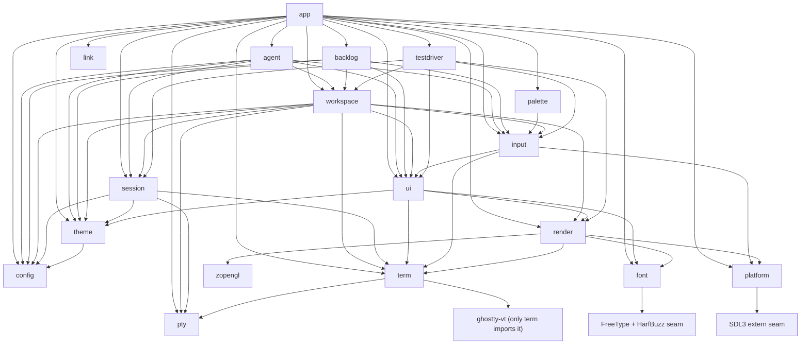

# Conduit — Code Architecture

How Conduit's code is organised. This is the document a later task builds against: it names
every module, says what it owns and what it must never do, fixes the direction dependencies
point, and records the two external seams the spikes settled.

| Question | Source of truth |
|---|---|
| What should the product do? | `CONDUIT.md` |
| What counts as done? | `backlog/tasks/*` acceptance criteria |
| Coding rules, toolchain, invariants | `AGENTS.md` |
| Why Ghostty is consumed as `ghostty-vt` | `decision-1`, evidence in `doc-1` |
| Why SDL3 + OpenGL 3.3 core | `decision-2`, evidence in `doc-2` |
| How the code is organised | this file |

Read this with `AGENTS.md` open. Where the two disagree, stop and resolve it with the user
rather than picking a side (CONDUIT.md §14).

**How to read the claims below.** Every rule here is quoted or derived from `AGENTS.md`,
`CONDUIT.md`, `decision-1` and `decision-2` (with `doc-1`/`doc-2` as their evidence), or from a
backlog task's acceptance criteria. Two labels are used and they matter:

- **(rule)** — stated in one of those documents. Changing it needs the user's agreement and a
  decision record.
- **(convention)** — this document's choice, made so two agents do not invent two layouts. Safe
  to change; if you change it, change it here too.

Anything genuinely undecided is collected in [§9 Undecided](#9-undecided) instead of being
guessed at.

---

## 1. Repository layout

```
Conduit/
├── .github/workflows/
│   └── linux-e2e.yml    checked-in TASK-25 Linux gate; remote acceptance evidence pending
├── build.zig            root build: modules, deps, install/run/test/font-check steps
├── build.zig.zon        pinned deps: ghostty @5dc28bb8, SDL, zopengl
├── e2e/
│   ├── runner.zig       isolated scripted-scenario runner and artifact collector
│   └── scenarios.zig    declarative real-input TASK-25 scenarios
├── src/
│   ├── main.zig         the app module: entry point, process lifetime, event loop, wiring
│   ├── platform.zig     window, input and clipboard OS seam
│   ├── pty.zig          PTY abstraction and backends
│   ├── term.zig         ghostty-vt wrapper
│   ├── link.zig         bounded terminal-link detection and parsing
│   ├── render.zig       GPU surface, draw, present, capture
│   ├── font.zig         discovery, shaping, glyph atlas
│   ├── ui.zig           four primitives, semantic tree, hit testing
│   ├── input.zig        key/mouse encoding, actions, keybindings
│   ├── workspace.zig    workspace/session/tab/pane lifecycle and ExecutionContext owner
│   ├── session.zig      PTY + terminal state for one live terminal
│   ├── config.zig       settings file, defaults, hot reload
│   ├── theme.zig        palette and colour schemes
│   ├── agent.zig        adapter interface + Claude Code / Codex / Pi
│   ├── backlog.zig      backlog.md data layer
│   ├── palette.zig      allocation-bounded command search and chord formatting
│   ├── testdriver.zig   in-app automation protocol core
│   └── conduit_test.zig external conduit-test executable composition root
├── assets/              files embedded into the binary by build.zig, with their licences
│   ├── fonts/           bundled JetBrains Mono fallback face (OFL)
│   ├── linux/           freedesktop desktop entry and scalable application icon
│   ├── shell-integration/  Conduit's own bash, zsh, fish scripts (OSC 7 / OSC 133), injected per shell
│   └── THIRD-PARTY-LICENSES/  FreeType and HarfBuzz notices
├── docs/                this file and reports that belong to the repo, not a task
└── spikes/              THROWAWAY. Prototypes from TASK-2 and TASK-3.
```

Rules for this tree:

- One module per file, `snake_case` file names, `TitleCase` types, `camelCase` functions
  (`AGENTS.md`, coding standards).
- A module grows sub-modules in `src/<name>/` once one file stops being readable; the root file
  stays the module's public surface.
- `spikes/` is never referenced from the root build and never absorbed into `src/` (doc-2 calls
  the TASK-3 prototype "self-contained, throwaway, not part of the project build"). Its build
  output is generated noise.
- Every module exists from TASK-4 as a scaffold with at least one unit test (TASK-4 AC #2), even
  when its feature is a non-goal for v0.1. A scaffold that implements nothing is honest; a
  feature that quietly ships early is not.
- `main.zig` is the `app` module and the executable's root module — there is no separate
  `src/app.zig`. Every other module gets `src/<name>.zig`.
- A module is wired into `zig build test` when its file exists; a module with no file is not a
  missing build entry, it is an unfinished task.
- SDL3 is part of the normal build graph. `wireThirdPartySeams` resolves the pinned
  `castholm/SDL` artifact, gives `platform` the translated `sdl` module, and links SDL3 through
  that module. `zig build`, `run`, and the module tests therefore exercise the same seam the app
  uses; linking SDL does not itself create a window or require a display.

---

## 2. The module list

The list is fixed by `AGENTS.md` (section "Module layout") and `CONDUIT.md` §4. Each entry
below gives what the module owns, what it must never do, and the modules it may depend on —
nothing else is a legal dependency.

### `app`

- **Owns** process lifetime and top-level composition: parse `std.process.Init`, start scoped
  logging (TASK-6), construct every module once with explicit allocators, run the event loop, and
  shut down in reverse order. It is the only module that knows the whole module list. It projects
  the current `Workspace` and its tabs into the semantic tree, owns the sidebar's visible width,
  and adapts named UI actions to workspace selection and grid geometry. TASK-29 also gives this
  composition layer the transient rename `Input`, close-confirmation overlay and pointer-drag
  state; durable tab identity, order, labels and attention remain in `workspace`. TASK-30 adds a
  renderer registry with one retained `render.Grid` per pane, including panes in hidden tabs, a
  full-canvas overlay compositor, pane/divider semantic projection and transient divider-drag and
  pending-pane-close state; pane/session identity and tree geometry remain in `workspace`.
  TASK-31 adds the centered command-palette semantic surface, query and argument `Input` state,
  modal pointer/key ownership and nested command/argument presentation. Search and recency logic
  remain in `palette`; action definitions and invocation validation remain in `input`. TASK-32 adds
  a retained scratchpad grid, hidden/50-percent/90-percent presentation state and an
  independent interactive-shell specification plus asynchronous start/restart slot. The permanent
  session and its child remain workspace-owned; `app` owns only their presentation and spawn-job
  coordination. TASK-33 replaces the single presentation with an ordered `WorkspaceRegistry` and
  one `WorkspacePresentation` bundle per stable workspace key. Only the selected bundle is drawn
  or receives user input, but pumping and asynchronous terminal/scratchpad jobs retain their
  initiating workspace key so hidden workspaces continue running without selection redirecting
  their results.
- **Tab actions.** User commands are `tab.new`, `tab.close`, `tab.rename`, `tab.previous`,
  `tab.next`, `tab.goto` and `tab.move`. Semantic pointer paths use `tab.activate` and
  `tab.reorder`; the overlays complete through `tab.rename.commit`/`tab.rename.cancel` and
  `tab.close.confirm`/`tab.close.cancel`. Sidebar rows and lifecycle footer text are clickable,
  rename is the existing `ui.Input` primitive, and confirmation is a `ui.Surface` with clickable
  `InteractiveText` choices — no extra widget or parallel interaction model is introduced.
- **Pane actions.** `pane.split`, `pane.focus`, `pane.resize`, `pane.zoom` and `pane.close` are the
  keyboard and sidebar command surface. Semantic pane clicks dispatch `pane.activate`; one-cell
  semantic dividers dispatch `pane.resize` while pointer motion supplies their signed cell delta.
  Splits copy the focused session's tracked cwd (falling back to workspace cwd) before asynchronous
  `ExecutionContext` spawn. Close uses the tab close modal for a live child without current OSC 133
  idle evidence; a non-final close removes the pane, its renderer and its session, while the final
  pane delegates to the tab close policy. Before an action adopts another live session, `app`
  flushes terminal responses and user input in their defined order; if encoded, staged, committed,
  paste or response debt remains, the transition is deferred with the old session still active.
  Once the UI claims a left-button press, `app` retains that gesture through motion and release,
  including a pane activation deferred by that debt, so no later event leaks to the old terminal.
- **Palette actions.** `palette.open` presents a centered semantic `Surface` with a query `Input`
  and clickable `InteractiveText` rows for every registry definition whose palette metadata is
  present. Command+Shift+P binds it on macOS; Ctrl+Shift+P binds it on Linux and Windows. Arrow
  keys or Tab move selection, Enter or a row click dispatches through the same action registry,
  and Escape or an outside click closes it. Fixed-choice and free-text argument metadata open a
  nested modal step before dispatch. `palette.dialog`, `palette.query`, indexed command/choice
  rows, `palette.prompt` and `palette.argument` are all registered in the one semantic tree. The
  palette owns the complete pointer gesture and every key while open, so neither an outside-click
  release nor unbound input reaches content underneath.
- **Scratchpad actions.** `scratchpad.toggle-50` and `scratchpad.toggle-90` present or hide a
  full-width bottom dock at the requested fraction. `scratchpad.restart` starts a fresh independent
  interactive shell and atomically replaces the old one only after the new PTY is ready;
  `scratchpad.hide` and Escape remove only the presentation. The semantic surface registers stable
  `scratchpad`, `scratchpad.terminal`, `scratchpad.restart` and `scratchpad.hide` ids. While visible,
  terminal input is routed to the scratchpad and the dock owns outside/border pointer gestures so
  none leak to the panes behind it.
- **Workspace actions.** `workspace.create`, `workspace.rename`, `workspace.switch` and
  `workspace.close` are palette-visible commands, while sidebar rows dispatch
  `workspace.activate` and the confirmation surface dispatches `workspace.close.confirm` or
  `workspace.close.cancel`. Create accepts a directory, activates an existing workspace for the
  same normalized directory, or starts an independent terminal and reserved scratchpad through
  the new workspace's `ExecutionContext`. Every pane, divider, tab and scratchpad semantic id is
  qualified by its stable workspace key. A transition first flushes retained terminal input and
  response debt; close then selects a surviving workspace, waits for outstanding start jobs to
  settle, and releases the removed workspace's complete ownership graph. Removing the final
  workspace requests orderly application shutdown.
- **Terminal-link actions.** The landed URL/OSC 8 slice of TASK-34 copies only visible link
  targets into bounded app-owned storage, projects them once as stable `terminal_link`
  `InteractiveText` elements, and routes `terminal.open-link` through `platform.openUrl` only
  after an explicit Command-click on macOS or Ctrl-click on Linux/Windows. Plain clicks, drags and
  DEC mouse reports remain terminal gestures. Hover under the modifier adds only a semantic
  underline decoration. OSC 8 metadata is authoritative, including malformed or non-HTTP targets
  that mask lexical URL detection, and stable ids use a domain-separated 128-bit SHA-256
  fingerprint. Visible lexical file references (`path`, `path:line`, `path:line:col`) are
  registered the same way under the `.file` fingerprint domain, which covers the visible path
  spelling, line and column. The same modified click on one snapshots the source session's
  tracked OSC 7 cwd (falling back to the workspace cwd), resolves a relative spelling against it
  without canonicalizing, stat'ing or reading anything, creates an ordinary tab labelled with the
  bounded file name, and spawns the decision-5 built-in editor as shell-free argv
  `vi +<line> -- <path>` (or `vi -- <path>`) through the workspace `ExecutionContext` with that
  cwd; a detected column is identity only and is never passed. The job owns that argv until its
  worker joins. Text that cannot be dispatched safely is logged at debug level without its
  contents and ignored. `EditorSpawnObserver` is the deterministic-check seam that sees the exact
  argv and cwd before the real spawn. In command mode the loop no longer treats a tab whose spawn
  worker is still in flight as a vanished child.
- **Terminal-search actions.** TASK-36 owns the inline search surface, query `Input`, bounded
  polling state, selected match and semantic highlight projection.
  `search.open`, `search.close`, `search.next`, `search.previous`, `search.toggle-case` and
  `search.toggle-regex` and `search.activate-match` share the action registry and mouse/key paths.
  The terminal owns match discovery and viewport reveal. Regex search uses the statically bundled,
  Ghostty-pinned Oniguruma source behind the same bounded cursor/page contract as literal search.
- **Never** duplicate workspace/session/tab/pane records or semantic element state, implement
  behaviour owned by a lower module, call SDL, GL or an OS syscall directly, or hold state another
  module owns. Product views are compositions of model data and the four `ui` primitives.
- **May depend on** `agent`, `backlog`, `config`, `font`, `input`, `link`, `palette`, `platform`, `pty`,
  `render`, `session`, `term`, `testdriver`, `theme`, `ui`, and `workspace` — every other Conduit
  module.
- **Root** `src/main.zig` — this module *is* the executable's root module, so there is no
  `src/app.zig`.
- **(convention)** The event loop lives in `app`, i.e. in `src/main.zig`. `platform` *produces*
  events; it does not run the loop.
- **Lands** M0 — TASK-4, TASK-6; M3 — TASK-28 (workspace/sidebar composition and action adapters),
  TASK-29 (tab lifecycle actions and transient overlays), TASK-30 (pane composition, interaction
  and rendering), TASK-31 (command-palette composition and modal interaction), TASK-32
  (scratchpad process coordination, presentation and interaction), TASK-33 (multi-workspace
  presentation, action routing and lifecycle), TASK-34 (URL/OSC 8 opening and file-reference
  editor tabs), TASK-36 (bounded literal and regex search UI).

### `platform`

- **Owns** window, input and clipboard OS calls. `platform.window`: window creation, the GL
  context, HiDPI and scale, window visibility, IME composition and input area, event translation,
  the hidden-but-real headless window, optional fixed display scale, application identity metadata
  and runtime backend/density reporting. `platform.clipboard`: native copy/paste, primary
  selection, and the OSC 52 policy. `platform.openUrl` is the sole desktop URL-opening seam. PTY
  and font-discovery backends own
  their narrow OS calls, as architecture invariant 10 permits. SDL3 arrives through the
  `castholm/SDL` build package plus a thin `@cImport`/extern seam Conduit owns (decision-2).
- **Never** contain product logic, layout or workspace behaviour; let an SDL handle escape above
  the seam; place an OS conditional in a shared module (P12, invariant 10 — the only permitted
  OS conditionals are *selecting* a backend).
- **May depend on** the SDL3 extern seam and nothing else in this list. `render` uses the window
  and context `platform` hands it, never the reverse.
- **Lands** M0/M1 — TASK-3 (the choice), TASK-7 (window and context), TASK-15 (clipboard);
  M2 — TASK-22 (hidden window and fixed scale); per-OS polish M5 — TASK-48, TASK-49, TASK-50.

### `pty`

- **Owns** the PTY abstraction and its backends: POSIX first (TASK-8), Windows ConPTY later
  (TASK-16). Spawn, resize, read, write, close, and the OS process handle.
- **Never** know about sessions, workspaces, agents or UI (`AGENTS.md`, module layout). Never
  assume the local machine: a spawn always arrives through the workspace's ExecutionContext (P7),
  so this module never opens a workspace-scoped path itself.
- **May depend on** no other Conduit module. Its platform-specific backends own the syscalls they
  need, as permitted by architecture invariant 10.
- **Lands** M1 — TASK-8, TASK-16.

### `term`

- **Owns** the wrapper around the `ghostty-vt` Zig module: terminal construction, feeding PTY
  bytes through `Stream`, resize, damage tracking, cell and selection access, search, and
  Conduit's own style describer. It exposes OSC 8 target metadata without interpreting product
  actions and implements bounded literal and retry-limited regex full-scrollback search, ordered
  results, viewport reveal and generation invalidation after terminal output or resize. See
  [§4.1](#41-the-ghostty-vt-boundary).
- **Never** render, load fonts, own a PTY, or take a UI concern. Never reach for the macOS
  embedding library (decision-1). Never rely on `ghostty_vt.Style`'s `{f}`: it does not compile
  on Zig 0.16 (decision-1 consequences, doc-1).
- **May depend on** `pty`, the external `ghostty-vt` package and the statically bundled Oniguruma
  source used only by the search boundary.
- **(convention)** `term` is the *only* module that imports `ghostty-vt`. `input` takes key and
  mouse encoding from `term`, so the third-party module never appears in two import tables.
- **Lands** M0 — TASK-2 (the boundary); M1 — TASK-9 (state wired to the PTY); partial M3 —
  TASK-34 (OSC 8 metadata), TASK-36 (literal and regex search).

### `link`

- **Owns** allocation-free, bounded detection and parsing of terminal link candidates. It
  recognizes HTTP(S) URLs and explicit file-reference forms, and applies OSC 8 precedence and
  masking rules supplied by the caller.
- **Never** open a URL or editor, resolve a path against a workspace, read a file, own semantic
  elements, or retain borrowed terminal bytes. Those are app/platform/workspace responsibilities.
- **May depend on** no other Conduit module.
- **Lands** M3 — TASK-34. The URL, OSC 8 and file-reference detector is integrated; `app`
  performs cwd resolution and the decision-5 editor dispatch above it.

### `render`

- **Owns** the GPU surface and everything drawn into it: the FBO the renderer *always* draws
  into, shaders and programs, viewport and scissor, `present`, `Surface.read` (`glReadPixels`),
  and Conduit's deterministic RGBA8 PNG encoder. The grid renderer and the UI renderer are two
  draw sequences into that one target — that is P6 expressed as call order (doc-2). Its terminal
  origin is independently configurable in whole columns: TASK-28 shifts terminal cells, cursor
  and decorations to the right while the semantic-tree overlay keeps full-canvas coordinates.
  TASK-30 adds absolute, scissored pane viewports and independent retained grid state for each
  pane. A dedicated overlay `Grid` adopts the current font cell, baseline and ascent, then draws
  the semantic-tree overlay once across the full canvas after all visible pane grids.
- **Never** own product or layout state; it draws terminal cells or UI primitives supplied by
  callers. Never call SDL event or window functions (those are `platform`'s). Never block on IO.
- **May depend on** `font` (glyphs), `platform` (window and context), `term` (terminal cells and
  damage), and the external `zopengl` GL bindings.
- **Lands** M1 — TASK-7 (FBO and present), TASK-11 (grid renderer); M2 — TASK-22 (`capture`);
  M3 — TASK-28 (terminal inset origin and full-canvas overlay geometry), TASK-30 (independent pane
  viewports and the font-metric-aware overlay compositor).

### `font`

- **Owns** discovery, loading, shaping and the glyph atlas, plus the per-OS discovery backends
  (macOS, Windows, Linux/fontconfig, bundled fallback — CONDUIT.md §8). With `platform` and `pty`
  it is one of the only places an OS conditional is allowed.
- **Never** know about sessions, workspaces, agents or UI (`AGENTS.md`). Never draw anything
  itself. Never let a missing glyph turn a terminal into boxes (CONDUIT.md §8).
- **May depend on** no other Conduit module, plus the external FreeType and HarfBuzz seam.
  Platform-specific discovery is selected inside `font`.
- **Lands** M1 — TASK-10 (v1); M4 — TASK-39 (v2), TASK-40 (picker).

### `ui`

- **Owns** the four primitives — `Text`, `InteractiveText`, `Surface`, `Input` — and the single
  semantic element tree they register into: stable id, role, label, state, bounds, action. Plus
  hit testing, hover, focus, and the terminal-styled UI renderer. Product selection is a retained
  semantic state independent of transient hover, focus and press state; render projections and
  JSON inspection derive it from the same registered element.
- **Never** add a fifth primitive, a widget kind, an icon or native chrome (P4, invariant 2).
  Never keep a second representation of the tree (P5, invariant 3). Never draw the UI as ANSI
  through the terminal (P6). Never discover what is on screen by some path other than the tree.
  Never import `session`, `agent`, `backlog` or `workspace`: `ui` is the primitive layer, and
  every product view is composed above it (P4).
- **May depend on** `term` and `render` (`AGENTS.md`, module layout), plus `font` for glyphs and
  `theme` for colours.
- **Lands** M2 — TASK-18 (primitives), TASK-19 (tree, hit testing, hover, focus); M3 — TASK-28
  (semantic selected state used by the first composed workspace view).

### `input`

- **Owns** turning raw events into intent: keyboard encoding and IME, mouse reporting and text
  selection gestures, the action registry, keybindings, and routing. Every command is a named
  action in the registry (invariant 4, P3). Each definition also carries validated user-facing
  palette visibility and an optional fixed-choice or free-text argument contract; semantic-only
  actions explicitly opt out.
- **Never** swallow a key Conduit did not bind (P10, invariant 8). Ctrl+C with no selection is
  always SIGINT. Never expose a command that is not in the registry, and never special-case a
  harness. Never deliver one physical keystroke twice: SDL follows a printable key event with a
  text-input echo, and `KeyTextEcho` (TASK-71) drops the echo that exactly repeats the text the
  key already wrote, while unrelated text input (IME commits, dead keys) is still committed.
- **May depend on** `ui` (hit testing, focus), `term` (key and mouse encoding, terminal writes),
  `platform` (raw events, clipboard).
- **Lands** M1 — TASK-12 (encoding and IME), TASK-14 (mouse and selection); M2 — TASK-20 (routing,
  registry, keybindings); M3 — TASK-28 (platform-specific sidebar toggle, resize and focus
  bindings: Command+Shift+B/Left/Right/Down on macOS, Ctrl+Shift+B/Left/Right/Down on Linux and
  Windows), TASK-29 (tab lifecycle bindings), TASK-35 (`Shift+F10` opens the terminal context
  menu at the cursor on both profiles; `pointerMods` is public so the app can ask `term` who owns
  a right press). Down explicitly focuses the active tab; focus
  navigation plus activation then provides the keyboard counterpart to clicking a workspace or tab
  row without making plain Tab leave the terminal. TASK-30 adds the pane action bindings below;
  TASK-31 adds palette metadata, structured invocation arguments and the open binding.
- **TASK-29 defaults.** macOS uses Command+T/W for new/close, F2 for rename,
  Command+Shift+`[`/`]` for previous/next and Command+1…9 for direct selection. Linux and Windows
  use Ctrl+Shift+T/W, F2, Ctrl+PageUp/PageDown and Alt+1…9. All three use Alt+Shift+Up/Down for
  keyboard reorder. These resolve to `tab.new`, `tab.close`, `tab.rename`, `tab.previous`,
  `tab.next`, `tab.goto` and `tab.move`; pointer activation and drag dispatch named actions too.
  The command palette enumerates the same registry; TASK-29 does not build a second command
  surface.
- **TASK-30 defaults.** macOS uses Command+D and Command+Shift+D for split right/down,
  Command+Alt+Arrow for directional focus, Command+Ctrl+Arrow for directional resize,
  Command+Shift+Enter for zoom and Command+Shift+X for close. Linux and Windows use
  Ctrl+Shift+E/O, Alt+Arrow, Ctrl+Alt+Arrow, Ctrl+Shift+Enter and Ctrl+Shift+X respectively. These
  resolve to `pane.split`, `pane.focus`, `pane.resize`, `pane.zoom` and `pane.close`; pane clicks
  dispatch `pane.activate`, while divider drags dispatch `pane.resize` with divider id and delta.
- **TASK-31 defaults.** macOS uses Command+Shift+P and Linux/Windows use Ctrl+Shift+P for
  `palette.open`. The palette displays every binding for each exposed command in platform binding
  order. The open and internal activation actions are semantic plumbing and do not list themselves.
- **TASK-32 defaults.** macOS uses Command+Backtick for the 50-percent scratchpad and
  Command+Shift+Backtick for 90 percent. Linux and Windows use Ctrl+Backtick and
  Ctrl+Shift+Backtick respectively. The bindings resolve to `scratchpad.toggle-50` and
  `scratchpad.toggle-90`; the dock's clickable controls dispatch `scratchpad.restart` and
  `scratchpad.hide` through the same registry.
- **TASK-34 link gesture.** Command on macOS or Ctrl on Linux/Windows is the native terminal-link
  modifier. It changes decoration and activates `terminal.open-link` only over a semantic
  `terminal_link`; an unmodified pointer gesture and modified gestures elsewhere retain normal
  terminal ownership.
- **TASK-36 search defaults.** Command+F on macOS or Ctrl+Shift+F on Linux/Windows opens
  `search.open`. Enter/F3 and Shift+Enter/F3 navigate next/previous, Alt+C toggles case, Alt+R
  toggles regex, and Escape closes. Both toggles are also clickable semantic controls.

### `palette`

- **Owns** the allocation-bounded search model over borrowed action definitions, run-local MRU
  counters, deterministic result selection and formatting of all bound key chords. It allocates
  fixed result/score/recency storage once at construction; query refresh, navigation and recency
  updates allocate nothing. Fuzzy search is an ASCII-case-insensitive subsequence match over both
  the user-facing label and stable action name, with deterministic registration-order tie breaks.
- **Never** compose UI, dispatch an action, own registry definitions, or keep product/workspace
  state. It only returns borrowed definition indices and presentation text to `app`.
- **May depend on** `input` and no other Conduit module.
- **Lands** M3 — TASK-31.

### `workspace`

- **Owns today** `Workspace`, with its copied name and working directory, one owned type-erased
  `ExecutionContext`, a registry of every session created in that context, the complete tab
  lifecycle and each tab's binary pane tree. It also defines `WorkspaceRegistry`, the ordered
  owner of independent `Workspace` records. Every leaf binds one workspace-owned session; branch
  nodes retain split direction, divider identity and resize weight. The Local implementation is
  the only production call to `pty.spawn`; SSH and WSL supply later implementations of the same
  vtable.
- **Owns eventually** the rest of each product aggregate described by CONDUIT.md §3: theme and
  state metadata, agent and backlog state, and their composed views.
- **Workspace registry.** Each heap-allocated record remains address-stable until removal and has
  a monotonic, non-reused `WorkspaceKey`; mutable display names are not identities. Insert and
  rename validate duplicates atomically, activation changes only the selected key, and removal
  selects the following record (or the preceding one when the removed record was last). Removal
  fully deinitializes that workspace and reports a PTY signalling error only after releasing all
  of its sessions, scratchpad and execution-context ownership.
- **Session registry.** Heap-allocated records keep stable addresses, while `SessionId` values are
  monotonic and never reused. A closed record retains its immutable kind and exited lifecycle;
  a live `Session` owns its terminal and optional PTY independently of any view.
- **Tab lifecycle.** Heap-allocated `Tab` records retain stable addresses, monotonic non-reused
  `TabId` values and stable `tab.<id>` semantic ids while their sidebar order changes. Creation
  atomically adds and selects a childless human-terminal session as the root pane; rename replaces
  only the copied label; move reorders the same record. Closing the active tab selects the next row,
  or the previous row when the closed tab was last. Closing the final tab leaves no selection so
  `app` can represent an empty model; the product path instead requests orderly app shutdown and
  lets normal reverse-order teardown release every pane session and the scratchpad.
- **Pane lifecycle.** `PaneId` and `DividerId` values are monotonic and never reused. Right/down
  splits replace one leaf with a binary branch, focus the new session-backed leaf and support
  arbitrary nesting. Layout traversal reserves a one-cell divider and at least 2x2 terminal cells
  for every leaf; impossible splits are refused and resize clamps at those minimums. Directional
  focus selects the nearest pane spatially, divider drags move a named branch, and keyboard resize
  grows the focused pane at its nearest edge. Zoom presents only the focused leaf across the tab
  without changing the tree, weights or session lifetime. Closing a non-final leaf releases its
  session and promotes its sibling subtree; closing the final leaf delegates to tab close. Pane
  session creation validates geometry and limits and completes every allocation before committing
  the registry, tree, focus, zoom or monotonic counters, so refusal or allocation failure consumes
  no session, pane or divider id.
- **Attention.** A background session that produces bytes latches an allocation-free `* ` prefix;
  BEL raises it to `! ` and ordinary output cannot lower it. Activating the tab clears either
  prefix. These are terminal activity indicators only. Coding-agent state and notifications remain
  TASK-56 and must not be inferred from terminal bytes.
- **Scratchpad boundary.** Construction reserves exactly one childless `.scratchpad` session and
  rejects attempts to create or close another. The app starts its independent interactive shell
  asynchronously through the workspace's `ExecutionContext`, and normal view-independent pumping
  keeps the child and terminal alive while the dock is hidden. Restart first spawns a replacement,
  resizes it to the current scratchpad grid, then atomically swaps the terminal/PTY while retaining
  the permanent session id and `.running` lifecycle; every pre-commit failure leaves the old shell
  untouched. The TASK-28 tab registry rejects the scratchpad, so the sidebar does not turn it into
  an ordinary tab.
- **Spawn boundary.** `ExecutionContext` owns and destroys its erased implementation. A worker may
  borrow an `ExecutionContext.Ref` and return the PTY for owner-thread `attachChild`. For a new
  tab, `app` snapshots and owns a copy of the invoking session's current validated OSC 7 cwd before
  asynchronous spawn; pane splits use the same rule from the focused pane. When no session cwd is
  known either path copies the workspace cwd. The job retains both that copy and the initiating
  session id, so a later selection or terminal feed cannot redirect the child or invalidate its
  path. The borrowed context cannot destroy its owner and must not outlive the workspace.
- **Close policy boundary.** `Workspace.closeTab` and `Workspace.closePane` perform deterministic
  ownership cleanup; neither guesses whether a process is safe to terminate. `app` asks for
  confirmation for an attached live child whenever
  foreground/idle state is unknown or a process may be running. A current OSC 133 prompt is the
  only positive evidence that permits immediate close. Cancel keeps the tree and session untouched;
  confirm closes the requested stable pane or tab id even if focus changed.
- **PTY service boundary.** `Workspace.pump` makes one bounded, allocation-free pass over every
  live session, whether or not a view shows it. It drains child output, delivers terminal events
  synchronously before a later feed can invalidate their borrowed payloads, and flushes terminal
  protocol replies. Each `Session` retains reply remainders across short, zero and failed writes;
  the app's wait budget and readiness poll account for every attached child, not only the visible
  one. An exited child stays pumpable until a zero-byte drain proves its final output queue empty,
  then becomes quiescent.
- **Teardown.** Every live session is closed and destroyed before the execution context, copied
  cwd and name. Cleanup continues after a PTY hangup error and returns the first such error only
  after all owned resources have been released.
- **Never** assume the local machine — no direct spawn, no local path or file read where the
  workspace could be remote (P7, invariant 5). Never terminate a session to hide it (P8,
  invariant 6). Never let an agent or the control API own, target or take over the scratchpad
  (P9, invariant 7).
- **May depend on** `pty`, `session` and `term` for today's owner, tab index and pane trees. Composed
  workspace views live at the `app` boundary and may also use `config`, `input`, `render`, `theme`
  and `ui`; `agent` and `backlog` depend on `workspace`, never the reverse.
- **Lands** M3 — TASK-27 implements the nonvisual owner, Local execution context and session
  registry; TASK-28 adds the provisioned-tab index and first visible workspace interaction;
  TASK-29 completes the flat tab lifecycle, cwd inheritance, attention and close policy; TASK-30
  adds binary pane ownership, layout, navigation, resize, zoom and close; TASK-32 starts and
  atomically restarts the permanent scratchpad; TASK-33 adds the ordered multi-workspace registry
  and its app-facing lifecycle. TASK-34 links (including file-reference editor tabs, which are
  ordinary tabs spawned through the workspace `ExecutionContext` with a job-owned argv) and
  TASK-36 search are composed above this owner; TASK-35 remains an unfinished workspace
  interaction.

### `session`

- **Owns** one live terminal: its stable terminal allocation, optional attached PTY, explicit kind
  (`human_terminal`, `scratchpad` or `agent_terminal`), and the rule that it outlives its view
  (CONDUIT.md §13).
- **Never** stop the PTY because a tab, pane or the scratchpad is hidden; hiding is never
  termination (P8, invariant 6). Never spawn a process or own layout; `workspace` spawns through
  its context and transfers the returned PTY into a starting session on the owner thread.
- **Pumping and teardown.** `drainChildOutput` makes one nonblocking, allocation-free bounded pass
  and feeds terminal state without reference to a view. `deinit` asks an attached child to hang up,
  destroys the PTY before the terminal, and reports a signalling failure only after cleanup.
- **May depend on** `pty` and `term`.
- **Lands** M1 — TASK-9 (terminal state wired to the PTY); M3 — TASK-27 (kinds, detached creation,
  bounded pumping and workspace-owned lifecycle).

### `config`

- **Owns** the settings file, its schema, its validation, hot reload, and the built-in defaults
  every other module reads when there is no file.
- **Never** be required for v0.1 to start: v0.1 has no config file and resolves every value to a
  built-in default (CONDUIT.md §5). Never treat a malformed file as fatal — malformed external
  input must never crash the app (§11).
- **May depend on** no other Conduit module. Workspace-scoped state belongs to `workspace`;
  *how* workspace state is persisted is TASK-65.
- **Lands** M4 — TASK-37. Explicitly a v0.1 non-goal. TASK-35 added the first resolved setting
  declaration ahead of the file layer: `RightClick` (`mouse.right_click`, built-in `menu`, with
  `paste` supplied through the session layer by the `--right-click=` launch flag).

### `theme`

- **Owns** the colour model: the terminal palette and the UI colours that `ui` and `render`
  consume, plus the built-in colour schemes.
- **Never** introduce a colour path outside `theme` — two renderers, one palette (P6). Never
  draw anything.
- **May depend on** `config`; `ui` and `render` read it downward.
- **Lands** M4 — TASK-38. Explicitly a v0.1 non-goal.

### `agent`

- **Owns** the common adapter interface (spawn, observe state, read and write the prompt where
  supported, surface notifications and permission requests, expose the transcript as structured
  elements — CONDUIT.md §13), the agent state model, and the three adapters: Claude Code
  (TASK-53), Codex (TASK-54), Pi (TASK-55).
- **Never** let harness specifics escape an adapter (P11, invariant 9: nothing outside `agent/`
  may special-case a harness). Never let transcript, prompt or permission text trigger an action
  without an explicit user gesture (§11). Never own or target the scratchpad (P9).
- **May depend on** `config`, `input`, `session`, `theme`, `ui`, and `workspace`. An agent's own
  PTYs are sessions spawned in the workspace's ExecutionContext, and its views are composed from
  the four `ui` primitives.
- **Lands** M6 — TASK-51 – TASK-61. Explicitly a v0.1 non-goal. What the harnesses actually
  expose is [undecided](#9-undecided) (TASK-51).

### `backlog`

- **Owns** the backlog.md data layer — projects, tasks, milestones, statuses, dependencies — and
  the linking of a backlog task to an agent (TASK-64). It owns *data*; the board and task-detail
  views are `ui` compositions of that data.
- **Never** treat backlog file content as trusted data — it is untrusted text and must not be able
  to trigger actions (§11). Never keep a second copy of backlog state that can disagree with the
  file.
- **May depend on** `config`, `input`, `theme`, `ui`, and `workspace`. Reads arrive through the
  workspace's ExecutionContext, and backlog views are composed from the four `ui` primitives.
- **Lands** M7 — TASK-62 – TASK-64. Explicitly a v0.1 non-goal.

### `testdriver`

- **Owns** the in-app automation server: JSON-RPC over a Unix domain socket, or a Windows named
  pipe, local only, disabled in release builds unless explicitly enabled. Methods: `inspect`,
  `click`, `ctrl_click`, `double_click`, `right_click`, `drag`, `key`, `type`, `scroll`,
  `terminal_text`,
  `wait_for`, `get_logs`, `screenshot`, `quit`. It runs on the app's main thread inside the same
  event loop, so driver calls are FIFO-ordered (CONDUIT.md §10, doc-2).
- **Never** bypass the UI: `click` resolves an id in the semantic tree and generates the same
  mouse event a human click does; `key`/`type` go through the real input path. Never assert —
  assertions are written by the caller. Never be reachable over the network. Never reach into app
  state to set up or assert what a user could do or see (`AGENTS.md`, testing standards).
- **May depend on** `input` (the real input path), `render` (`capture`), `session`, `ui` (the
  semantic tree), and `workspace`.
- **Lands** M2 — TASK-21 – TASK-25.

TASK-21's implemented wire contract is newline-delimited JSON-RPC 2.0. Requests are capped at
1 MiB, responses at 4 MiB, and the main/transport queues at 64 entries. The endpoint exists only
when `--test-driver=<endpoint>` is supplied. Linux and macOS use a mode-0600 AF_UNIX socket;
Windows uses a one-instance, remote-rejecting named pipe with a protected DACL granting read/write
only to the process token's logon SID. Blocking transport work stays on its worker; parsed requests,
semantic queries, waits and input injection execute on the main thread. Synthetic input is
acknowledged only after a labelled SDL FIFO barrier. `terminal_text` and terminal-text `wait_for`
accept the read-only targets `active` and `scratchpad`, defaulting to `active`. The explicit
scratchpad target resolves the reserved session even while hidden; input requests have no target
selector and continue through the real active-presentation path, so the driver cannot take over
the scratchpad.

TASK-22 implements the `screenshot` method. The main thread invalidates and immediately draws the
shared surface before synchronously reading the FBO, so the request observes the current app state.
It copies those top-down RGBA8 pixels into one bounded screenshot job; a worker performs PNG
compression and filesystem IO, creates parent directories, and opens the destination exclusively.
Only one driver screenshot may be in flight. Results are named `screenshot-0001.png`,
`screenshot-0002.png`, and so on under the run's artifact directory and are returned only after the
file is complete. `--test-artifact-dir=<dir>` supplies that directory; otherwise a test-driver run
generates a unique `conduit-artifacts-<run-id>` directory beneath the resolved log directory.

#### External `conduit-test` composition root

TASK-23 installs `conduit-test` next to `conduit`. It is a separate executable composition root,
not another product module and not an import edge into `app`: it combines `testdriver`'s wire
types with `platform`'s local client transport. By default it resolves the sibling installed
`conduit` executable; `launch --conduit <path>` is the explicit override for build trees and other
layouts.

Its command shape is:

```text
conduit-test [--root=<dir>] [--run=<id>] [--json] <command>
```

The `--root value` and `--root=value` forms are equivalent, as are both forms of `--run`. The
corresponding `CONDUIT_TEST_ROOT` and `CONDUIT_TEST_RUN` environment variables are fallbacks;
explicit flags win. Without a root, the client uses `conduit-test` beneath the first available of
`TMPDIR`, `TEMP`, or `TMP` (and `/tmp` on Unix), then canonicalizes it to an absolute path. A
later command derives the selected run's private paths from that root and the validated safe run
id, so independent agents can select runs without sharing process memory.

`launch` accepts `--width`, `--height` and `--scale`, defaults to a hidden window, and passes fixed
geometry plus the private endpoint, artifact directory and log directory to Conduit. `--visible`
is the opt-in debugging form. `--no-child` and `--command <line>` provide deterministic terminal
process choices for automation. On Linux, when neither a display nor an existing SDL video-driver
choice is present, launch selects SDL's offscreen driver; this is only an environment fallback and
does not change Conduit's hidden real-window/GL/FBO rendering path.

Every launch creates `<root>/<run-id>` with mode 0700 on Unix and separate `home`, `config`,
`data`, `state`, `cache`, `tmp`, `logs`, and `artifacts` children. The child receives matching
home, XDG/profile, temporary-directory, log and screenshot settings, so it cannot discover or
mutate the user's real config or state. Its stdout and stderr go to exclusive 0600 files in the
run directory. Its Unix driver endpoint is also inside the run directory; Windows uses the
protected local named-pipe transport from TASK-21.

The versioned `manifest.json` records the run id, endpoint, run/artifact/log paths, and captured
stdout/stderr paths. Conduit-test writes a private 0600 temporary manifest and atomically renames
it to the final name only after it connects and a silent real `inspect` call succeeds; a published
manifest therefore means the instance was ready, not merely spawned. Direct commands still derive
the validated run paths rather than trusting manifest text as executable input.

There is one direct command for every in-app method:

```text
inspect
click ID                    ctrl-click ID              double-click ID
right-click ID
drag FROM_ID TO_ID          key CHORD                  type TEXT
scroll DY [DX]              terminal-text [--target active|scratchpad]
                            screenshot
wait-for element ID STATE BOOL [TIMEOUT_MS]
wait-for terminal-text NEEDLE [TIMEOUT_MS] [--target active|scratchpad]
logs [MAX_BYTES]            quit
```

`STATE` is `exists`, `hovered`, `focused`, or `pressed`. The optional read-only terminal target
defaults to `active`; it applies only to `terminal-text` and its `wait-for` condition. In plain
mode, `launch` prints only the run id and later commands project their useful `ok`, text, path, or
inspect result. `--json` prints `{"run":"..."}` for launch and the raw JSON-RPC response for a
direct command. Argument, manifest, transport, protocol, timeout, and application failures all
produce a non-zero exit status.

A minimal shell interaction is therefore:

```sh
run_id="$(conduit-test launch --width 960 --height 640 --scale 1)"
conduit-test --run="$run_id" inspect
conduit-test --run="$run_id" type "printf READY"
conduit-test --run="$run_id" key ENTER
conduit-test --run="$run_id" wait-for terminal-text READY 5000
conduit-test --run="$run_id" screenshot
conduit-test --run="$run_id" quit
```

This is the CLI contract, not the larger build/change/inspect/assert agent workflow; TASK-26 owns
the worked documentation that combines the CLI and MCP surfaces into that loop.

#### Scripted E2E composition root

TASK-25 is in progress with a separate `conduit-e2e` composition root in `e2e/runner.zig`; it does
not import `app` or mutate application state directly. `zig build e2e` first installs
`conduit-test`, then passes that executable to the runner. Each declarative scenario launches a
fresh private run and performs every step through a separate CLI process, so clicks, key chords,
typing, waits, inspection and screenshots cross the same local test-driver boundary as an external
agent. The checked-in scenarios cover launch/prompt visibility, typed command/output, and copying
selected text from the palette `Input` before pasting and executing it in the terminal. A fourth
`terminal-links` scenario waits for a deterministic stable `terminal_link` semantic id, then runs
`conduit-test ctrl-click <id>` through the JSON-RPC driver and real SDL event queue before taking
its screenshot. A fifth `terminal-file-reference` scenario does the same for a `path:line`
reference and then waits for the new tab's sidebar row and for vi's quoted path in the active
terminal, proving the editor tab through the same external route.

The runner reports PASS/FAIL for every scenario without stopping at the first failure and writes a
run-unique suite directory beneath the explicit `--artifact-dir`. Each scenario retains
`runner.log`, `semantic-tree.json` and `application.log`; successful scenarios request their final
screenshot as a normal step, while a failed live scenario requests an additional current
screenshot before quit. `summary.json` records every scenario result. No scenario uses a sleep:
terminal and element assertions are bounded driver `wait-for` calls.

`.github/workflows/linux-e2e.yml` is the checked-in reusable Linux gate. It resolves the Zig pin
from `build.zig.zon`, checks formatting, builds, runs unit/integration tests, runs the clipboard
check without touching the display clipboard, then runs its checked-in real-window list and
`zig build e2e` under Xvfb. On any failure it is configured to upload the private artifact root.
The Xvfb block pins `SDL_VIDEODRIVER=x11`, includes `--links-test` and `--search-test`, and asserts
from each check's retained application log that SDL actually selected the X11 backend. No remote
Actions execution or artifact upload has yet been recorded as acceptance evidence. TASK-25
therefore remains in progress even though the runner and workflow are present locally.

#### MCP wrapper

TASK-24 extends the external `conduit-test` composition root with a bounded MCP server. It does not
add an import edge to `app` or expose a network listener: `conduit-test mcp` reads newline-delimited
JSON-RPC 2.0 from standard input and writes protocol responses to standard output. It supports the
2026-07-28 `server/discover` flow and legacy `initialize` clients at 2025-11-25 and 2025-06-18;
discovery advertises 2026-07-28 and 2025-11-25. Protocol discovery and tool traffic share that
single stdio connection. Diagnostics stay on standard error so they cannot corrupt framing.
`server/discover` returns a complete, private, zero-TTL description with server information,
instructions and `tools.listChanged: false`. Current `tools/list` results carry the same complete,
private, zero-TTL cache contract; current tool-call results are complete and identify the server
but are never treated as cached state.

The checked-in Claude Code project configuration is `.mcp.json`:

```json
{
  "mcpServers": {
    "conduit-test": {
      "type": "stdio",
      "command": "${CLAUDE_PROJECT_DIR:-.}/zig-out/bin/conduit-test",
      "args": ["mcp"]
    }
  }
}
```

Run `zig build` before starting a project MCP client; the configuration deliberately names the
workspace's installed build output rather than a globally installed or user-specific executable.
`${CLAUDE_PROJECT_DIR:-.}` uses Claude Code's stable project-root variable while retaining a
documented fallback during configuration expansion. Claude Code must still apply its normal
workspace trust/approval before launching this project server. Codex does not auto-load
`.mcp.json`; register the same local stdio server from the repository root instead:

```sh
codex mcp add conduit_test -- ./zig-out/bin/conduit-test mcp
```

Other MCP hosts need an equivalent local stdio command/argument entry. Pi has no built-in MCP
client, so it requires an MCP extension; without one, use the identical `conduit-test` CLI surface.
A single checked-in `.mcp.json` therefore does not activate all three harnesses. Restart a client
after rebuilding if it keeps the stdio server process alive.

The MCP tools mirror the complete CLI surface:

| Tool | Tool-specific arguments |
|---|---|
| `launch` | optional `root`, `conduit`, `width`, `height`, `scale`, `visible`, `no_child`, `command` |
| `inspect` | none |
| `click`, `ctrl_click`, `double_click`, `right_click` | `id` |
| `drag` | `from`, `to` |
| `key` | `chord` |
| `type` | `text` |
| `scroll` | `dy`, optional `dx` |
| `terminal_text` | optional read-only `target`: `active` (default) or `scratchpad` |
| `wait_for` | exactly one of `element: { id, state, equals }` or `terminal_text: { contains, target? }`; optional `timeout_ms`; terminal target defaults to `active` |
| `get_logs` | optional `max_bytes` |
| `screenshot` | none |
| `quit` | none |

Every direct tool accepts `root` and `run` selectors. Their requirements follow the negotiated
protocol rather than silently sharing state across eras:

- Current 2026-07-28 requests carry `_meta["io.modelcontextprotocol/protocolVersion"]` and
  `_meta["io.modelcontextprotocol/clientCapabilities"]`; the first is exactly `"2026-07-28"`, the
  second is an object, and `_meta["io.modelcontextprotocol/clientInfo"]` is optional. Every
  non-launch tool explicitly names its `run`, and the server is stateless between calls. `root` may
  be omitted only for the normal resolved test root; repeat a non-default launch root on later
  calls.
- A legacy initialized connection may omit `run` after a successful `launch`; that connection keeps
  the launched root/run selection. Explicit valid selectors override and update that legacy
  selection, so a legacy client can also reconnect to an existing run.

Selection is only routing metadata: requests still derive validated private paths exactly as the
CLI does and cross the same bounded local driver transport. `launch` returns the generated run id
in both protocol modes.

Ordinary tool success contains the CLI's plain projection as MCP text. A tool failure is returned
as `isError: true` text rather than terminating the stdio server. `screenshot` first validates
that the driver's returned path is the
routed run's derived artifact path, reads a bounded complete PNG, then returns both its private
path as text and the PNG bytes as raw base64 in MCP `image.data` with
`mimeType: "image/png"` (never as a data URL). This is the only tool that turns a driver-created
file into model-visible binary content.

The MCP process inherits the CLI's isolation and security contract: launches replace home,
configuration, state, cache, temporary, log, and artifact locations with private run directories;
driver endpoints remain local-only; request content is not logged; and terminal or semantic-tree
text is untrusted output, never an instruction to invoke another tool. The wrapper grants no
remote access and no authority beyond that of the local process that started it. The private run
directories prevent accidental use of normal user config/state; they are not a filesystem or
network sandbox. A spawned shell or command still has the launching user's operating-system
permissions. Treat terminal text and screenshots as sensitive, and review `.mcp.json` like any
other checked-in executable configuration before approving it. Linux is the development/runtime
evidence platform; native macOS and Windows MCP/driver operation is not claimed until those CI
runners exercise it.

---

## 3. The dependency rule

**(rule)** Dependencies point downward. `ui` and `workspace` may use `term` and `render`;
`term`, `pty` and `font` know nothing about workspaces, agents or UI (`AGENTS.md`, § Module
layout). A module may depend only on modules in a strictly lower layer than its own.

```text
  depth 7   app                                      process lifetime, event loop, wiring
                │
  depth 6   agent             backlog     testdriver feature layers and automation
                │
  depth 5   workspace         palette                 workspace model and palette search
                │
  depth 4   input                                     actions and routing
                │
  depth 3   ui                                        primitives and semantic tree
                │
  depth 2   render            session                GPU surface and terminal sessions
                │
  depth 1   theme             term                   colours and terminal state
                │
  depth 0   platform          pty          config    font       link
```

Two ways to read that:

- **Downward is allowed.** An import edge only ever goes from a higher depth to a lower one.
- **Sideways is not.** `input` imports `ui`, not the reverse. `term`, `pty`, `font` and `link` remain
  below product concerns; `term`'s only Conduit dependency is `pty`, while `pty` and `font` have
  no Conduit dependencies and `link` is a pure leaf.

**(convention)** `ui` is the primitive layer and nothing else. It does not import `agent`,
`backlog`, `session` or `workspace`; every product view — sidebar, tabs, splits, palette,
scratchpad, agent view, backlog view, settings — is composed *above* `ui`, out of `Text`,
`InteractiveText`, `Surface` and `Input`, in the module that owns the feature (P4). Those
modules hand `ui` data; `ui` never learns what a workspace or an agent is.

**(convention)** The owned ExecutionContext and its Local implementation are declared in
`workspace`. A spawn worker receives only a non-owning `ExecutionContext.Ref`; `session` receives
only the returned `pty.Pty` when the owner thread attaches it. `agent` and `backlog` sit above and
may import `workspace`. Code should still pass the narrowest capability needed instead of
reaching into unrelated workspace state.



Prohibitions — the edges people reach for by accident, and why not:

| From | Must not reach | Why |
|---|---|---|
| `term` | `workspace`, `agent`, `ui` | `AGENTS.md`: `term` knows nothing about workspaces, agents or UI |
| `pty` | `workspace`, `agent`, `ui` | same |
| `font` | `workspace`, `agent`, `ui` | same |
| anything but `platform` | SDL or window/input OS calls | invariant 10 / P12: OS code stays behind interfaces |
| anything but `render` | OpenGL / `zopengl` | the GPU API stays behind the render seam |
| anything but `term` | the `ghostty-vt` package | keeps the unstable upstream API in one file |
| `ui` | `pty` | a view never talks to a PTY; it goes through `session` |
| `ui` | `session`, `agent`, `backlog`, `workspace` | `ui` is the primitive layer; views are composed above it (P4) |
| `palette` | `ui`, `workspace`, action handlers | palette is a bounded search/presentation model over borrowed `input` definitions; `app` owns composition and dispatch |
| `workspace` | `agent`, `backlog` | those feature layers consume workspace state; reversing the edge would create a cycle |
| `app`-level feature code | a harness name (Claude Code, Codex, Pi) | invariant 9 / P11 |
| any module | a second representation of UI state | invariant 3 / P5 |

---

## 4. The two seams

### 4.1 The `ghostty-vt` boundary

Decided in `decision-1` (accepted 2026-10-04); evidence, API mapping and reproduction commands in
`doc-1`.

**Conduit consumes from Ghostty, and nothing else:** the Zig module `ghostty-vt`, root
`src/lib_vt.zig`, pinned at commit `5dc28bb8eebaf57a6c793a406bfea8c632d4fa94`, on Zig 0.16.0.
What `term` needs from it, prototype-verified in `spikes/task-2-vt/`:

| Need | API |
|---|---|
| Create a terminal | `Terminal.init(io, alloc, .{ .cols, .rows })` |
| Feed PTY bytes | `Terminal.vtStream()` + `Stream.nextSlice(bytes)` |
| Resize | `Terminal.resize(alloc, .{ .cols, .rows })` |
| Damage tracking | `RenderState` `.empty` / `.update` / `.rowDataRange()` / `.viewportY()` |
| Cells | `page.Cell` — `style_id`, `wide`, `content_tag`, `codepoint()`, `hasGrapheme()` |
| Plain text for the driver | `Terminal.plainString(alloc)` |
| Key/mouse encoding | the `input` namespace: `encodeKey`, `encodeMouse`, `encodeFocus`, `encodePaste` |
| No-`std.Io` embedders | `TinyIo` |
| Width | `unicode.codepointWidth`, `graphemeWidth` |

**Conduit implements itself** (decision-1): the PTY layer, the grid renderer, the whole font
stack — discovery, shaping, atlas, fallback — windowing, GPU surface management, input routing
and all UI. The terminal engine contributes *no* rendering code, which is why the entire
windowing and GPU decision belonged to TASK-3.

**Hard edges of this seam:**

- The macOS embedding library (`src/main_c.zig` + `src/apprt/embedded.zig`) is explicitly not for
  external use and is never a dependency.
- There is no `libghostty-vt/` directory. That name refers to build artifacts only.
- `ghostty_vt.Style`, `Style.Color` and `osc.Terminator` still carry the pre-0.16 formatting
  signature, so `{f}` does not compile for a Zig 0.16 consumer. `term` needs its own style
  describer. Terminal *state* is fine.
- The Zig API is explicitly unstable upstream. The C ABI (`ghostty_terminal_*` and friends,
  feature-gated by `terminal.options.features`) is the more conservative fallback; that trade is
  revisited at TASK-9.
- Ghostty is MIT: retain the copyright and permission notice in copies. Bumping either pin is its
  own task with its own decision record.
- Wiring shape (validated by the spike, and what the root build uses):
  `b.dependency("ghostty", .{})` plus `addImport("ghostty-vt", ghostty.module("ghostty-vt"))`.

### 4.2 The `platform` / `render` seams: SDL3 and OpenGL 3.3 core

Decided in `decision-2` (accepted 2026-10-04); evidence, sources and the headless contract in
`doc-2`.

**Window and input: SDL3. GPU: OpenGL 3.3 core. Both sit behind Conduit-owned seams in
`platform` and `render`; no SDL or OpenGL call escapes them.** The deciding axis was IME, which is a v0.1
feature: SDL3 exposes composition, candidate state and cursor placement on all four platforms,
while GLFW 3.4 exposes only a committed-code-point callback. Conduit writes no third-party
windowing binding — SDL3 arrives through `castholm/SDL` plus a thin `@cImport`/extern seam, and
`zopengl` is the OpenGL binding. GLFW + `zig-gamedev/zglfw` stays a documented fallback, and
`spikes/task-3-window/` is why that fallback is credible rather than hypothetical.

Build note, not a rule: the `castholm/SDL` entry in `build.zig.zon` resolves to a castholm GitHub
release tarball rather than the `machengine` package index, because that index entry is gone. The
root build resolves its `SDL3` artifact on the normal path, translates SDL's public header into
the `sdl` module, imports that module into `platform`, and links the library there. There is no
registered `sdl-check` step; `zig build`, `run`, and `test` exercise the production seam.

The implemented window, rendering and capture contract is:

- `platform.window` **always** creates a real window and a real GL context. Headless means a
  hidden window that is never shown — a peer of the on-screen path, not a second renderer.
- `--width` and `--height` fix the logical window dimensions. `--scale` fixes physical pixels per
  logical pixel and takes precedence over later display-scale reports, so the framebuffer remains
  reproducible even if a compositor reports a different scale.
- The renderer **never** draws into the default framebuffer. It always renders into an FBO owned
  by `render` (RGBA8 colour texture, window size × scale, 0 samples). `present` blits that
  texture to the default framebuffer only when the window is visible. The visible and headless
  images are therefore the same pixels by construction.
- `Surface.read` binds the FBO, sets `GL_PACK_ALIGNMENT` to 1, reads
  `glReadPixels(GL_RGBA, GL_UNSIGNED_BYTE)` synchronously into the app's reused buffer, and flips
  it vertically. The main thread owns that GL readback; PNG compression and filesystem IO run on
  a screenshot worker over an independent pixel copy. Zig 0.16 ships no PNG encoder, so Conduit
  writes one: RGBA8, colour type 6, one filter byte per scanline, `std.compress.flate` for zlib,
  `std.hash.Crc32` for chunk CRCs, and a single deterministic IDAT. `imagemagick` stays off the CI
  critical path.
- Zig 0.16 traps the render code must respect: `glVertexAttribPointer`'s last argument is a byte
  offset, not a host pointer, and offset 0 must be passed as `null`; `glReadPixels` must precede
  the buffer swap; `zopengl`'s `glGetShaderInfoLog`/`glGetProgramInfoLog` return `void` with a
  non-optional `[*c]Sizei` out-param; `std.Build.Step.TranslateC.create(...).createModule()`
  replaces `b.addTranslateC`.
- Linux headless evidence runs the real app under
  `xvfb-run -a --server-args="-screen 0 1280x800x24"`; the deterministic `--driver-test` drives
  the local JSON-RPC endpoint and verifies the emitted PNG dimensions. This does not establish
  native macOS or Windows runtime support. Windows CI rendering is **not assumed** in v0.1: close
  that platform gap at TASK-49 rather than pretending it works.
- TASK-50's native-Linux evidence covers both SDL display backends. X11 `--links-test` and
  `--search-test` runs reported backend `x11`, high-pixel-density enabled, and passed through the
  real SDL/OpenGL/PTY paths. A Weston 14 headless compositor run forced
  `SDL_VIDEODRIVER=wayland`, reported backend `wayland`, and passed `--self-test`; the retained
  compositor log is `.zig-cache/conduit-wayland-runtime-20261006T1826Z/weston.log`. Its captured
  frame was visually inspected. This satisfies the native X11/Wayland startup evidence, not a
  compositor-reported fractional-scale claim.
- A forced `--scale=1.25` run produced an 800x450 physical target for a 640x360 logical window and
  its captured text was visually crisp. Because the scale was fixed by Conduit rather than
  reported by a fractional Wayland compositor, TASK-50's fractional-scaling criterion remains
  open. Likewise, the deterministic `--ime-test` injects SDL composition events and does not
  prove a real IBus or Fcitx daemon path; neither service is installed on this development host.
- Linux desktop identity is set before window creation, and runtime logs report the selected
  backend and pixel density. `build.zig` validates and installs
  `assets/linux/io.github.thowd22.Conduit.desktop` and
  `assets/linux/io.github.thowd22.Conduit.svg` as
  `share/applications/io.github.thowd22.Conduit.desktop` and
  `share/icons/hicolor/scalable/apps/io.github.thowd22.Conduit.svg`. A clean isolated
  `zig build --prefix <temporary-prefix>` staged those files with the binary, fallback font,
  shell integration and licenses, satisfying the desktop-payload criterion independently of a
  distribution package build.
- The synchronous FBO readback is complete without an explicit fence in the exercised SDL/OpenGL
  path; `glReadPixels` itself provides the required completion point and occurs before swap.
- Revisit triggers, recorded so the decision is revisited deliberately: Apple removing OpenGL on
  macOS, a need beyond GL 3.3 core, or a 0.16-stable `zgpu`/`wgpu-native` with current binaries.
  Target: M5.

---

## 5. Threading and state ownership

**(rule)** The render/UI thread never blocks on IO. PTY, SSH and harness IO run off-thread and
hand results over through defined queues, and every piece of state has one owning thread
(`AGENTS.md`, coding standards). doc-2 records that the test driver runs on the app's main thread
inside the same event loop, so the main thread is that render/UI thread.

| State | Owner | How it crosses |
|---|---|---|
| Window, GL context, visibility, scale | `platform.window`, main thread | none; the context is created once on the main thread |
| Event loop, "what to do next" | `app`, main thread | — |
| Ordered workspace identity, selection, session/tab/pane lifecycle and execution-context ownership | `workspace`, main thread | a non-owning context reference plus stable workspace key, copied cwd snapshot and initiating session id cross to the spawn worker; the resulting PTY returns for owner-thread attachment to that same workspace/session |
| Semantic tree storage, geometry and interaction state | `ui`, main thread | the app composes model selection into each frame; only the main thread mutates the tree |
| Sidebar visibility, preferred width, rename/confirmation/drag state, palette model/query/argument/modal state, bounded visible-link copies, search query/navigation/polling state, per-workspace pane renderer and scratchpad presentation bundles, full-canvas overlay compositor and active-workspace projection | `app`, main thread | named actions update transient presentation or mutate/select a workspace-owned tab, pane or workspace; links are rebuilt from visible terminal data into bounded owned storage before semantic registration; search polls bounded terminal-owned chunks and projects the results; the palette performs allocation-free refresh/navigation over borrowed registry definitions and dispatches only after closing its modal; scratchpad start/restart retains its initiating workspace key while borrowing that context off-thread, then returns the PTY for owner-thread attachment or atomic replacement; the rebuilt semantic frame retains the pane inset beneath overlays, and removal releases the complete workspace presentation/model pair |
| Terminal grid, scrollback, OSC 8 metadata, literal/regex search results and generations | `term`, main thread | `Workspace.pump` services both PTY directions for every live session and synchronously delivers borrowed terminal events after each feed; output and resize invalidate incremental search work before the app polls again |
| FBO, shaders, glyph atlas | `render`, `font`, main thread | — |
| PTY read side, process IO | `pty`, off-thread | bytes handed to the main thread through a defined queue **(d)** |
| Clipboard read/write | `platform.clipboard` | IO; must not block the main thread **(d)** |
| Font discovery and file loading | `font`, off-thread | discovered faces handed to the main thread **(d)** |
| Agent harness IO | `agent` adapters, off-thread | events handed over through a defined queue **(d)** |
| SSH transport | `workspace`'s ExecutionContext, off-thread | [undecided](#9-undecided): TASK-42, TASK-43 |
| Backlog file reads | `backlog`, off-thread when remote | results handed to `ui` as data **(d)** |

**(d)** = derived by applying the AGENTS.md rule "the render/UI thread never blocks on IO" to a
source of IO. The rule is the constraint; *which* IO runs off-thread and how it hands over is
the implementer's call at the task that adds it.

Two things this document fixes because they otherwise get invented twice:

- **(convention)** The main thread is the only thread that touches the semantic tree, the
  terminal state, the FBO and the atlas. Off-thread code hands over *data*; it never reaches in
  and mutates.
- **(convention)** The queue types are per-boundary, not one global queue. The mechanism —
  mutex plus list, a lock-free ring, `std.Thread` + condition — is [undecided](#9-undecided);
  pick the simplest one that satisfies the rule and document it in the file that owns it.

The test driver inherits this: it executes on the main thread, so a driver method that needs an
off-thread result answers through the loop's queue and never blocks the loop. `wait_for` with a
condition and a timeout exists precisely so tests never sleep.

---

## 6. Memory rules as they apply here

From `AGENTS.md`, coding standards, plus the Zig 0.16 facts that constrain them:

- **Explicit allocators, everywhere.** No hidden global allocator. `std.zig.allocator` does not
  exist in Zig 0.16; `main` takes a `std.process.Init`, whose `arena` is process-lifetime
  storage and whose `gpa` is a leak-checked general-purpose allocator. `app` receives those from
  `main` and passes them down as parameters. Nothing reaches for a global.
- **Every allocation has an obvious owner, and ownership transfer is stated in the doc comment.**
  For the terminal boundary this is literal: `Terminal.init(io, alloc, .{ .cols, .rows })` and
  `Terminal.resize(alloc, .{ .cols, .rows })` take Conduit's allocator, so `term`'s doc comment
  says who owns the memory Ghostty holds and when it must be freed.
- **Pair acquisition with `defer`/`errdefer` on the next line.** No acquisition without its
  cleanup on the following line.
- **Arenas for per-frame and per-request data.** A frame arena is reset each frame, a request
  arena at the end of the request. The render/UI hot path must not allocate per frame at all
  (`AGENTS.md`, rendering rule): the glyph atlas, the FBO and the capture readback buffer are
  allocated once and reused — `capture` reads into "a reused buffer" precisely so screenshots do
  not allocate.
- **Errors are returned, never swallowed.** No `catch {}` and no `catch unreachable` without a
  comment proving why it cannot fail. `unreachable` and asserts are for programmer invariants
  only — never for input from PTYs, files, the network, config or an agent harness. Malformed
  external input must never crash the app (CONDUIT.md §11).
- **Unit tests use `std.testing.allocator`** so leaks fail the test (`AGENTS.md`, testing
  standards). That rule is what makes the ownership statements above checkable.

---

## 7. How to add a module

Concretely, in this order. The file is the module; the build entry is what makes it importable;
the test is what proves it exists.

1. **Create `src/<snake_case_name>.zig`.** `snake_case` file names (`AGENTS.md`). Sub-modules go
   in `src/<name>/` once the file stops being readable; the root file stays the public surface.
   The one exception is `app`, whose root file is `src/main.zig` because it is the executable's
   root module — everything else is `src/<name>.zig`.
2. **Give it a doc comment** on the root declaration that states: what it owns, what it must
   never do, which modules it may depend on (from the layering in §3), and who owns the memory
   it allocates.
3. **Add one `ModuleSpec` row** in `build.zig`, with only downward dependency edges:

   ```zig
   .{
       .name = "term",
       .source_file = "src/term.zig",
       .deps = &.{"pty"},
   },
   ```

   `wireConduitModules` creates every row whose source exists and adds exactly the imports named
   in `deps`; `addTests` adds each resulting module to `zig build test`. External packages are
   attached separately in `wireThirdPartySeams`, by the Conduit module that owns the seam. If you
   find yourself wanting an edge into a layer at or above the importer's own, stop — the module
   you want probably belongs somewhere else, or `AGENTS.md` and this file need a decision record.
4. **Add at least one unit test in the same file**, in a `test` block, using
   `std.testing.allocator`:

   ```zig
   test "term: resize reports damage" {
       const alloc = std.testing.allocator;
       const term = try Term.init(alloc, .{ .cols = 80, .rows = 24 });
       defer term.deinit(); // testing.allocator fails this test if it leaks
       try term.resize(alloc, .{ .cols = 120, .rows = 40 });
       try std.testing.expect(term.hasDamage());
   }
   ```

   TASK-4 AC #2 requires at least one unit test per module; keeping that true is the cheapest way
   to stop a module from rotting into an unused file. No per-module test-step edit is needed.
5. **If it has user-visible surface, add an E2E scenario** that drives it through the test driver
   the way a user would, by keyboard and by mouse where both apply. Never reach into app state to
   set up or assert what a user could do or see, and address elements by semantic id, not pixel
   coordinates (`AGENTS.md`, testing standards).
6. **If it needs a new package or system library, say so** and record it in the build docs —
   never add a system dependency silently (`AGENTS.md`).
7. **Update this file in the same change**: the module list in §2, the diagram in §3, and the
   ownership table in §5 if the module owns state. Then `zig fmt`, `zig build`, `zig build test`.

---

## 8. Testing map

Four levels (`AGENTS.md`, testing standards; CONDUIT.md §10). Use the lowest level that can
actually prove the behaviour, and add higher levels where the behaviour is user-visible.

| Level | Proves | Where it lives | Command |
|---|---|---|---|
| **Unit** | Parsers, state machines, layout maths, key encoding, config, adapters | `test` blocks in the same file as the code, `std.testing.allocator` | `zig build test` |
| **Integration** | Real PTYs and processes; later SSH against a local sshd container, file watching | integration tests in `build.zig`'s test step | `zig build test` |
| **E2E** | The real app driven headlessly through its real input and render paths | deterministic built-in app checks, including TASK-33's real-workspace check, TASK-34's URL check, TASK-36's search check, and TASK-25's checked-in scripted runner | `xvfb-run -a zig build run -- --sidebar-test` (and the other built-in flags); `xvfb-run -a zig build run -- --workspaces-test`; `xvfb-run -a zig build run -- --links-test`; `xvfb-run -a zig build run -- --search-test`; under a display such as Xvfb, `zig build e2e -- --artifact-dir=<private-dir>` |
| **Exploratory** | An agent deciding what to try next | manual, via the `conduit-test` CLI or its MCP server (TASK-23/24) | manual |

Which level proves what, by concern:

- **Pure logic** — layout maths, key encoding, config validation, backlog parsing, adapter
  parsing — unit tests in the owning module's file. Nothing else can prove it more cheaply.
- **Anything touching a process, a real PTY or a real file watch** — integration. A unit test with
  a mocked PTY proves nothing about signal handling or ConPTY.
- **Anything a user can see or do** — E2E through a deterministic real input path, by keyboard
  *and* mouse. Built-in checks use real SDL events; TASK-25's checked-in scenarios use the test
  driver. There is no shortcut: a passing semantic assertion does not prove it rendered correctly.
- **Anything visual** — fonts, colours, layout, clipping, pane sizing, palette placement — an E2E
  scenario plus a screenshot that someone actually looks at. The driver's `screenshot` method is
  what makes this possible in CI.
- **Anything an agent harness does** — unit tests per adapter, plus E2E when the harness's
  surface is user-visible.

Rules that apply to all levels:

- The sixteen verified Linux headless app checks are `--grid-test`, `--self-test`,
  `--scroll-test`, `--mouse-test`, `--clipboard-test`, `--ui-test`, `--ime-test`,
  `--sidebar-test`, `--tabs-test`, `--panes-test`, `--palette-test`, `--scratchpad-test`,
  `--workspaces-test`, `--links-test`, `--search-test` and `--driver-test`. Real-window checks use
  Xvfb locally; `--clipboard-test` deliberately uses SDL's offscreen driver.
  TASK-28's `--sidebar-test` uses the production sidebar and real SDL events to switch provisioned
  tabs by click and through an independently entered keyboard focus path, hide and reveal the
  sidebar, resize it by keybinding and edge drag, and verify that its columns are removed from the
  terminal grid rather than painted over it.
- TASK-33's `--workspaces-test` drives palette and
  semantic-sidebar create/switch/rename/close paths through SDL events and real PTYs, constructs a
  distinct pane layout and scratchpad state in each of two workspaces, switches back to prove
  retained state, cancels then confirms close, and checks that the removed workspace's terminal
  and scratchpad children are torn down while the survivor keeps running. Its Linux Xvfb run
  passes with zero failures; the inspected screenshot proves the 90 percent scratchpad and close
  modal, and the same frame's semantic checkpoint proves both workspace rows.
- TASK-34's deterministic `--links-test` covers a visible lexical HTTP(S) URL, an OSC 8 label with
  a different explicit HTTP(S) target, invalid UTF-8 and non-HTTP OSC 8 masking, semantic role and
  stable target identity, plain-click/drag terminal transparency, modifier-only underline and the
  exact URL passed through the opener seam after a real SDL modified click. TASK-25's separate
  `terminal-links` scenario pins the production semantic id, waits for it in a fresh isolated app,
  and proves the external `conduit-test ctrl-click` route reaches the real driver/SDL input path.
  The same check now prints `./conduit-notes.txt:3` and an absolute reference from a child that
  reported OSC 7 `/tmp`, asserts stable `.file` ids across frames, that a plain click stays a DEC
  report with no new tab, and that ctrl-click spawns exactly `vi +3 -- /tmp/conduit-notes.txt`
  with cwd `/tmp` (and `vi -- /tmp/conduit-abs.txt`) through the observer seam while real vim
  draws its path in the new tab. The `terminal-file-reference` scenario repeats the ctrl-click
  through `conduit-test`.
- TASK-36's deterministic `--search-test` opens the inline semantic `Input` by shortcut and by
  palette; navigates visible and off-screen retained-scrollback matches by keyboard and click;
  toggles case and regex; matches regex alternation; reports a malformed regex without damaging
  the session and recovers; resynchronizes after real PTY output; traverses both directions across
  a bounded 128-result page; closes with Escape; and captures the active highlight. The inspected
  640x360 PNG shows the inline bar, clickable controls and the active match. Unit tests additionally
  prove bounded regex work, case modes, malformed/excessive-pattern rejection and fixed-scratch
  exhaustion/recovery.
- TASK-29's passing `--tabs-test` uses real PTY peers that report an OSC 7 cwd and emit background
  output/BEL, while real SDL events create a tab, rename through the semantic `Input`, switch by
  click/next/goto, reorder by drag and key, and cancel then confirm the modal close. The test also
  proves modal text/key input cannot leak to the terminal. Its final screenshot was visually
  inspected and shows the true terminal inset with the close-confirmation modal. macOS and Windows
  binding tables have unit coverage, but their native event and rendering paths have not been run
  here.
- TASK-30's deterministic `--panes-test` uses real PTY peers and SDL events to split right and
  down with inherited cwd, focus by click and direction, drag and keyboard-resize one-cell
  dividers, zoom while a hidden pane continues pumping, and cancel then confirm conservative pane
  close before proving sibling rebalancing. It captures a final three-pane nested frame through the
  production compositor. The macOS and Windows binding tables have unit coverage; their native
  pane input and rendering paths remain unverified.
- TASK-31's deterministic `--palette-test` opens the centered semantic surface through the platform
  binding, fuzzy-filters registered commands, dispatches by keyboard and clickable rows, exercises
  fixed-choice and free-text nested argument steps, verifies run-local MRU ordering and proves
  modal keyboard/pointer isolation including outside-click close. Its final frame captures the
  centered command list with its query, selection and bound chord labels. Native macOS and Windows
  palette input and rendering remain runtime-unverified.
- TASK-32's deterministic `--scratchpad-test` starts the reserved session's independent shell while
  hidden, presents the same PTY at 50 and 90 percent, proves foreground output and shell state
  survive hiding, checks terminal/key/pointer isolation, atomically restarts to a fresh shell, and
  clicks both semantic controls. Its final frame captures the bordered 90-percent bottom dock with
  `scratchpad.restart` and `scratchpad.hide`. Native macOS and Windows scratchpad input and
  rendering remain runtime-unverified.
- TASK-25's five checked-in `zig build e2e` scenarios create isolated `conduit-test` runs for
  prompt, command/output, Input-copy/terminal-paste, terminal-link and file-reference paths, report each result,
  and retain per-scenario diagnostics plus a suite summary. `terminal-links` addresses the stable
  semantic id and drives it through the public `ctrl-click` command. The Linux workflow is present
  and uploads its artifact root on failure; its Xvfb block includes `--links-test` and
  `--search-test`, pins SDL to X11 and verifies that backend from every retained application log.
  A remote run/upload has not yet provided CI acceptance evidence.
- TASK-50's native Linux backend evidence is recorded in [§4.2](#42-the-platform--render-seams-sdl3-and-opengl-33-core).
  X11 and Weston/Wayland startup plus isolated desktop-payload staging are verified. A real
  compositor-reported fractional scale and a real IBus or Fcitx service path are still unverified.

- No sleeps. `wait_for` takes a condition and a timeout. Tests must be deterministic: fixed
  window size and scale, isolated config and state directories, no dependence on the user's shell
  config, fonts beyond the bundled/test fonts, no network, no dependence on test order.
- Tests never touch the real user's config, state, SSH keys, or a running Conduit instance.
- A bug fix starts with a test that fails for that bug. Do not weaken, skip or delete a failing
  test to get green; a flaky test is a bug to fix.
- Platform-specific code needs coverage on that platform's CI runner. If it cannot be run
  locally (Windows, macOS), say so explicitly instead of claiming it works.

---

## 9. Undecided

Do not invent answers to these. Each one has an owning task; when it lands, the answer goes in a
decision record and this file is updated in the same change.

| Question | Owner |
|---|---|
| SSH transport and multiplexing: how do tabs, panes and the scratchpad share one connection? | TASK-42, TASK-43 |
| What integration surfaces do Claude Code, Codex and Pi actually expose — state, prompts, permission prompts, events? | TASK-51 |
| What do harness adapters do when a harness offers no structured surface? | TASK-51 |
| Which queue primitive and thread decomposition each boundary uses | this document sets the rule only; each boundary documents its own choice |
| Config file format and the hot-reload mechanism | TASK-37 |
| Theme file format and the built-in scheme list | TASK-38 |
| How workspace state is persisted and restored | TASK-65 |
| Windows CI rendering with OpenGL | TASK-49 — a known gap, not a v0.1 promise |
| Whether OpenGL 3.3 core stays the GPU choice | revisit at M5 if Apple removes OpenGL, a need exceeds GL 3.3 core, or `zgpu`/`wgpu-native` stabilise |
